## Challenge Scenario

It was a tranquil night in the Phreaks headquarters when the entire district erupted in chaos. Unknown assailants, rumored to be a rogue foreign faction, had infiltrated the city's messaging system and critical infrastructure. Garbled transmissions crackled through the airwaves, spewing misinformation and disrupting communication channels. We need to understand what data was obtained from this attack in order to reclaim control of the communication backbone.

> **Note:** The flag is split into three parts.

## Materials on Hand

- **Pcap file:** `capture.pcapng`

---

## Initial Investigation

Receiving the pcap file, my first step was to check the IPv4 statistics and Protocol Hierarchy to get a broad picture of what I'm dealing with.

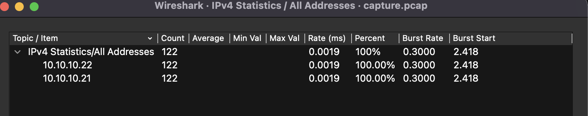

Nothing too crazy here — it's clear that only two IP addresses are talking to each other, which makes things a lot cleaner to follow.

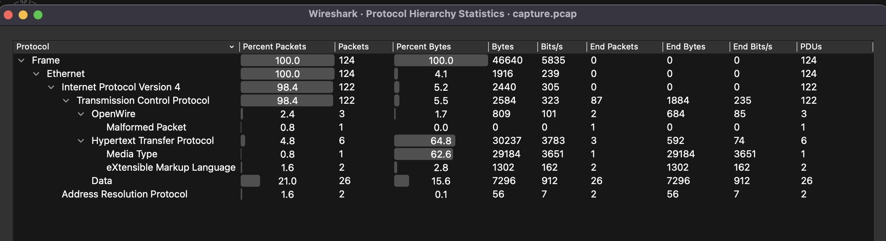

The Protocol Hierarchy also only shows TCP and HTTP traffic. At this point I wasn't 100% sure what I was looking at, but the pattern looked like it could be a C2 (Command and Control) setup.

My next step was to start filtering through the TCP and HTTP streams to get a clearer picture of what was actually going on.

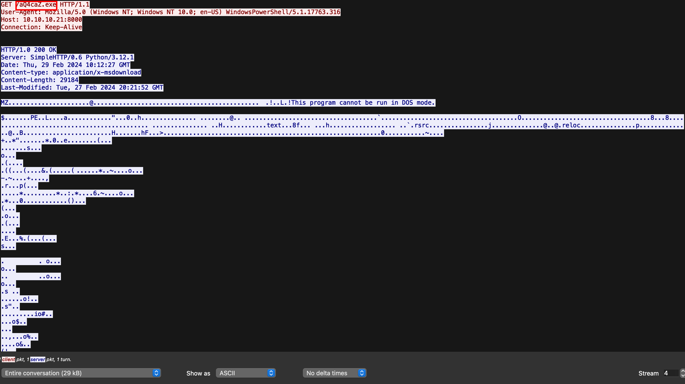

At **HTTP stream 4**, I noticed an executable being downloaded. Using Wireshark's **Export Objects** function under HTTP, I was able to pull out the binary directly.

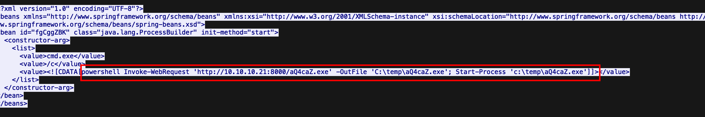

Looking further, **TCP stream 3** shows that after grabbing the binary, PowerShell executed it on the victim's machine. That confirmed my suspicion. **TCP stream 5** also caught my eye — it was full of what looked like encoded data being sent back and forth.

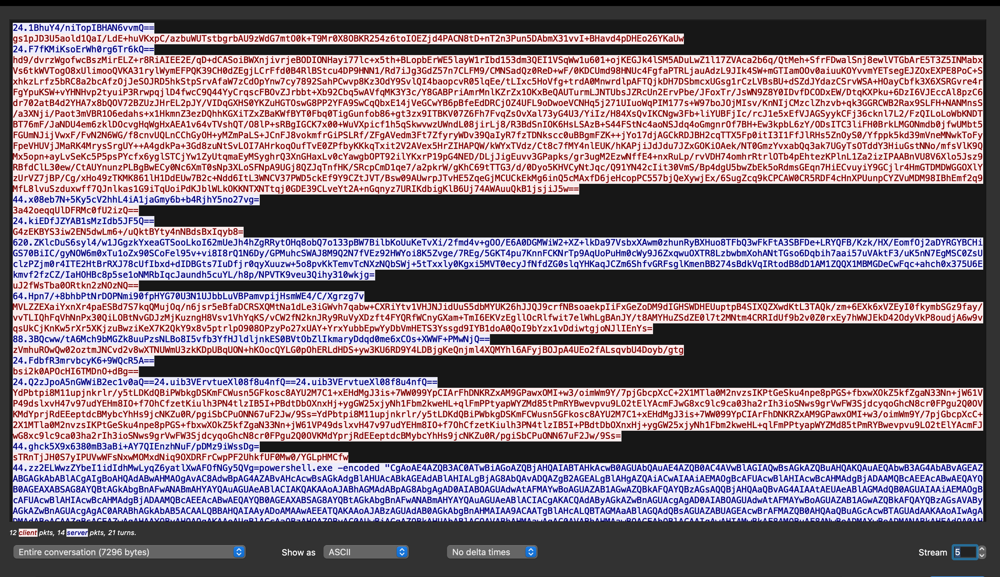

At this point it was pretty clear this was a C2 attack session. So my goal became: figure out what the binary is doing, and use that to decode the stream.

---

## Deeper Analysis

### Binary Analysis

Before doing anything, I wanted to know what kind of file I was dealing with. I ran it through **DIE (Detect It Easy)**, which told me it was written in **C# using the .NET framework**.

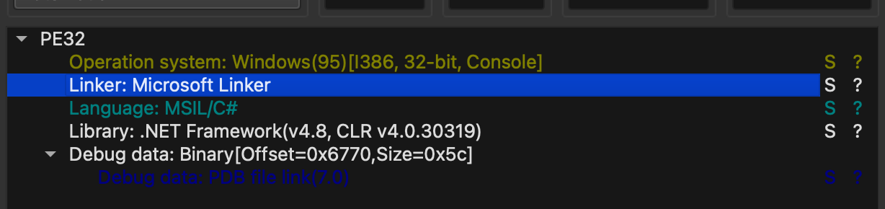

I also threw it on **VirusTotal** just to see what came back, and it told me the original filename was actually `EZRATCLIENT.exe`. That was a useful lead.

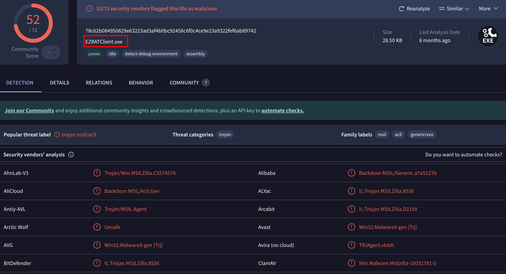

A quick Google search on `EZRAT` brought up a few articles and the [official GitHub repository](https://github.com/Exo-poulpe/EZRAT). Reading through it gave me a much better idea of what this malware actually does and how it communicates — which is exactly what I needed to figure out how to decode those streams.

With all of that context, I loaded the binary into **ILSpy** to decompile it and look at the actual code.

#### Locating the Decrypt Function

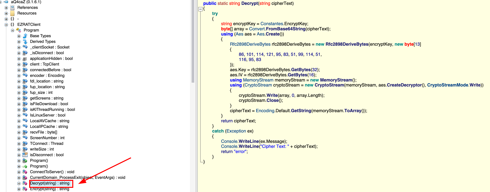

After playing around for a bit, I found the `Decrypt` function. This is the one that matters — understanding this is the key to decoding the payload stream.

---

### Decrypt Function Breakdown

**Step 1 — Setting the Encryption Key**

The function starts by grabbing `encryptKey` from a constant called `EncryptKey`, and then takes the Base64-encoded stream data as its input.

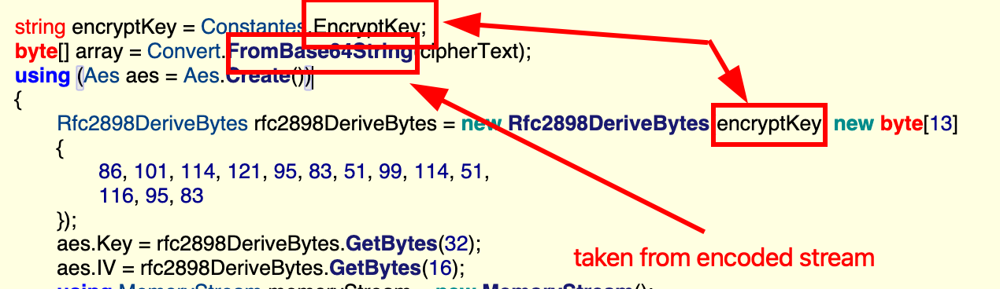

I followed the reference to `EncryptKey` and eventually tracked down its actual value:
```
VYAemVeO3zUDTL6N62kVA
```

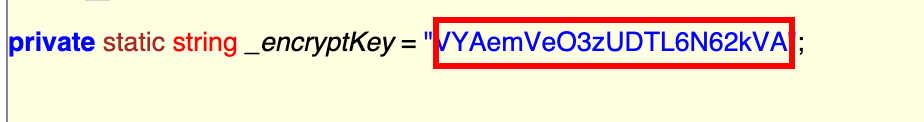

---

**Step 2 — RFC2898 / PBKDF2 Key Derivation**

This part took me a while to understand. The function uses `Rfc2898DeriveBytes`, which I had to stop and Google. Turns out it's .NET's implementation of **PBKDF2** (Password-Based Key Derivation Function 2) — basically a way to take a weak input like a password and turn it into strong cryptographic key material.

The way it works is it takes three things:

| Parameter | Value |
|---|---|
| **Password** | `VYAemVeO3zUDTL6N62kVA` |
| **Salt** | `{ 86, 101, 114, 121, 95, 83, 51, 99, 114, 51, 116, 95, 83 }` |
| **Iterations** | 1000 |
| **Hashing Function** | HMAC-SHA1 |

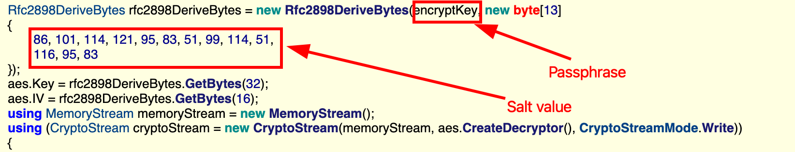

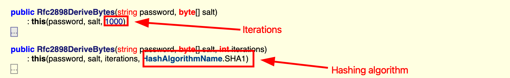

The salt values are in decimal. Converting each one to UTF-8 gives:
```
Very_S3cr3t_S
```

So the salt was hardcoded into the binary the whole time — not ideal from a security standpoint, but very useful for us.

---

**Step 3 — AES Decryption**

The AES implementation uses **CBC mode** with a 32-byte key and 16-byte IV, which makes it **AES-256-CBC**.

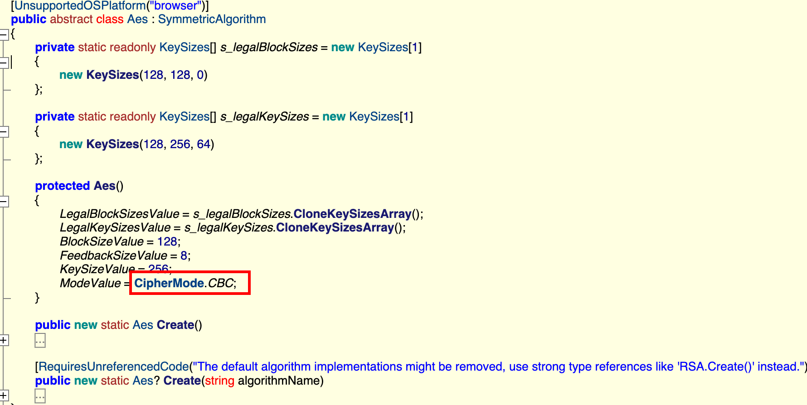

The part that tripped me up here was figuring out where the IV comes from. I initially assumed it might be prepended to the ciphertext like in some other implementations — but that's not the case here. Both the key and IV come entirely from the PBKDF2 output, sequentially:

- **First 32 bytes** → AES Key
- **Next 16 bytes** → IV

Think of PBKDF2 as a tap — each time you call `GetBytes()`, it continues from where it left off. So the key and IV are just two consecutive pulls from the same stream.

Plugging everything into CyberChef:

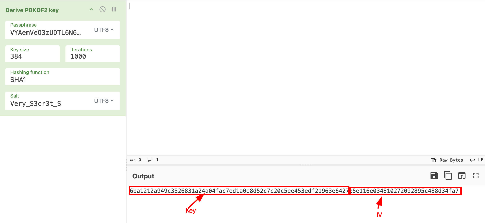
```
KEY: 6ba1212a949c3526831a24a04fac7ed1a0e8d52c7c20c5ee453edf21963e6427
IV:  e5e116e034810272092895c488d34fa7
```

---

### Stream Decryption

With the key and IV sorted out, the CyberChef recipe is straightforward:
```
From Base64 → AES Decrypt (CBC, Key, IV)
```

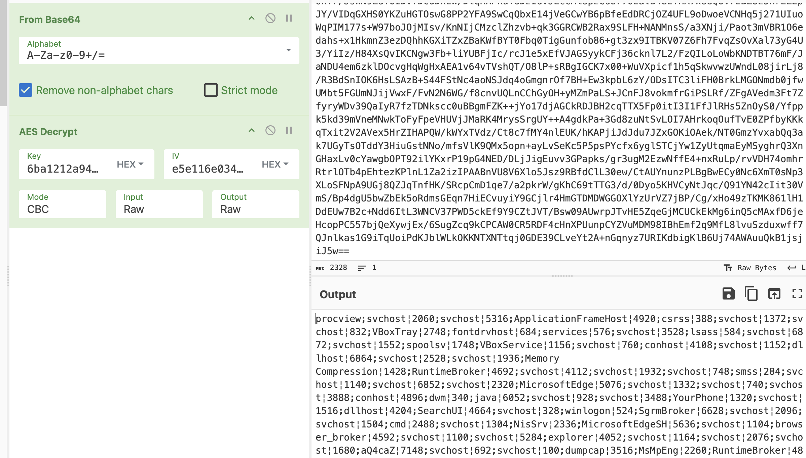

**Flag 1:**

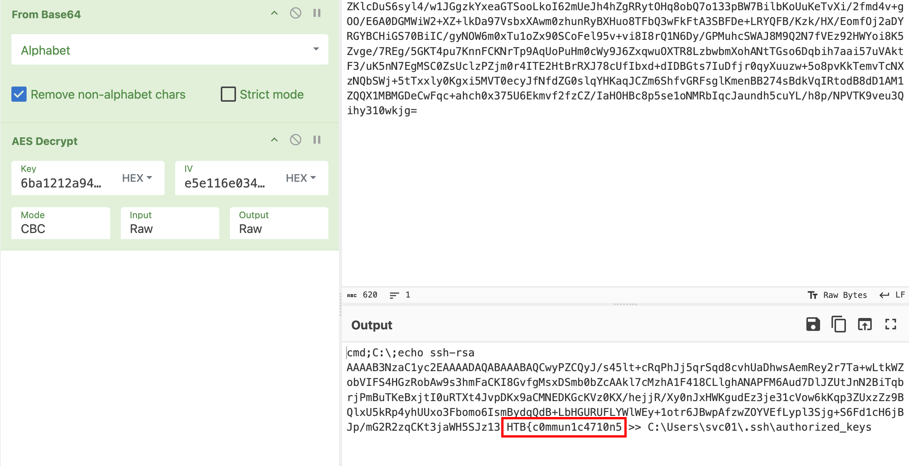

**Flag 2:**

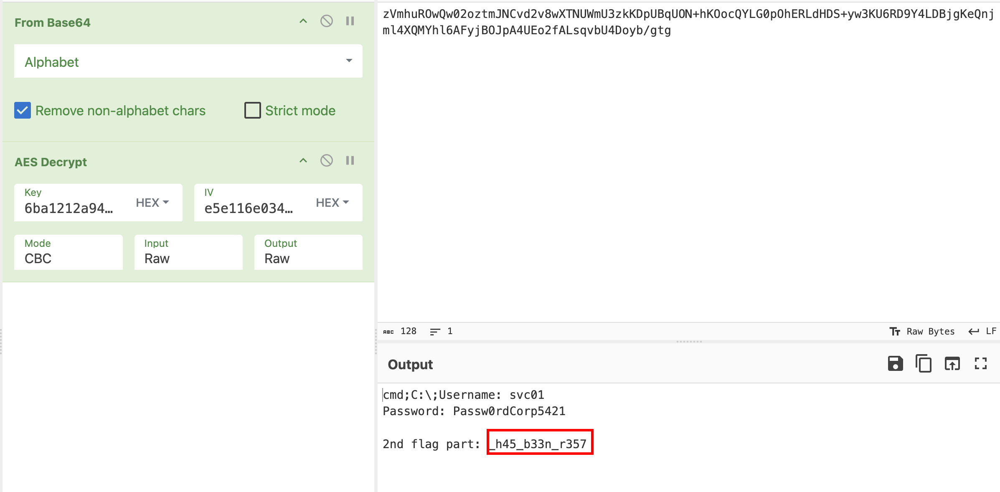

**Flag 3:** This one caught me off guard — I was expecting to need the same AES decryption, but it turned out this part of the stream was just Base64 encoded on its own. Running it through Base64 decode was all it took.

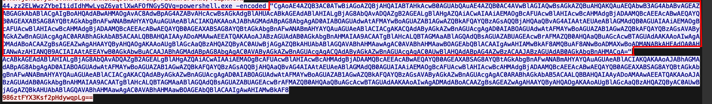

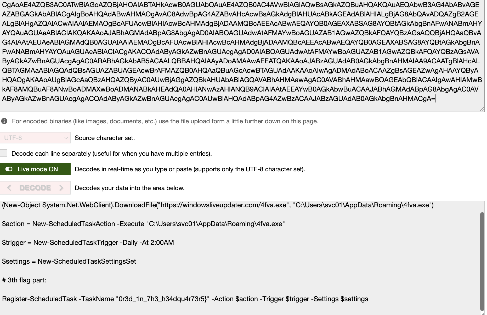

---

## Final Flag
```
HTB{c0mmun1c4710n5_h45_b33n_r3570r3d_1n_7h3_h34dqu4r73r5}
```