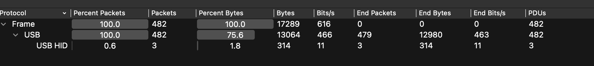
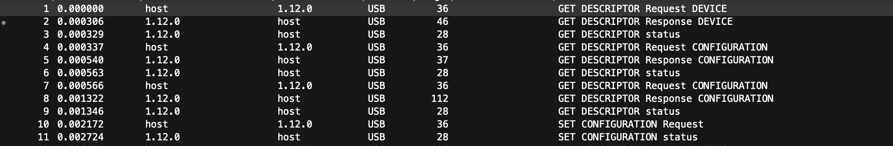
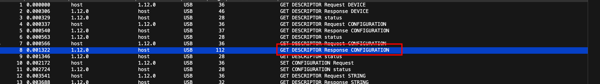
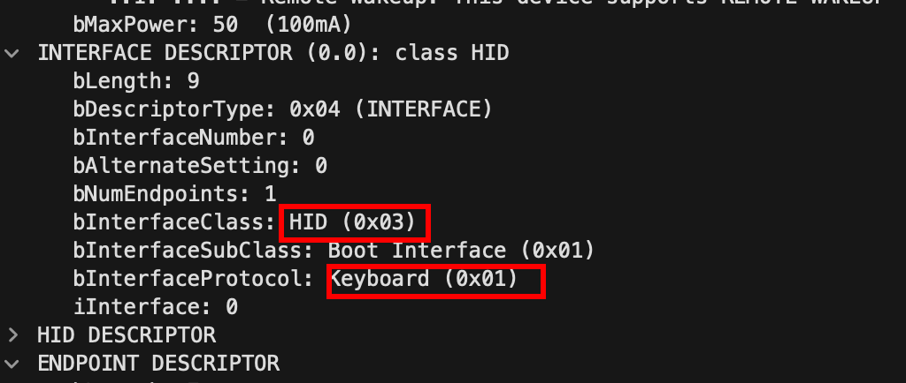
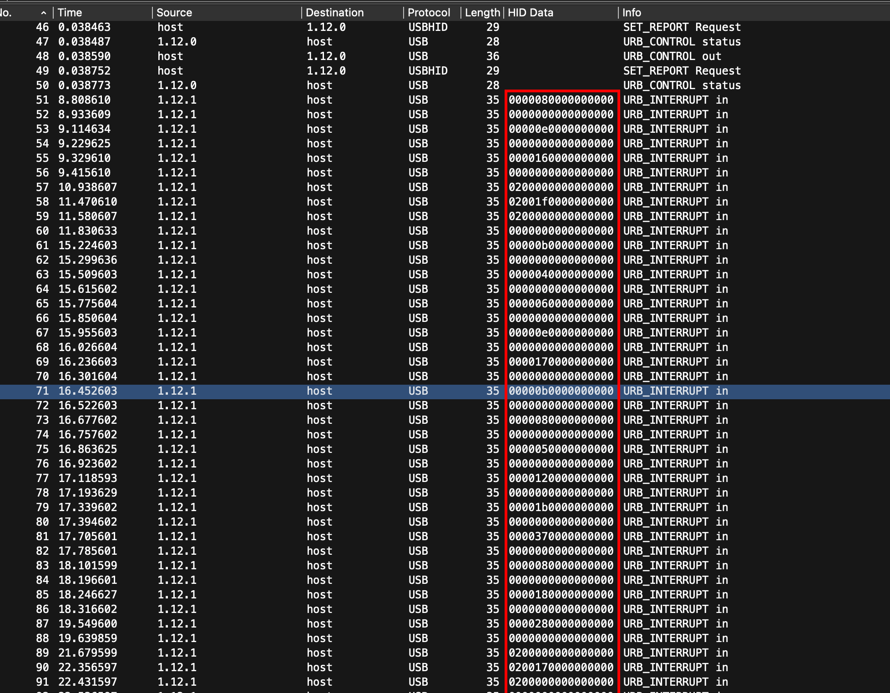
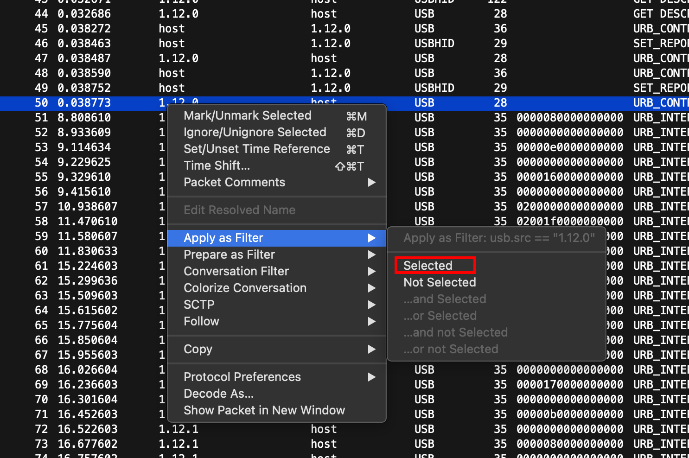
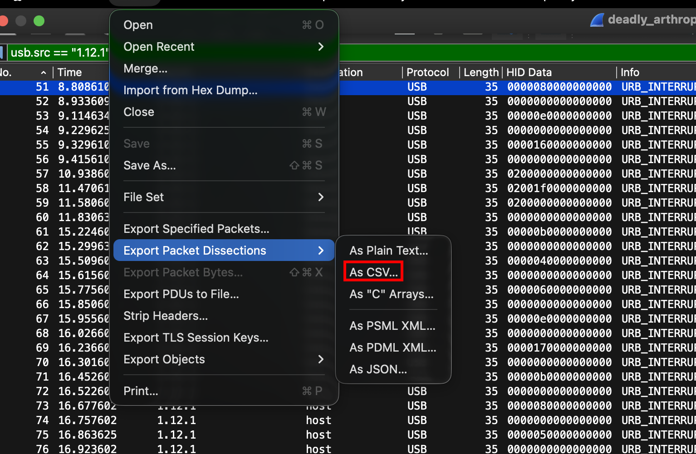
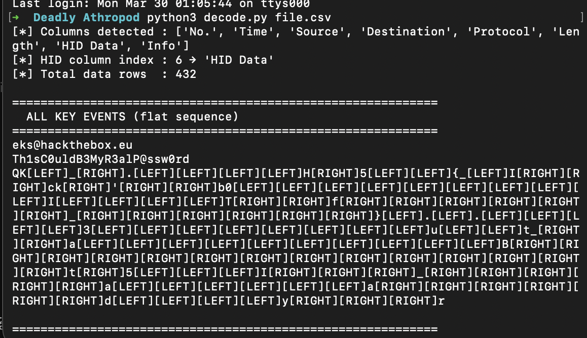
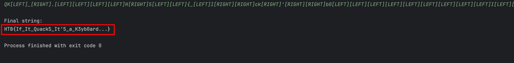

# Deadly Arthropod — CTF Writeup

Our operatives have intercepted critical information. Origin? Classified. <br>Objective: Retrieve the flag!

## Challenge Scenario

**Materials on hand:**
- PCAP file: `deadly_arthropod.pcap`

---

## Initial Investigation

Upon opening the PCAP file, it became clear right away that this was not a typical network analysis session. Instead of the usual HTTP, TCP, or DNS traffic, checking the protocol hierarchy revealed something entirely different — everything here was running over **USB protocol**.



I took some time to research the USB protocol and how forensics can be performed on it. As it turns out, USB is a common communication interface that allows peripheral devices — such as mice, digital cameras, printers, keyboards, media devices, scanners, flash drives, and external hard drives — to communicate with a host controller like a PC or smartphone. Whenever a device is plugged in, a structured communication process begins between the host and the device. This process includes **device enumeration**, **descriptor exchange**, and **continuous data transfer** through defined endpoints.

To understand what was happening inside the capture, I examined a specific chunk of packets in Wireshark:



This sequence represents the **USB enumeration handshake** — essentially, the "getting to know you" process that happens the moment a USB device is plugged in.

- **Packets 1–2:** The host requests the device descriptor → the device responds with basic identifying information (Vendor ID, Product ID, USB version, etc.)
- **Packet 3:** The host acknowledges receipt of the descriptor.
- **Packets 4–6:** The host requests the configuration descriptor → receives a partial response (just the header, enough to know the full size).
- **Packets 7–9:** The host requests the full configuration descriptor → receives the complete data, including interface and endpoint details.
- **Packets 10–11:** The host sets the chosen configuration → the device confirms. At this point, the device is fully ready to use.

Following packet 8 — labeled `GET DESCRIPTOR Response CONFIGURATION` — revealed detailed information about the connected device:





The device turned out to be a **keyboard**. The protocol listed was **HID**, which stands for **Human Interface Device** — a USB device class designed for devices operated directly by a human, such as keyboards, mice, and barcode readers.

Further research revealed that Wireshark is also capable of capturing **HID data** — the raw activity generated by the user on an HID device, such as mouse clicks and keystrokes. Most importantly, this data is **fully decodable**.



This opened up a clear path forward: extract the HID data from the capture and decode it to recover the original keystrokes typed by the user.

---

## Deeper Analysis

### Extracting HID Data

First, I filtered the traffic to isolate packets originating from host `1.12.1`, which is the source of the HID data, using Wireshark's **Apply as Filter** function:



Next, I used Wireshark's **Export Packet Dissections** feature to export the filtered table into a CSV file for easier processing:



---

### Decoding the HID Data

To decode the raw HID data, it helps to understand the **HID Keyboard Report Format**. Every keypress sends an 8-byte report structured as follows:

```
Byte 0      Byte 1       Byte 2   Byte 3   Byte 4   Byte 5   Byte 6   Byte 7
[MODIFIER]  [RESERVED]  [KEY1]   [KEY2]   [KEY3]   [KEY4]   [KEY5]   [KEY6]
```

- **Byte 0** — A modifier bitmask indicating whether keys like Shift, Ctrl, Alt, or GUI (Windows key) are held down.
- **Byte 1** — Always `0x00`, reserved and unused.
- **Bytes 2–7** — Up to 6 simultaneous keycodes representing the keys being pressed.

The decoding process works as follows:

1. Check **Byte 0** for modifier flags (e.g., `0x02` = Left Shift is held).
2. Look up **Bytes 2–7** in a keycode lookup table — each keycode maps to a `(normal, shifted)` character pair.
3. Select the correct character variant based on whether Shift is active.
4. An all-zero report means the key was released — skip it.
5. Post-process the sequence: `[BS]` deletes the last character, `[CAPS]` toggles capitalization.

**Example:** `02 00 04 00 00 00 00 00`
- Byte 0 = `0x02` → Left Shift is held
- Byte 2 = `0x04` → maps to `('a', 'A')` → output: **`A`**

I then used an AI-generated Python script to automate the decoding process, taking the exported CSV file as input:

```python
import csv
import sys
import argparse
from pathlib import Path

HID_KEYCODE_MAP = {
    0x04: ('a', 'A'), 0x05: ('b', 'B'), 0x06: ('c', 'C'),
    0x07: ('d', 'D'), 0x08: ('e', 'E'), 0x09: ('f', 'F'),
    0x0A: ('g', 'G'), 0x0B: ('h', 'H'), 0x0C: ('i', 'I'),
    0x0D: ('j', 'J'), 0x0E: ('k', 'K'), 0x0F: ('l', 'L'),
    0x10: ('m', 'M'), 0x11: ('n', 'N'), 0x12: ('o', 'O'),
    0x13: ('p', 'P'), 0x14: ('q', 'Q'), 0x15: ('r', 'R'),
    0x16: ('s', 'S'), 0x17: ('t', 'T'), 0x18: ('u', 'U'),
    0x19: ('v', 'V'), 0x1A: ('w', 'W'), 0x1B: ('x', 'X'),
    0x1C: ('y', 'Y'), 0x1D: ('z', 'Z'),
    0x1E: ('1', '!'), 0x1F: ('2', '@'), 0x20: ('3', '#'),
    0x21: ('4', '$'), 0x22: ('5', '%'), 0x23: ('6', '^'),
    0x24: ('7', '&'), 0x25: ('8', '*'), 0x26: ('9', '('),
    0x27: ('0', ')'),
    0x28: ('\n', '\n'),
    0x29: ('[ESC]', '[ESC]'),
    0x2A: ('[BS]', '[BS]'),
    0x2B: ('\t', '\t'),
    0x2C: (' ', ' '),
    0x2D: ('-', '_'), 0x2E: ('=', '+'),
    0x2F: ('[', '{'), 0x30: (']', '}'),
    0x31: ('\\', '|'),
    0x33: (';', ':'), 0x34: ("'", '"'),
    0x35: ('`', '~'),
    0x36: (',', '<'), 0x37: ('.', '>'), 0x38: ('/', '?'),
    0x39: ('[CAPS]', '[CAPS]'),
    0x3A: ('[F1]', '[F1]'),   0x3B: ('[F2]', '[F2]'),
    0x3C: ('[F3]', '[F3]'),   0x3D: ('[F4]', '[F4]'),
    0x3E: ('[F5]', '[F5]'),   0x3F: ('[F6]', '[F6]'),
    0x40: ('[F7]', '[F7]'),   0x41: ('[F8]', '[F8]'),
    0x42: ('[F9]', '[F9]'),   0x43: ('[F10]', '[F10]'),
    0x44: ('[F11]', '[F11]'), 0x45: ('[F12]', '[F12]'),
    0x4F: ('[RIGHT]', '[RIGHT]'), 0x50: ('[LEFT]', '[LEFT]'),
    0x51: ('[DOWN]', '[DOWN]'), 0x52: ('[UP]', '[UP]'),
    0x4A: ('[HOME]', '[HOME]'), 0x4B: ('[PGUP]', '[PGUP]'),
    0x4C: ('[DEL]', '[DEL]'),  0x4D: ('[END]', '[END]'),
    0x4E: ('[PGDN]', '[PGDN]'),
    0x49: ('[INS]', '[INS]'),
}

MODIFIER_SHIFT = 0x22
MODIFIER_CTRL  = 0x11
MODIFIER_ALT   = 0x44
MODIFIER_GUI   = 0x88


def parse_hid_report(hex_str: str):
    hex_str = hex_str.strip().replace(' ', '').replace(':', '')
    if not hex_str or hex_str == '0' * len(hex_str):
        return []
    try:
        data = bytes.fromhex(hex_str)
    except ValueError:
        return []
    if len(data) < 3:
        return []

    modifier = data[0]
    shift = bool(modifier & MODIFIER_SHIFT)
    ctrl  = bool(modifier & MODIFIER_CTRL)
    alt   = bool(modifier & MODIFIER_ALT)
    gui   = bool(modifier & MODIFIER_GUI)

    events = []
    for keycode in data[2:]:
        if keycode == 0x00:
            continue
        if keycode in HID_KEYCODE_MAP:
            normal, shifted = HID_KEYCODE_MAP[keycode]
            char = shifted if shift else normal
            prefix = ''
            if ctrl: prefix += 'CTRL+'
            if alt:  prefix += 'ALT+'
            if gui:  prefix += 'GUI+'
            if prefix:
                char = f'[{prefix}{char.strip("[]")}]'
            events.append(char)
        else:
            events.append(f'[0x{keycode:02X}]')
    return events


def find_hid_column(headers):
    for i, h in enumerate(headers):
        if 'hid' in h.lower():
            return i
    raise ValueError(f"No HID Data column found in headers: {headers}")


def decode_csv(csv_path, verbose=False):
    path = Path(csv_path)
    if not path.exists():
        print(f"[ERROR] File not found: {csv_path}")
        sys.exit(1)

    all_keys = []
    raw_rows = []

    with open(path, newline='', encoding='utf-8-sig') as f:
        reader = csv.reader(f)
        rows = list(reader)

    if not rows:
        print("[ERROR] CSV is empty.")
        sys.exit(1)

    first = rows[0]
    if any('hid' in cell.lower() for cell in first):
        headers = [c.strip().strip('"') for c in first]
        data_rows = rows[1:]
    else:
        headers = ['No', 'Time', 'Source', 'Destination',
                   'Protocol', 'Length', 'HID Data', 'Info']
        data_rows = rows

    try:
        hid_col = find_hid_column(headers)
    except ValueError as e:
        print(f"[ERROR] {e}")
        sys.exit(1)

    for i, row in enumerate(data_rows, start=2):
        if len(row) <= hid_col:
            continue
        hex_str = row[hid_col].strip().strip('"')
        events = parse_hid_report(hex_str)
        if events:
            all_keys.extend(events)
            raw_rows.append((i, hex_str, events))

    typed_text = []
    caps = False
    for k in all_keys:
        if k == '[CAPS]':
            caps = not caps
        elif k == '[BS]':
            if typed_text:
                typed_text.pop()
        elif len(k) == 1:
            typed_text.append(k.upper() if caps else k)
        else:
            typed_text.append(k)

    reconstructed = ''.join(typed_text)

    if verbose:
        print("=" * 60)
        print("  RAW KEY EVENTS (per packet)")
        print("=" * 60)
        for row_no, hex_str, events in raw_rows:
            print(f"  Row {row_no:>4}  [{hex_str}]  →  {''.join(events)}")
        print()

    print("=" * 60)
    print("  ALL KEY EVENTS (flat sequence)")
    print("=" * 60)
    print(''.join(all_keys))
    print()
    print("=" * 60)
    print("  RECONSTRUCTED TYPED TEXT")
    print("=" * 60)
    print(reconstructed)
    print()

    return reconstructed


def main():
    parser = argparse.ArgumentParser(
        description="Decode USB HID keyboard data from a Wireshark CSV export."
    )
    parser.add_argument('csv_file', help='Path to the CSV file')
    parser.add_argument('-v', '--verbose', action='store_true',
                        help='Print per-packet key events')
    args = parser.parse_args()
    decode_csv(args.csv_file, verbose=args.verbose)


if __name__ == '__main__':
    main()
```

Running the script against the exported CSV produced the following output:



---

### Handling Arrow Keys

Looking at the output, I noticed that `[LEFT]` and `[RIGHT]` tokens appeared frequently. These represent the **left and right arrow keys**, which the user pressed to move the cursor while typing. This means the raw output is not a simple left-to-right sequence — the cursor could have been repositioned at any point.

For example, `b[LEFT]a[RIGHT][RIGHT]c` actually produces the text `abc`, because:
- `b` is typed first
- `[LEFT]` moves the cursor before `b`
- `a` is inserted before `b` → resulting in `ab`
- `[RIGHT][RIGHT]` moves the cursor past both characters
- `c` is appended at the end → final result: `abc`

To handle this correctly, I wrote a second script that simulates a text buffer with a movable cursor, properly replaying all navigation keys:

```python
import re
import sys

def reconstruct(raw: str) -> str:
    token_pattern = re.compile(r'\[LEFT\]|\[RIGHT\]|\[BS\]|\[DEL\]|\[HOME\]|\[END\]|.')
    tokens = token_pattern.findall(raw)

    buf = []
    pos = 0

    for token in tokens:
        if token == '[LEFT]':
            if pos > 0:
                pos -= 1
        elif token == '[RIGHT]':
            if pos < len(buf):
                pos += 1
        elif token == '[BS]':
            if pos > 0:
                buf.pop(pos - 1)
                pos -= 1
        elif token == '[DEL]':
            if pos < len(buf):
                buf.pop(pos)
        elif token == '[HOME]':
            pos = 0
        elif token == '[END]':
            pos = len(buf)
        else:
            buf.insert(pos, token)
            pos += 1

    return ''.join(buf)

def main():
    if len(sys.argv) > 1:
        raw = sys.argv[1]
    else:
        print("Paste keylogger input (then press Enter):")
        raw = input().strip()

    result = reconstruct(raw)
    print("\nFinal string:")
    print(result)

if __name__ == '__main__':
    main()
```

Running this script with the previous output successfully reconstructed the final typed text and revealed the flag:



---

## Final Flag

```
HTB{If_It_Quack5_It'5_a_K3yb0ard...}
```
