## Challenge Scenario ##

In the shadowed realm where the Phreaks hold sway, A mole lurks within leading them astray. Sending keys to the Talents, so sly and so slick, A network packet capture must reveal the trick. Through data and bytes, the sleuth seeks the sign, Decrypting messages, crossing the line. The traitor unveiled, with nowhere to hide, Betrayal confirmed, they'd no longer abide.

## Materials on hand ##

+ PCAP file: `phreaky.pcap`

## Initial Investigation ##

Upon opening the PCAP file, before doing anything else, I wanted to get a bird's-eye view of what 
we're working with. I started by checking the **Protocol Hierarchy** and **IPv4 Statistics** — 
two really useful features in Wireshark that let you see the big picture before diving into 
individual packets.

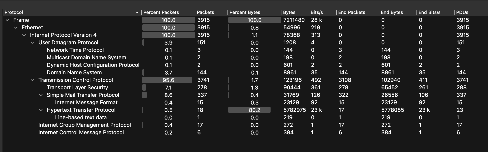

The **Protocol Hierarchy** tells you what percentage of the captured traffic belongs to each 
protocol. In this case, it shows that the session is mostly made up of **TCP** traffic, with some 
**SMTP** traffic mixed in as well.

The **IPv4 Statistics** also revealed that two addresses — `192.168.68.111` and `185.125.190.39` 
— have the highest number of occurrences and appear to be communicating with each other the most.

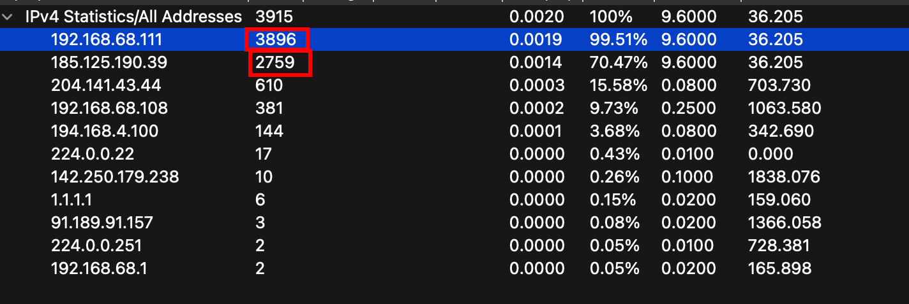

Next, I filtered for **HTTP** streams to see if there was anything useful hiding there. The results 
turned out to be what looked like a legitimate Ubuntu system update, so the HTTP traffic wasn't 
relevant to our investigation.

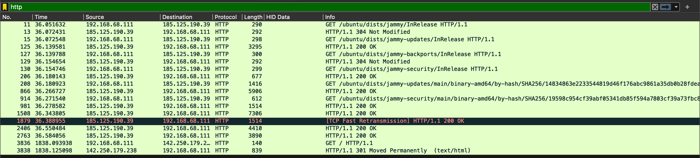

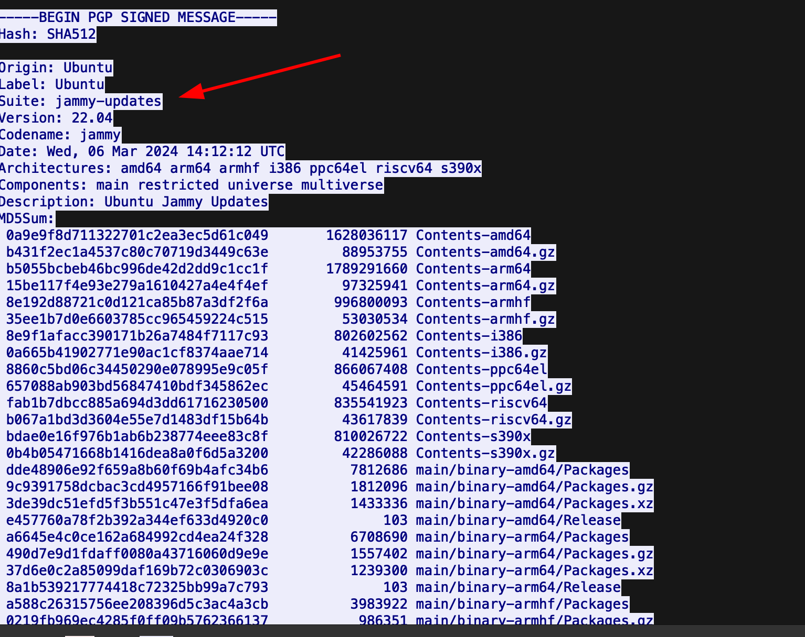

Moving on, I decided to take a closer look at the **SMTP** traffic.

Before we continue, let me quickly explain what SMTP actually is, since it's pretty central to 
this challenge. **SMTP**, or **Simple Mail Transfer Protocol**, is the standard protocol used for 
sending emails over the Internet. It's a text-based protocol that operates at the **application 
layer**, and it uses **TCP** connections under the hood to make sure data is delivered reliably 
and in the correct order. The important thing to note here is that SMTP can transmit data 
**in plaintext**, meaning that if you capture SMTP traffic, you might be able to read emails, 
usernames, passwords, and attachments directly — which makes it a valuable target for attackers 
and a goldmine for investigators.

After filtering for SMTP traffic, some suspicious activity started to reveal itself.

Specifically, a suspicious email address — `caleb@thefreaks.com` — was repeatedly sending emails 
with the subject line `Secure File Transfer` to the recipient `resources@thetalents.com`.

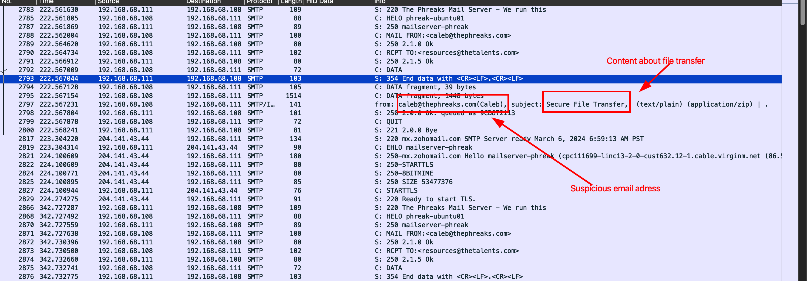

Using Wireshark's **Follow TCP Stream** feature (which lets you reconstruct and read the full 
conversation of a TCP connection in human-readable form), I was able to read the actual content 
of the emails.

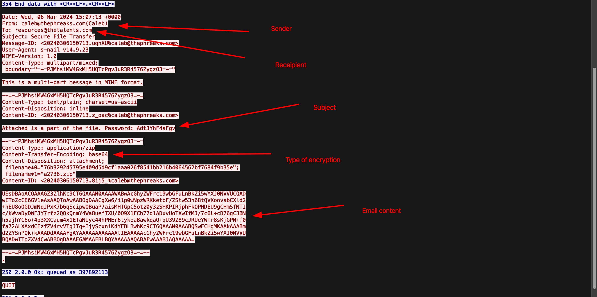

Interestingly, each email's subject line also contained a **password value** — likely for 
unlocking some kind of protected file. This pattern repeated across **15 more streams**, and 
each time the password was different, as was the **Base64-encoded** content inside the email 
body. 

My guess at this point was that the sender was splitting a file into multiple fragments and 
sending each one as a separate email, with each fragment protected by its own password. The 
Base64 content inside was probably some kind of archive — like a ZIP file.

I quickly threw the Base64 string into **CyberChef**  to see what was hiding inside.

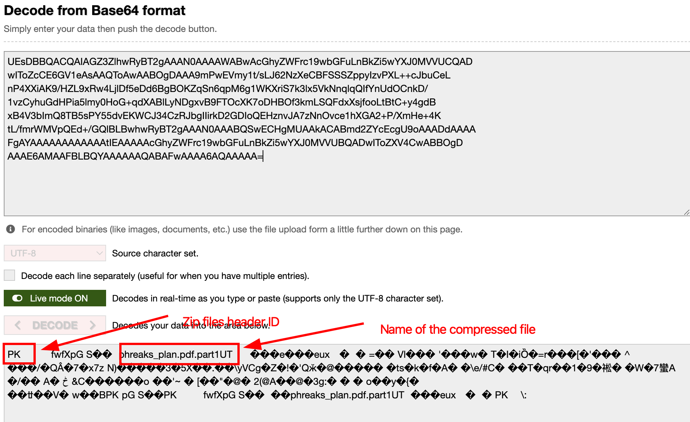

My speculation was correct. The bytes `PK` at the start are the magic bytes that identify a 
**ZIP file** — any ZIP file will start with those two characters. I could also spot a filename 
inside: `phreak_plan.pdf.part1`.

With all of this information in hand, my objective became clear — decode every stream, extract 
each part, and find a way to reconstruct the full PDF file.

---

## Deeper Analysis ##

Using the extracted data, I used the online hex editor **HexEdit** to decode each **Base64** 
string and reconstruct the ZIP files. Each output was saved with a `.zip` extension for 
further analysis.

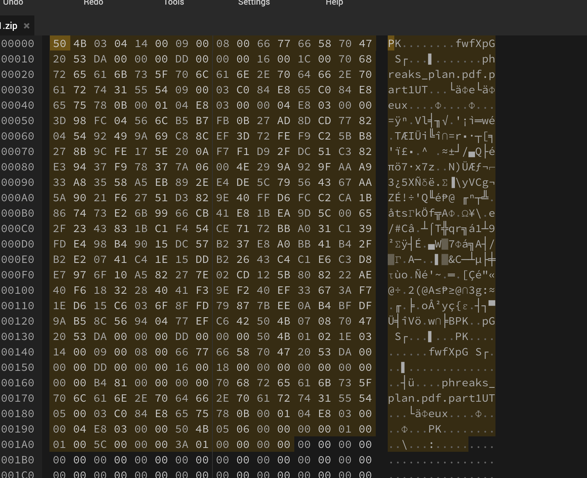

Using the password recovered from the same SMTP stream, I was able to unzip the file. Inside, 
I found a file named `phreaks_plan.pdf.part1`. At first, I tried renaming it to `.pdf` and 
opening it directly — but that didn't work, since it's only a fragment of the full file, not 
a complete PDF on its own.

I then uploaded the file to **HexEdit** to examine its **hex dump** (a raw byte-by-byte view 
of the file). It turned out that `part1` was indeed the very first fragment, and it contained 
the **PDF header** — the beginning section of the file that tells your system "hey, this is 
a PDF."

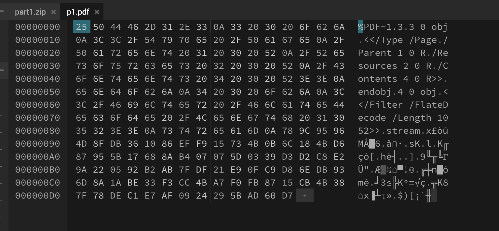

To reconstruct the full PDF, I needed to repeat this decryption process for all 15 streams, 
then arrange the parts in ascending order and merge them together — each part picking up exactly 
where the last one left off.

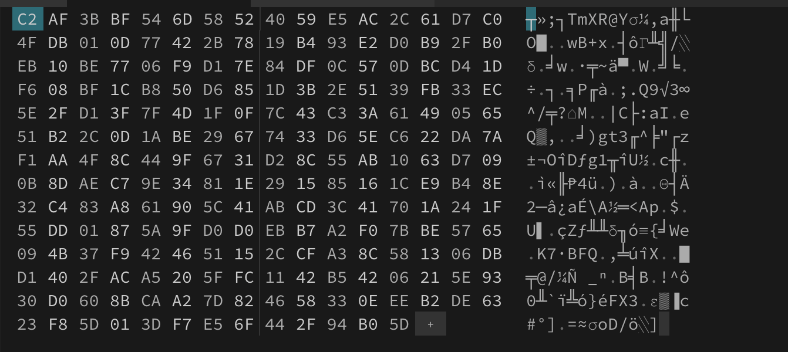
*Contents of Part 2*

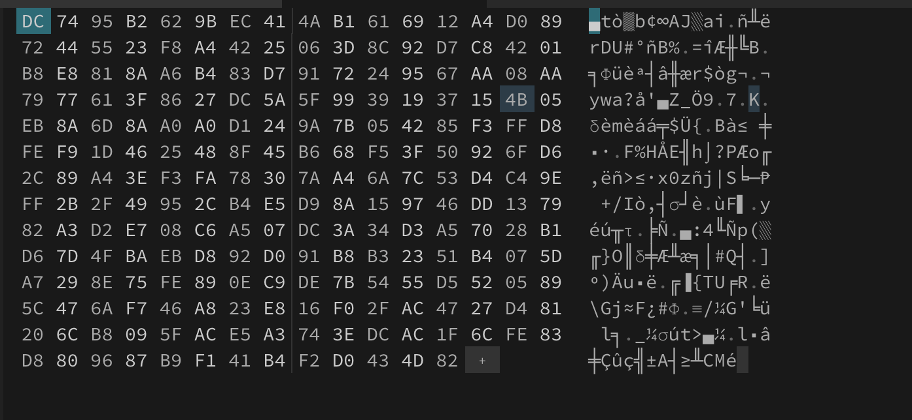
*Contents of Part 3*

And so on...

After processing all **15 packet streams**, all that was left was to merge them in order from 
`part1` through `part15`, stitching the hex data together sequentially. The result was a 
fully reconstructed PDF file. Opening it revealed the flag.

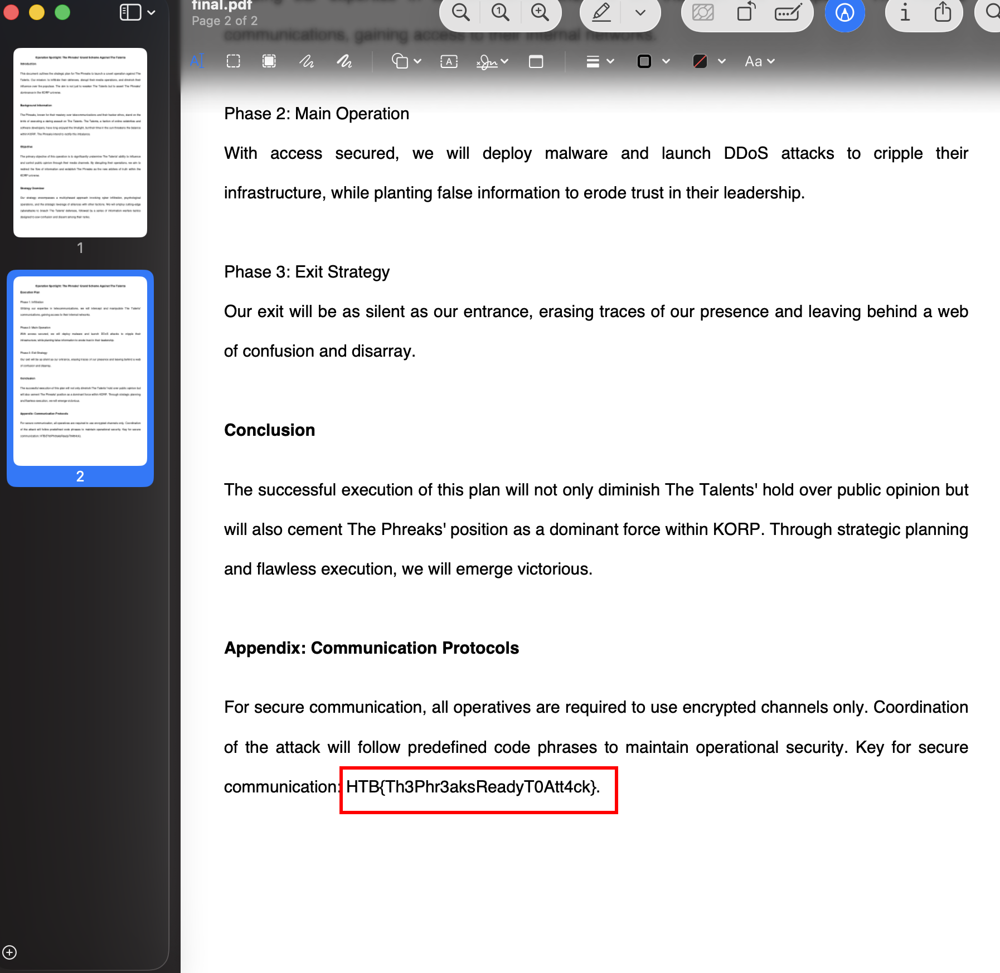

---

## Final Flag ##
`HTB{Th3Phr3aksReadyT0Att4ck}`