# Challenge Scenario

SecCorp has reached us about a recent cyber security incident. They are
confident that a malicious entity has managed to access a shared folder that
stores confidential files. Our threat intel informed us about an active dark
web forum where disgruntled employees offer to give access to their employer's
internal network for a financial reward. In this forum, one of SecCorp's
employees offers to provide access to a low-privileged domain-joined user for
10K in cryptocurrency. Your task is to find out how they managed to gain access
to the folder and what corporate secrets did they steal.

---

## Material

+ PCAP file: `capture.pcap`

---

## Initial Analysis

Analyzing the PCAP file, first I examined the **Protocol Hierarchy**. What
caught my eye was the presence of the `SMB2` protocol and an abundance of
`FTP` packets.

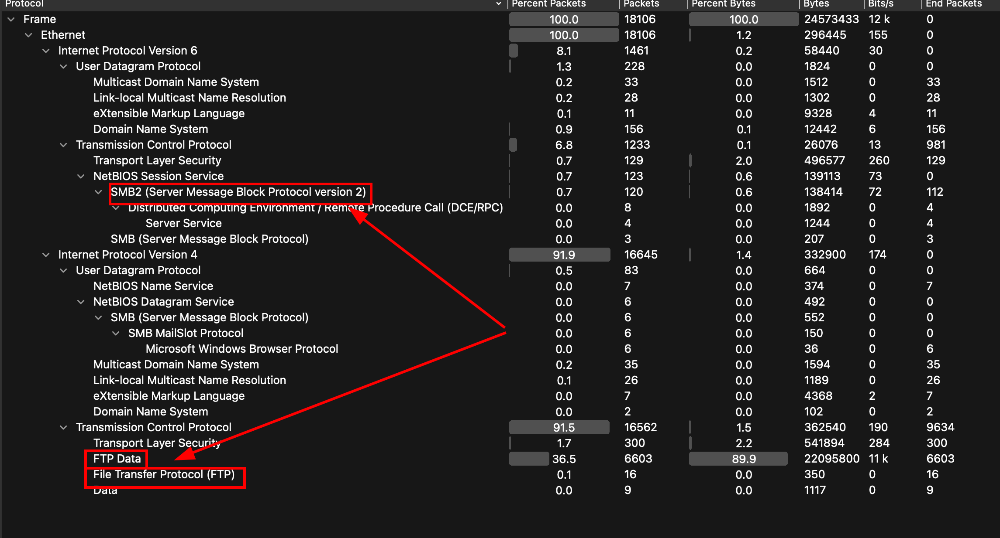

Since the challenge mentions access to a shared folder, I immediately headed
to investigate **FTP streams**. Using the filter to isolate only FTP streams,
here are some insights:

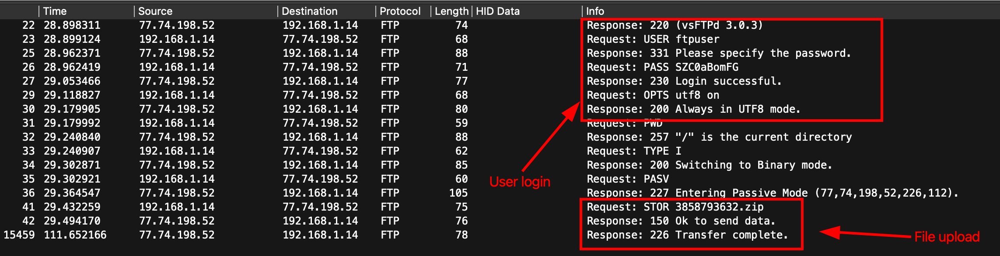

The session reveals a successful login followed by an **unencrypted file
upload**. Specifically, the client issues the `STOR` command to upload a file
named **`3858793632.zip`**.

My objective now was to extract the zip file and view its contents.

---

## Deeper Analysis

Using the **Export Objects** function in Wireshark — specifically exporting
objects present in the `FTP-DATA` protocol — I was able to retrieve the file.

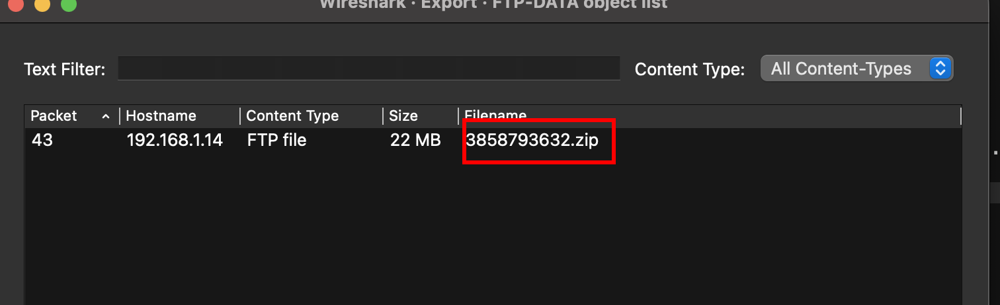

However, upon opening, the file appeared to be **corrupted**.

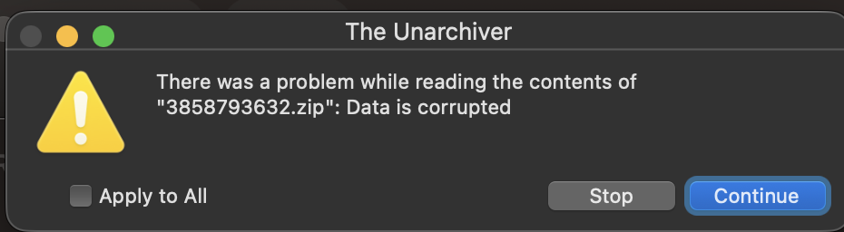

I then investigated the `FTP-DATA` stream further. Although the `Info` column
repeatedly references **`3858793632.zip`**, these entries represent individual
**TCP segments** of the file transfer rather than multiple file uploads.

My approach was to filter for the stream with the **longest length**, export
the packet content, rename it with a `.zip` extension, and attempt to unpack
it again.

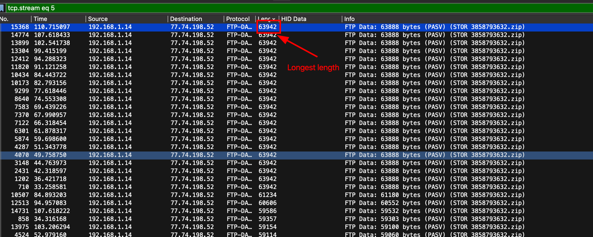

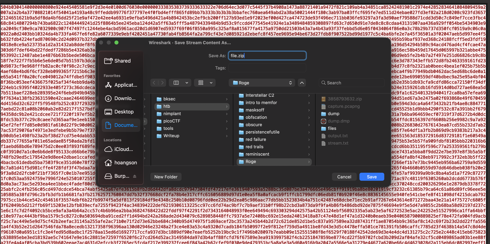

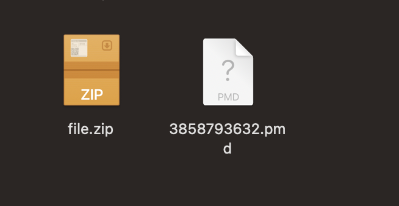

The extraction was successful. Inside, there was one file: **`3858793632.pmd`**

The `.pmd` file is actually a **minidump crash report file**, so I renamed it
with a `.dmp` extension.

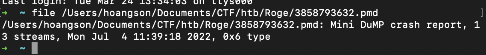

After experimenting with the file, I uploaded it to **VirusTotal** to gather
more information.

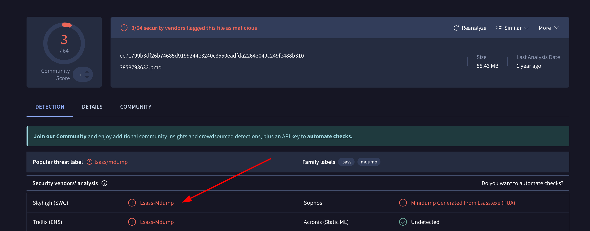

The result gave me a clearer picture of the file's purpose. After researching
`minidump` files in relation to `LSASS`, I found that this technique is
classified under **MITRE ATT&CK** as **OS Credential Dumping**
[T1003.001](https://attack.mitre.org/techniques/T1003/001/).

`LSASS` (**Local Security Authority Subsystem Service**) handles all
credentials and security policies for the OS. Every time a user logs in,
`LSASS` validates the password and retains that information in memory —
including `Kerberos` ticket data, `LSA` secrets, and cached domain credentials.

By pulling `LSASS` memory, an attacker can extract:

+ **Plaintext passwords**
+ **NTLM hashes**
+ **Kerberos keys**
+ Other authentication secrets

In this case, I used `pypykatz` to analyze the dump locally.

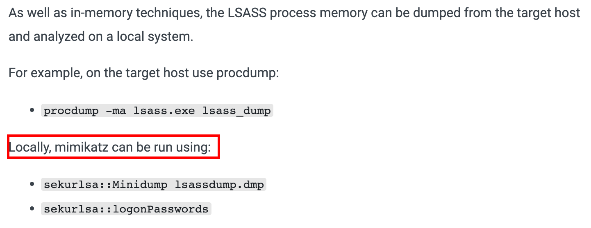

---

### Extracting LSASS Credentials

Using `pypykatz` with the `lsa` function alongside the minidump file, I
extracted the credentials present inside the dump:
```bash
pypykatz lsa minidump dump.dmp > output.txt
```

The output revealed credentials including **username**, **domain**,
**NT hash**, **AES keys**, and **SID**.

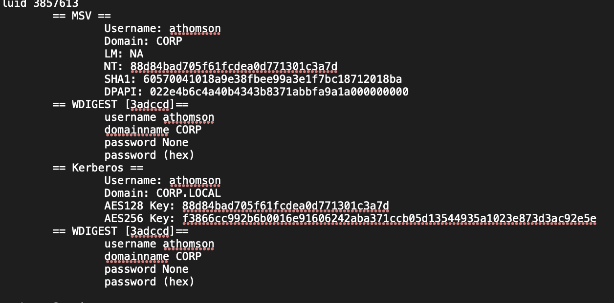

---

### SMB Stream Decryption

Based on
[this article](https://medium.com/maverislabs/decrypting-smb3-traffic-with-just-a-pcap-absolutely-maybe-712ed23ff6a2),
`SMB3` encrypted traffic can be decrypted using the `SessionID` and
`SessionKey` values present in captured packets. To derive the **Random
Session Key**, I used the
[SMB3-Decryption](https://github.com/iamdonu/SMB3-Decryption) script.

The script requires the following parameters:

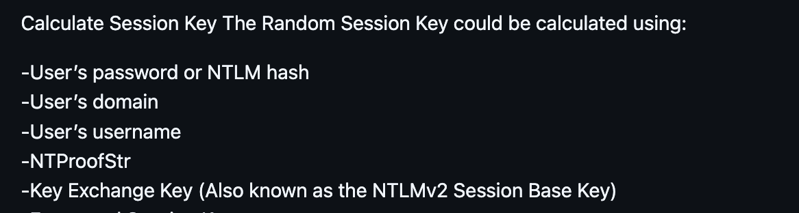

From the `LSASS` dump, I already had:

+ **Username:** `athomson`
+ **Domain:** `CORP`
+ **NT Hash:** `88d84bad705f61fcdea0d771301c3a7d`

The remaining values — **NTProofStr** and **Encrypted Session Key** — are
present inside the `PCAP` file.

Using the filter `ntlmssp` in Wireshark, I located the packet labeled
`Session Setup Request, NTLMSSP_AUTH, User: CORP\athomson`.

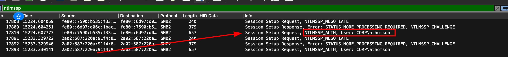

From this packet I extracted:

+ **NTProofStr:** `d047ccdffaeafb22f222e15e719a34d4`
+ **Encrypted Session Key:** `032c9ca4f6908be613b240062936e2d2`

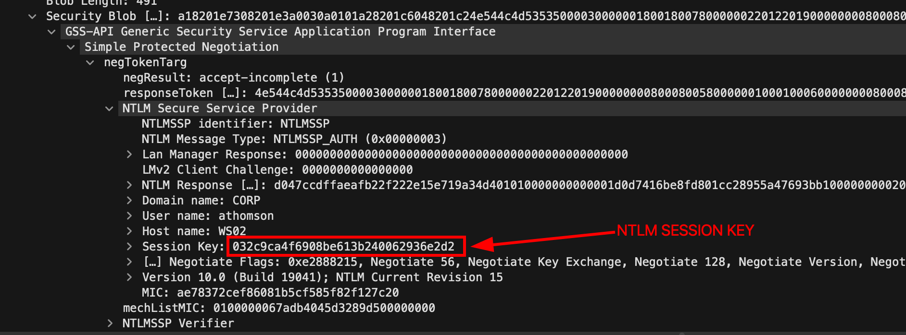

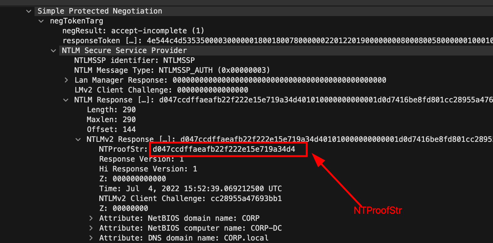

Additionally, I retrieved the **SMB2 Session ID**, required because `SMB2`
encryption is session-specific:

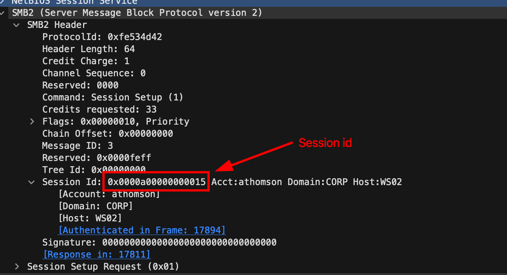

With all parameters ready, I ran the decryption script:
```bash
python3 randomSessionKeyNTLM.py \
  -u athomson \
  -d CORP \
  -n 88d84bad705f61fcdea0d771301c3a7d \
  -p d047ccdffaeafb22f222e15e719a34d4 \
  -k 032c9ca4f6908be613b240062936e2d2
```

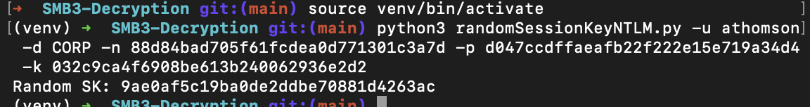

**Random Session Key:** `9ae0af5c19ba0de2ddbe70881d4263ac`

With the **Session Key** and **Session ID** ready, I entered them into
Wireshark to decrypt the `SMB3` stream:

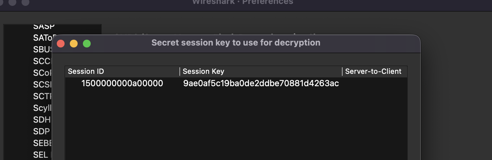

After decryption, a previously hidden file appeared under
**Export Objects → SMB** — a `PDF` file.

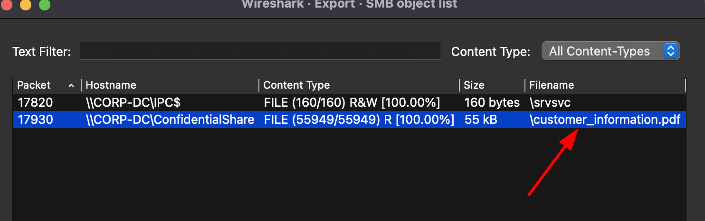

After exporting and opening the `PDF`, the flag was revealed on **page 3**:

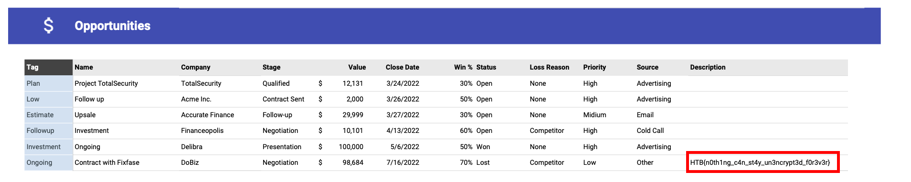

---

## Final Flag

`HTB{n0th1ng_c4n_st4y_un3ncrypt3d_f0r3v3r}`