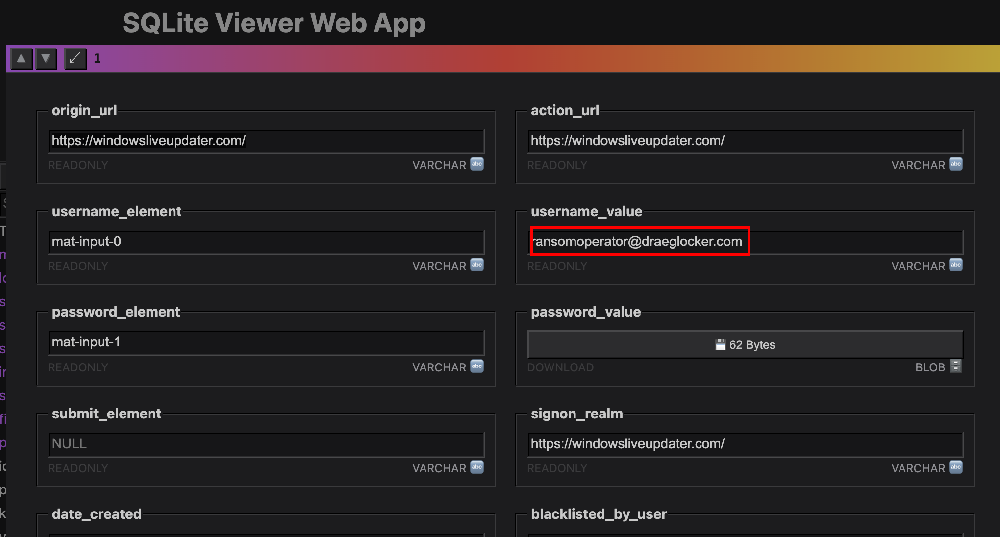
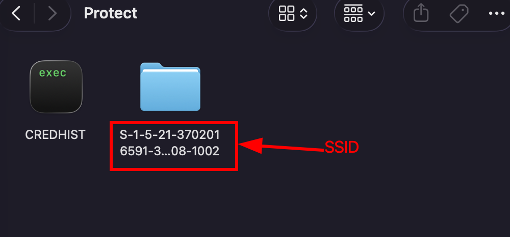
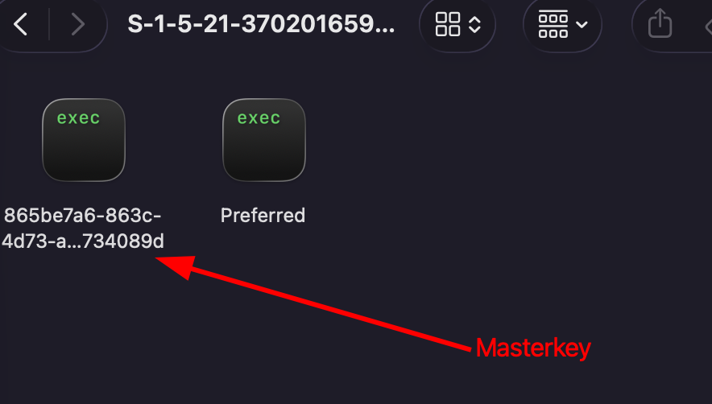
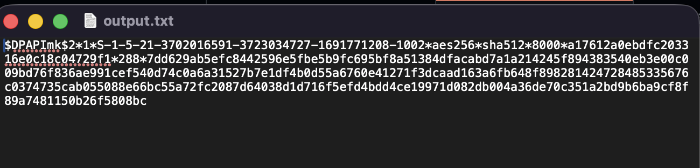
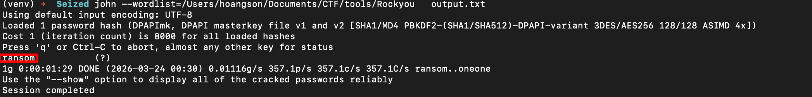
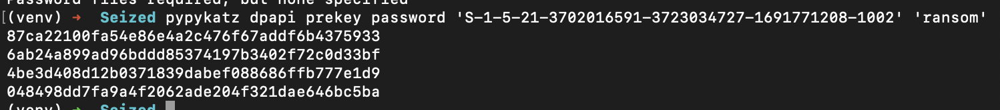
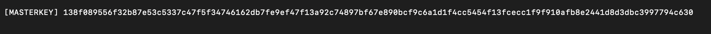
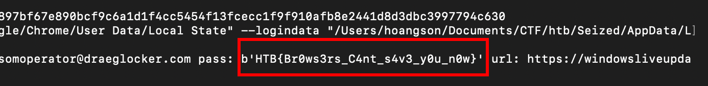

# Challenge Scenario
Miyuki is currently investigating a newly formed ransomware division operating 
under Longhir. This group targets critical infrastructure with the goal of 
causing significant financial damage to their adversaries. Notably, they never 
restore encrypted files, even if the ransom is paid.
This case has become the team's top priority. Miyuki has successfully seized 
the hard drive of one of the members, and it is believed that it may contain 
credentials for the ransomware's dashboard. Given the AppData folder, the objective is to retrieve the credentials.

---

## Material
+ AppData folder

---

## Initial Investigation
During initial inspection, I noticed that the user had Google Chrome installed. 
This suggested that credentials might be stored in Chrome's `Login Data` 
database, located at `Chrome/Default/Login Data`.

After loading this database into an SQLite viewer, I found that the user 
**ransomoperator@draeglocker.com** had stored credentials for the following 
website: `https://windowsliveupdater.com/`



The next objective was to decrypt the stored password.

---

## Deeper Analysis

After researching methods to decrypt Chrome passwords, I found a script called [decrypt_chrome_password.py](https://github.com/ohyicong/decrypt-chrome-passwords/blob/main/decrypt_chrome_password.py)

To understand the process, we need to break it down into two main steps: 
extracting the master key and decrypting the password.

### Extracting the Secret Key
```python
def get_secret_key():
    try:
        #(1) Get secretkey from chrome local state
        with open( CHROME_PATH_LOCAL_STATE, "r", encoding='utf-8') as f:
            local_state = f.read()
            local_state = json.loads(local_state)
        secret_key = base64.b64decode(local_state["os_crypt"]["encrypted_key"])
        #Remove suffix DPAPI
        secret_key = secret_key[5:] 
        secret_key = win32crypt.CryptUnprotectData(secret_key, None, None, None, 0)[1]
        return secret_key
    except Exception as e:
        print("%s"%str(e))
        print("[ERR] Chrome secretkey cannot be found")
        return None
```

This function retrieves Chrome's master encryption key:
+ It reads the `Local State` file (JSON format)
+ Extracts the `encrypted_key` field
+ Decodes it from Base64
+ Removes the `DPAPI` prefix
+ Uses Windows DPAPI to decrypt it into the real AES key

In short: this function extracts and decrypts Chrome's master key using the 
current Windows user context.

### Decrypting the Password
```python
def decrypt_password(ciphertext, secret_key):
    try:
        #(3-a) Initialisation vector for AES decryption
        initialisation_vector = ciphertext[3:15]
        #(3-b) Get encrypted password by removing suffix bytes (last 16 bits)
        encrypted_password = ciphertext[15:-16]
        #(4) Build the cipher to decrypt the ciphertext
        cipher = generate_cipher(secret_key, initialisation_vector)
        decrypted_pass = decrypt_payload(cipher, encrypted_password)
        decrypted_pass = decrypted_pass.decode()  
        return decrypted_pass
    except Exception as e:
        print("%s"%str(e))
        print("[ERR] Unable to decrypt, Chrome version <80 not supported. Please check.")
        return ""
```

Since Chrome version 80, passwords are encrypted using AES-256-GCM, which 
requires parsing the ciphertext carefully.

**Ciphertext Structure:**
+ **Prefix (v10)** → first 3 bytes (ignored)
+ **Initialization Vector (IV)** → bytes 3–15
+ **Encrypted Payload** → bytes 15 to -16
+ **Authentication Tag** → last 16 bytes

**Problem: Running on macOS** — `win32crypt.CryptUnprotectData` only works 
on Windows. To solve this, I used `pypykatz`, which supports DPAPI decryption 
using equivalent mechanisms. At this point, the only missing piece was the 
user's Windows password.

---

## Finding the Machine Password

After further research, I discovered that John the Ripper (Jumbo version) 
provides a script for parsing DPAPI master keys into a crackable hash format: 
[DPAPImk2john.py](https://github.com/openwall/john/blob/bleeding-jumbo/run/DPAPImk2john.py)

The script requires the **SID** and **Masterkey** file, both found at:
`AppData/Roaming/Microsoft/Protect`

The SID is the folder name inside `Protect`, and the masterkey file is inside 
the SID folder.




Running the script with `--context local` to generate the hash:
```bash
python3 dpapi2john.py --sid "S-1-5-21-3702016591-3723034727-1691771208-1002" \
--masterkey "865be7a6-863c-4d73-ac9f-233f8734089d" \
--context local > output.txt
```



Using John the Ripper with `rockyou.txt`, the password was successfully cracked:



Password: **`ransom`**

---

## Cracking Chrome Password

With all required components available, the final step is to decrypt Chrome 
credentials using `pypykatz`.

**Step 1: Generate Prekeys**
```bash
pypykatz dpapi prekey password 'S-1-5-21-3702016591-3723034727-1691771208-1002' 'ransom'
```



**Step 2: Decrypt Masterkey**
```bash
pypykatz dpapi masterkey \
  "/Users/hoangson/Documents/CTF/htb/Seized/AppData/Roaming/Microsoft/Protect/S-1-5-21-3702016591-3723034727-1691771208-1002/865be7a6-863c-4d73-ac9f-233f8734089d" \
  prekeys.txt
```



**Step 3: Decrypt Chrome Credentials**
```bash
pypykatz dpapi chrome masterkey.json \
  "/Users/hoangson/Documents/CTF/htb/Seized/AppData/Local/Google/Chrome/User Data/Local State" \
  --logindata "/Users/hoangson/Documents/CTF/htb/Seized/AppData/Local/Google/Chrome/User Data/Default/Login Data"
```



---

# Final Flag
`HTB{Br0ws3rs_C4nt_s4v3_y0u_n0w}`