# Challenge Scenerio #
A fleet of steam blimps waits the final signal from their commander in order to attack gogglestown kingdom. A recent cyber attack had us thinking if the enemy managed to discover our plans and prepare a counter-attack. Will the fleet get ambused???

## Materials on hand ##

The challenge contains 2 files: 
+ PCAP file: `capture.pcapng`
+ Minidump crash report file: `freesteam.dmp`

## Initial Analysis ##

 Examining the PCAP file, IPv4 statistics indicate that only two IP addresses — `192.168.1.7` and `192.168.1.9` — are present, with traffic limited to HTTP over TCP.

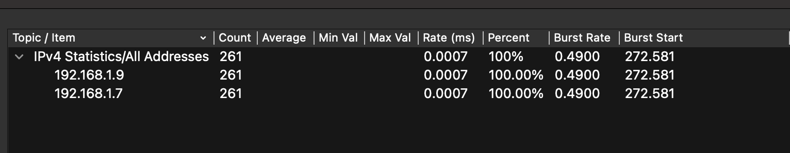

 By following the HTTP stream, the first notable event observed on the victim machine is the download of an executable named `freesteam.exe`.

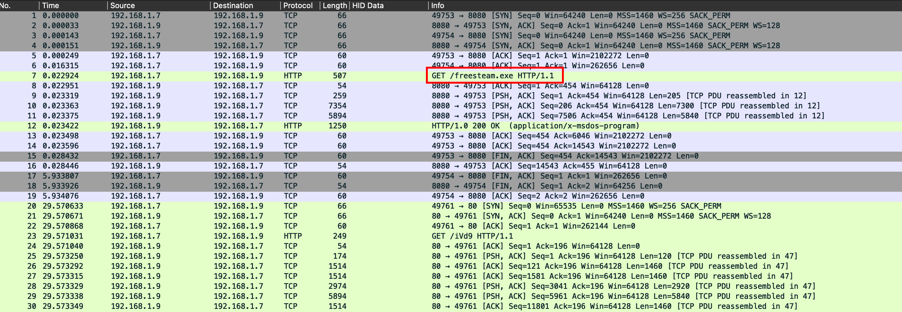

 Using Wireshark’s **Export Objects (HTTP)** feature (`File -> Export Objects -> HTTP`), the executable can be extracted for further analysis.

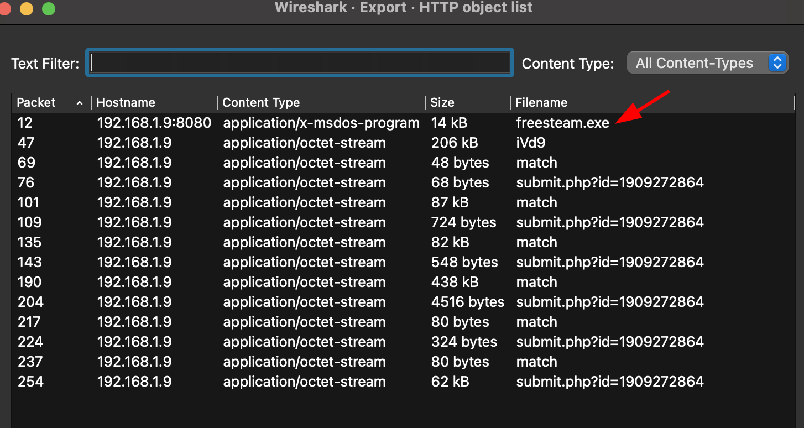

 The binary was then uploaded to VirusTotal, which suggests that it behaves as an “open gate” for a Cobalt Strike attack session, likely functioning as a Beacon payload.

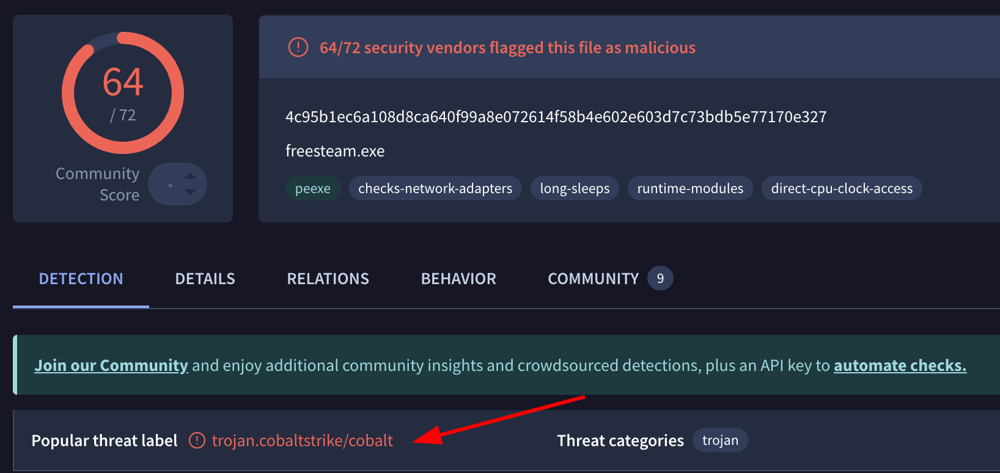

 The remaining network traffic contains obfuscated or non-human-readable (“fuzzy”) strings, indicating the presence of encoded or encrypted communication.

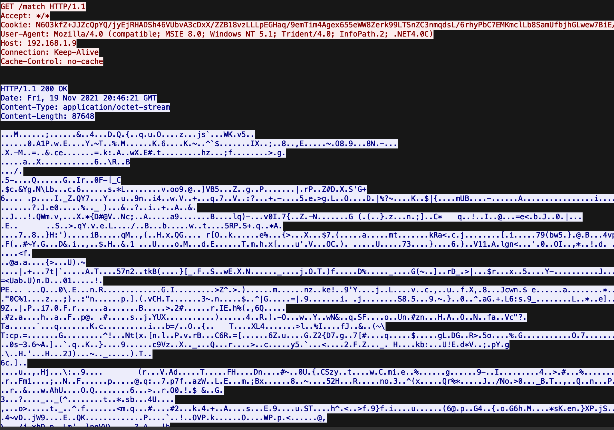

---

### Conclusion ###

The analysis indicates that the victim machine downloaded and likely executed a malicious payload, establishing a command-and-control (C2) channel. The next objective is to identify and decode the encoding or encryption mechanism used within the network traffic.

## Deeper Analysis

My initial thought process was to extract the beacon's content to get a better understanding of what was actually going on under the hood. After doing some research, I came across an excellent article by NVISO Labs on [Cobalt Strike: Decrypting Obfuscated Traffic – Part 4](https://blog.nviso.eu/2021/11/17/cobalt-strike-decrypting-obfuscated-traffic-part-4/). Following their guidance, I discovered a powerful Python script called `cs-parse-http-traffic.py`.

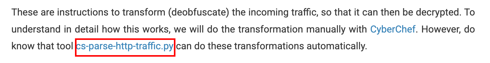

In Didier Stevens' repository, I also found a companion tool that is crucial for this specific challenge: `cs-extract-key.py`.

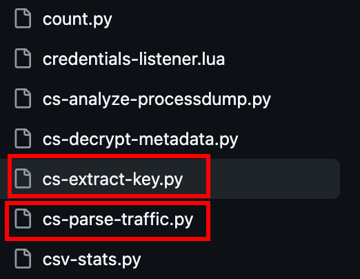

After retrieving the scripts and installing the required libraries, my first step was to run the built-in `help` command to understand the usage parameters.

For `cs-parse-http-traffic.py`:

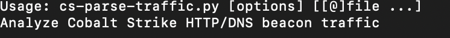
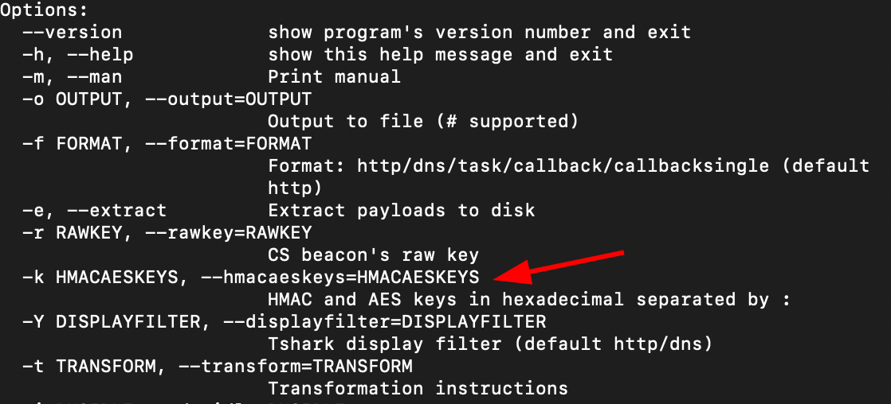

To successfully decrypt the traffic, we need to provide a key in the **`HMAC:AES`** format. Since I didn't have the key yet, I decided to pass the `unknown` parameter to see how the script handles it:

`python3 cs-parse-traffic.py -k unknown capture.pcap > output.txt`

The output gave me a detailed log of the encrypted traffic, providing insights into the payload length, HTTP requests, and packet numbers. This is exactly where `cs-extract-key.py` comes into play.

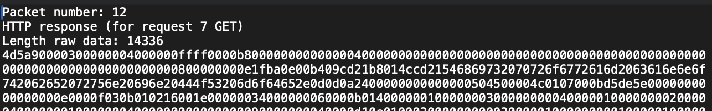

---

### Key Extraction

Taking a look at the help menu for `cs-extract-key.py`:

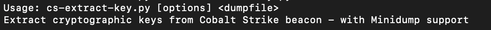

A massive advantage here is that **the script supports minidump formats!**

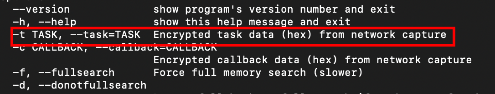

By using the `-t` flag, we can feed the script a chunk of encrypted data from the traffic we just parsed. You can select data from any packet to act as the input, but for efficiency, I chose the one with the smallest payload length.

`python3 cs-extract-key.py -t a4940d6ff0a59421822467d80d1b620bc7ecfa661c452a85c0486b56aa752e908c4aeb3f2f0a64d9c02d7025713867ee freesteam.dmp`

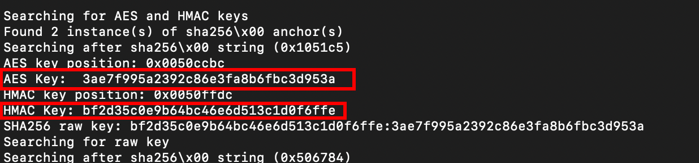

---

### Traffic Decryption

With the newly discovered key, I headed back to `cs-parse-http-traffic.py` and replaced the `unknown` parameter with our valid **`HMAC:AES`** key:

`python3 cs-parse-traffic.py -k bf2d35c0e9b64bc46e6d513c1d0f6ffe:3ae7f995a2392c86e3fa8b6fbc3d953a capture.pcap`

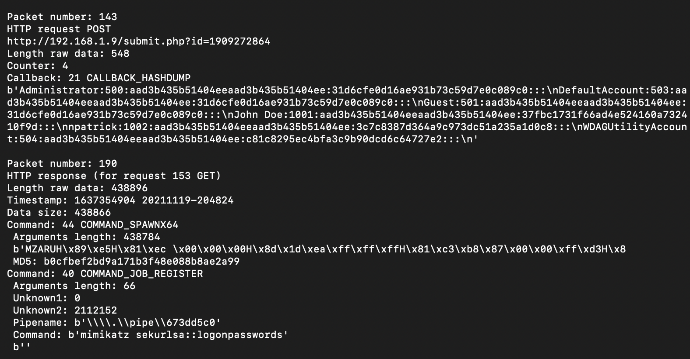

Once decrypted, the traffic revealed some incredibly juicy information:

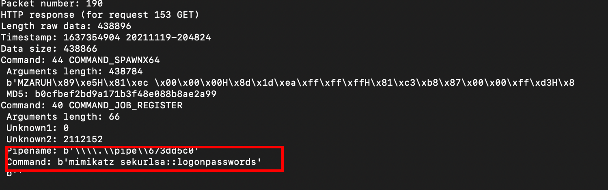 
*Evidence of `mimikatz` execution and user passwords.*

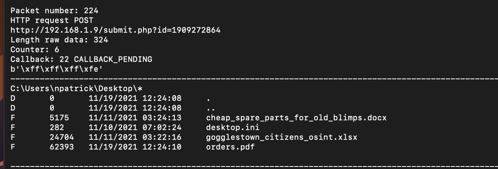 
*A snapshot of the victim's desktop.*

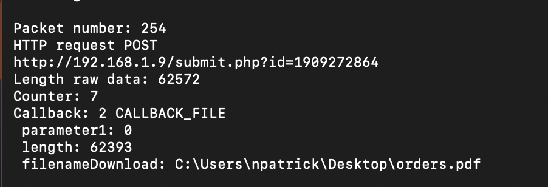 
*A PDF file being downloaded.*

---

### Extracting Files

Reviewing the help options for `cs-parse-http-traffic.py` once more, I spotted the `-e` flag, which allows for direct payload extraction from the network traffic. Let's pull those files out:

`python3 cs-parse-traffic.py -k bf2d35c0e9b64bc46e6d513c1d0f6ffe:3ae7f995a2392c86e3fa8b6fbc3d953a capture.pcap -e`

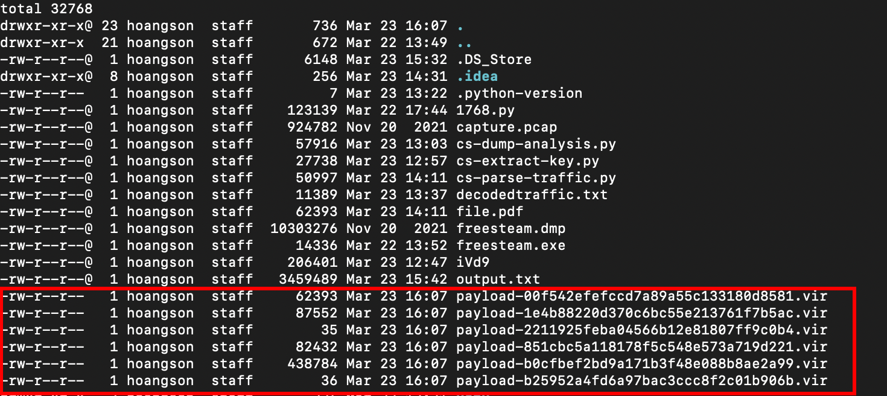

Running the `file` command on the output helped me identify the extracted payloads: one PDF, an ASCII text file, and a few DLLs. 

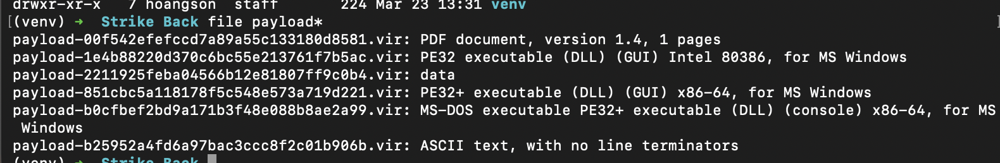

Naturally, the PDF immediately caught my attention. I renamed the file with a `.pdf` extension, opened it up, and there it was—the flag.

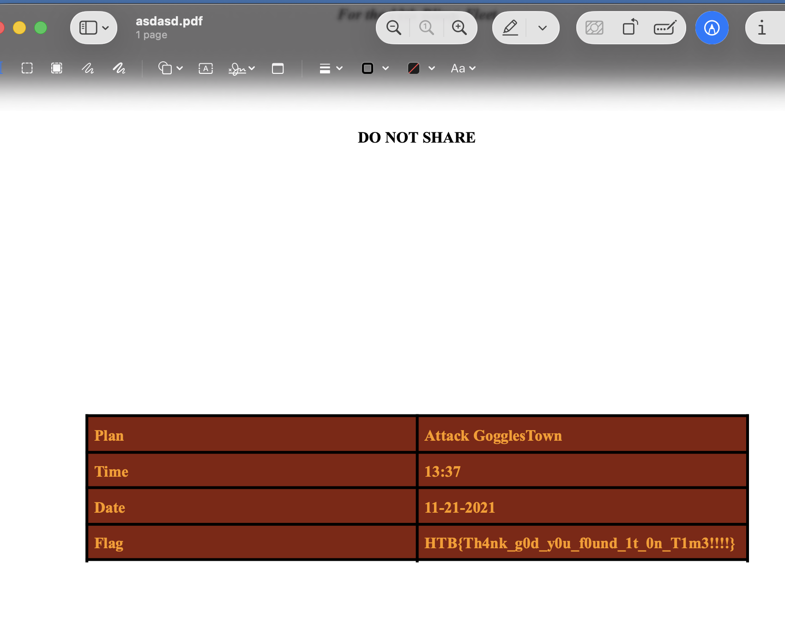

---

### Final Flag

> **`HTB{Th4nk_g0d_y0u_f0und_1t_0n_T1m3!!!!!}`**

