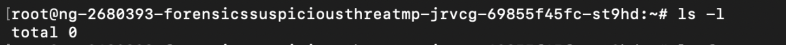
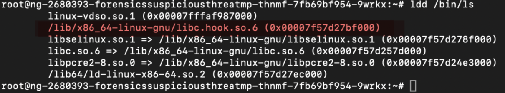
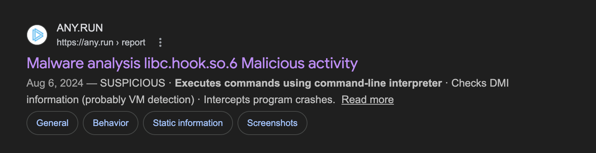
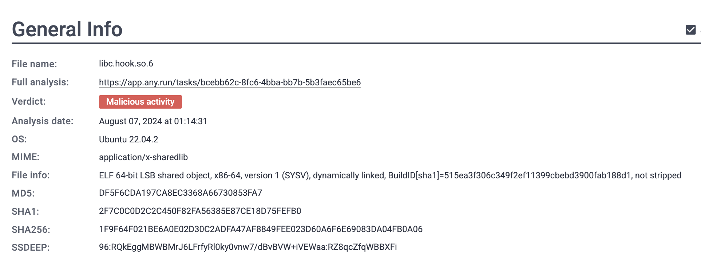
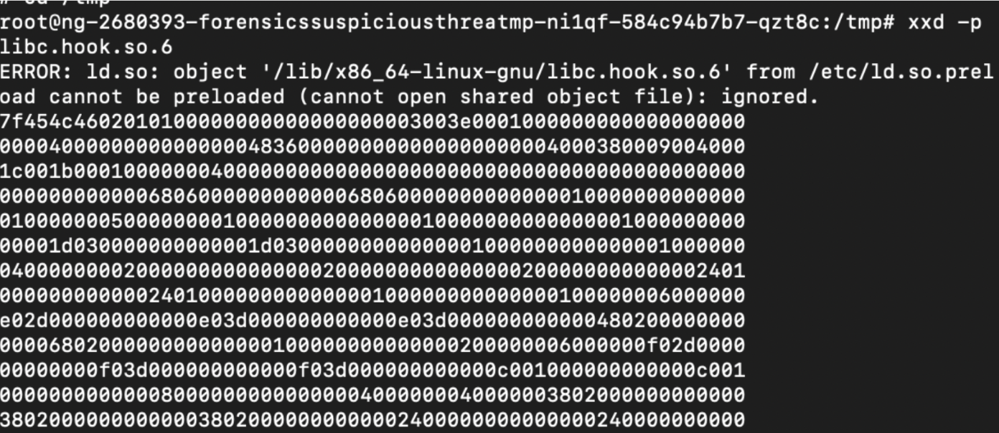
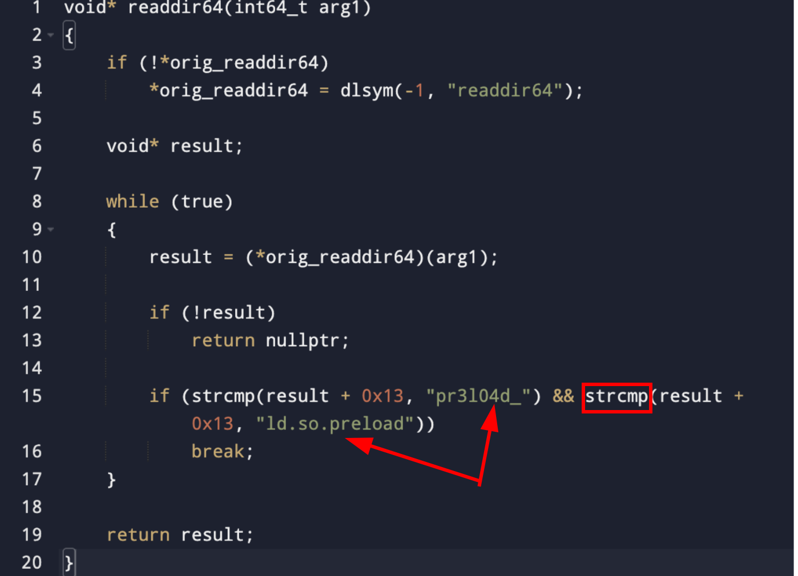
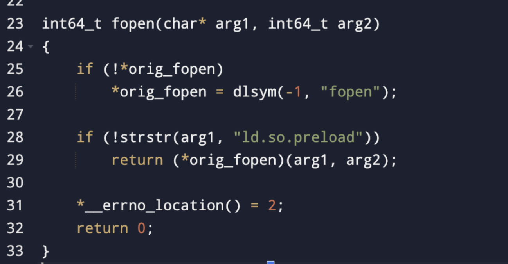
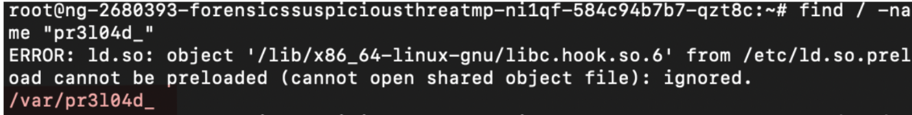
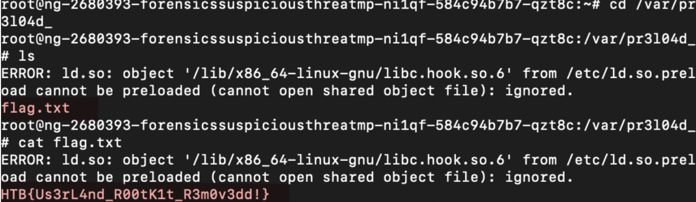

# Challenge Scenario

Our SSH server is exhibiting unusual behavior: library linking errors are appearing, and critical directories seem to be missing despite their confirmed existence.

This raises suspicion of a potential **userland rootkit** manipulating the system.

The objective is to investigate anomalies in the library loading process and filesystem to uncover any hidden manipulations.

---

## Initial Analysis

Upon gaining access to the target machine via SSH, I began by listing the directory contents to assess the system state.

However, the output appeared empty — highly unusual and immediately suggestive of tampering with standard system utilities.



To investigate further, I executed:
```bash
ldd /bin/ls
```


This revealed the shared libraries loaded by the `ls` binary. Among them, one entry stood out:
```
libc.hook.so.6
```

This library is highly suspicious. A quick search on google confirmed its association with malicious behavior, commonly used in **userland rootkits** to intercept and manipulate system calls.





---

## Malware Extraction

To analyze the suspicious library further, it needed to be extracted from the compromised environment.

Since direct file transfer was not available, I performed a manual extraction:

- Dumped the binary using a hexdump technique



- Parse the binary in `HexedIT`
- Downloaded a clean 1:1 copy to my local machine

This allowed for safe offline analysis.

---

## Rootkit Behavior

The extracted binary was loaded into a decompiler for inspection.

The analysis revealed that the shared object implements **function hooking** via `LD_PRELOAD` — a common technique employed by userland rootkits to intercept standard library calls.


### File Hiding Mechanism

The rootkit intercepts directory listing functions and compares filenames against the following hardcoded strings: ``
ld.so.preload ``
``
pr3l04d_ 
``




If a match is found, the corresponding file or directory is excluded from results, effectively hiding it from standard tools such as `ls`.

### `fopen` Hooking

The rootkit also hooks the `fopen` function:



- It resolves the original `fopen` using `dlsym` to prevent recursion
- For most files, it behaves normally
- When attempting to open `ld.so.preload`, it returns `NULL`

This prevents detection of the preload configuration file, which is critical to maintaining the rootkit's persistence on the system.

---

## Discovery

Based on the rootkit logic, I inferred that a hidden directory named `pr3l04d_` should exist on the filesystem.

By searching for this name explicitly, I was able to locate the hidden directory despite it not appearing in standard directory listings.



---

## Flag Retrieval

Inside the `pr3l04d_` directory, I discovered a file named:
```
flag.txt
```



Reading the file revealed the final flag.