## Challenge Scenario

> *"I had a dream that my PC was captured by evil daemons. The next day, strange things started happening to it."*

This challenge is split into **two flags** hidden across two forensic artifacts:

- `capture.pcap` — a network packet capture file
- `DbgInfo.DMP` — a Windows minidump crash file

The goal is to analyze both files, reverse-engineer an encrypted **C2 (Command and Control)** framework, and recover the hidden flags.

---

## Initial Investigation

### Analyzing the PCAP

I started by opening `capture.pcap` in **Wireshark**. The first thing I checked was the **IPv4 statistics** (Statistics → Conversations), and immediately noticed something unusual: the IP address `10.0.2.15` accounted for **100% of all traffic**. That means this is almost certainly internal/loopback traffic — the attacker and victim were communicating on the same local network.

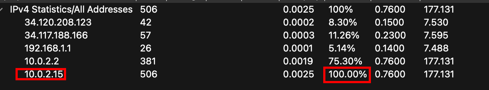

Next, I dug into the **TCP streams**. **Stream 1** was particularly interesting — it showed clear signs of a **C2 framework session**: commands being sent from the client, and responses coming back from the server. Both the commands and responses were **encrypted**. However, the stream also leaked two key fields in plaintext: an **`id`** field and a **`k`** field (which I suspected was some kind of encryption key — more on that later).

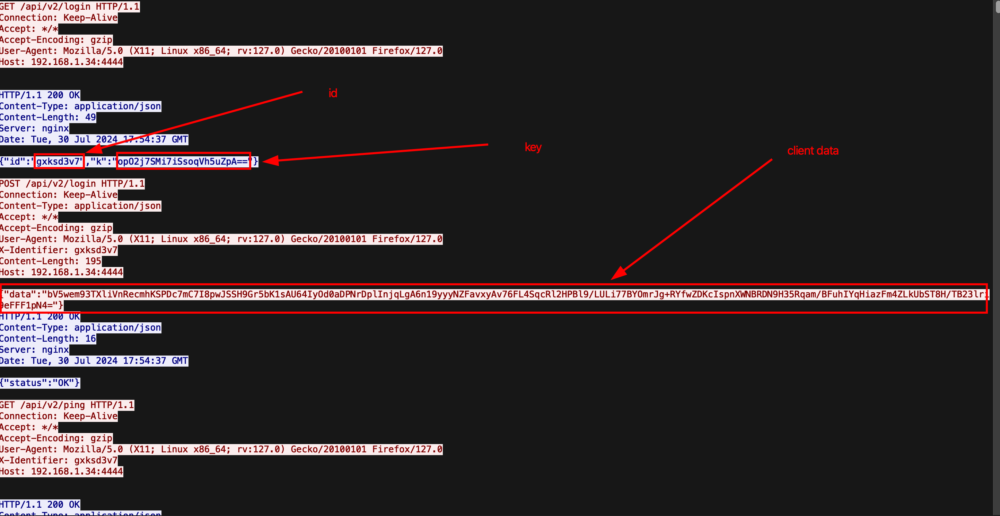

---

### Analyzing the Minidump

I then turned to `DbgInfo.DMP`. Using **Detect It Easy (DIE)**, I was able to inspect the embedded content inside the dump archive. One binary immediately caught my eye — it was written in **Nim**, a relatively uncommon compiled programming language.

I extracted the binary using DIE's built-in extract function.

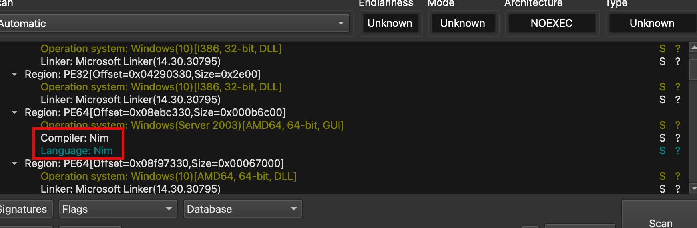

Since I wasn't familiar with any reliable decompiler for Nim code, I uploaded the binary to **VirusTotal** to look for any known malware family signatures. Sure enough, it came back flagged as part of a C2 framework called **Nimplant**.

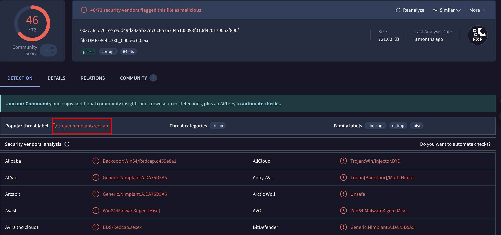

While there wasn't much public research on Nimplant at the time, it's **open source** — so I knew I could read through the source code to figure out the encryption scheme.

---

## Deeper Analysis

### Understanding Nimplant's Encryption

After spending quite a bit of time reading through the Nimplant source code (and even building and running the framework myself — it's surprisingly easy to deploy), I pieced together how the encryption works.

A helpful [YouTube tutorial](https://www.youtube.com/watch?v=kLVn5o6PT9Y&t=468s) walked me through deploying the implant by running `server.py`. One important thing the server does automatically: it creates a hidden file called **`.xorkey`**, which is used in the key encryption process.

---

### Source Code — `crypto.nim`

#### Key Encryption Function

```nim
proc xorString*(s: string, key: int): string {.noinline.} =
    var k = key
    result = s
    for i in 0 ..< result.len:
        for f in [0, 8, 16, 24]:
            result[i] = chr(uint8(result[i]) xor uint8((k shr f) and 0xFF))
        k = k +% 1
```

This implements a **custom XOR-based obfuscation scheme** used to hide the **AES key** during transmission. Here's what it does step by step:

Instead of sending the AES key in plaintext, Nimplant:
1. Generates a random string using `rndStr()`
2. XORs it with a **rolling integer key** (`k`)
3. Sends the XORed result as the `k` field visible in the PCAP

**The XOR mechanism works like this:**
- `k` is treated as a **32-bit integer**
- It is split into **4 bytes** using bit shifts:
  - `(k >> 0) & 0xFF`
  - `(k >> 8) & 0xFF`
  - `(k >> 16) & 0xFF`
  - `(k >> 24) & 0xFF`
- Each character of the string is XORed against all 4 bytes in sequence
- Then `k` is incremented by 1 before processing the next character

The **starting value of `k`** comes from the `.xorkey` file on disk.

---

#### Stream Decryption Function

```nim
proc decryptData*(blob: string, key: string): string =
    let 
        blobBytes = convertToByteSeq(decode(blob))
        iv = blobBytes[0 .. 15]
    var
        enc = newSeq[byte](blobBytes.len)
        dec = newSeq[byte](blobBytes.len)   
        keyBytes = convertToByteSeq(key)
        dctx: CTR[aes128]

    enc = blobBytes[16 .. ^1]
    dctx.init(keyBytes, iv)
    dctx.decrypt(enc, dec)
    dctx.clear()
    result = convertToString(dec).strip(leading=false, chars={'\0'})
```

This function decrypts the actual C2 traffic. The process is straightforward once you know the key:

1. **Base64 decode** the incoming blob
2. The **first 16 bytes** are the **IV (Initialization Vector)**
3. Everything after byte 16 is the **AES-128-CTR encrypted ciphertext**
4. Decrypt using the recovered AES key and the extracted IV

So the full pipeline is:

> `Base64 encoded blob` → decode → `[16-byte IV] + [AES-CTR ciphertext]` → decrypt with AES-128-CTR → plaintext

The hardest part of this challenge was actually recovering that AES key.

---

## Minidump Analysis

### Finding the AES Key

Since the `.xorkey` value wasn't immediately obvious, I fell back to a tried-and-true forensics technique: **strings dumping**. I used the `strings` command to extract all printable strings from the minidump.

Here's the key insight that narrowed my search: **Nimplant uses AES-128-CTR**, which requires a key that is **exactly 16 bytes** (16 ASCII characters). The key is also **randomly generated**, meaning it won't look like a real English word or phrase.

```bash
strings DbgInfo.DMP | grep -E '^.{16}$' > 16.txt
```

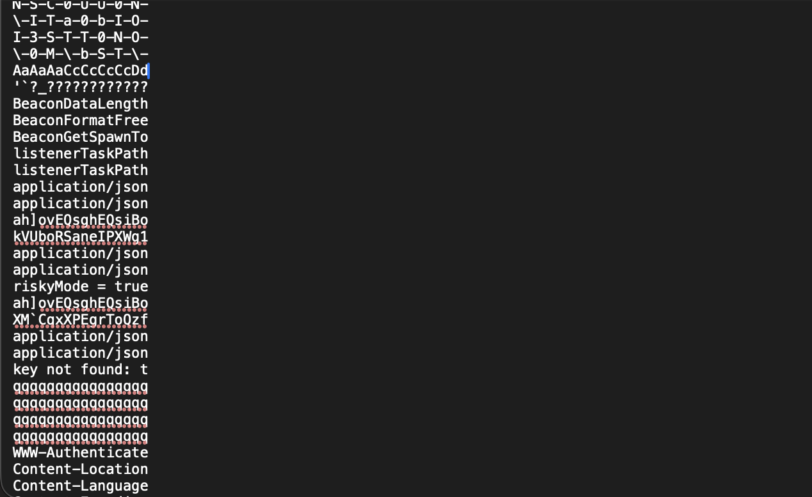

After filtering for exactly 16-character strings and manually skimming for anything that looked random (rather than human-readable), only **one candidate** stood out:

```
kVUboRSaneIPXWg1
```

I was excited — I thought I had the key! I plugged it into the decryption parameters and… it didn't work.

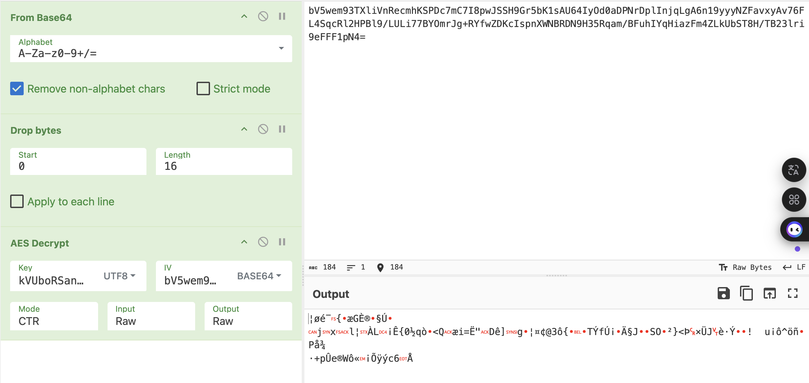

---

### Discovering the Second Nimplant Instance

Taking a closer look at the dump, I noticed something I had initially missed: there were **two separate streams of Nimplant traffic** — each with a different `k` and `id` value.

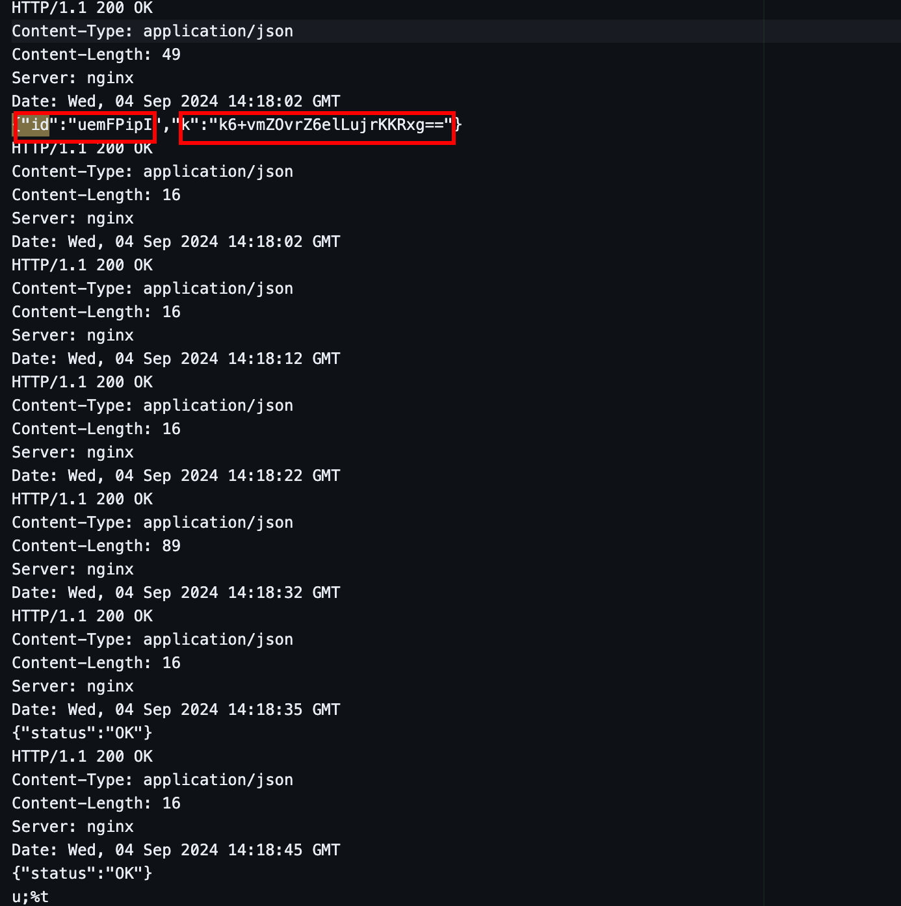

That's when it clicked. There must have been **two separate Nimplant deployments**. The key `kVUboRSaneIPXWg1` I found was the AES key for the **stream inside the dump** — not the one in the PCAP.

Here's the important part: Nimplant only generates a new `.xorkey` file if one doesn't already exist. If a `.xorkey` file is already present, **both deployments share the same xorkey value**. This meant:

- I know the **AES key** for the dump stream: `kVUboRSaneIPXWg1`
- I know the **encrypted `k` value** from the dump stream
- Therefore, I could **reverse the XOR encryption** to recover the shared `.xorkey` value
- Then use that xorkey to recover the AES key for the **PCAP stream**

To confirm `kVUboRSaneIPXWg1` was correct for the dump stream, I found an encrypted `{"data": ...}` field inside the dump and loaded it into **CyberChef** with the candidate key. The decryption succeeded.

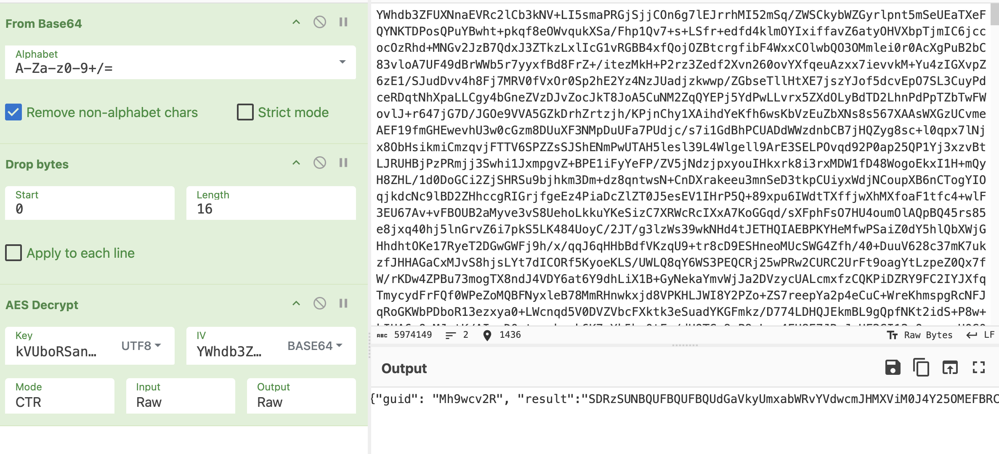

---

### Recovering the `.xorkey` Value

Now that I had a **known plaintext** (`kVUboRSaneIPXWg1`) and its corresponding **XOR-encrypted value** from the dump (`k6+vmZOvrZ6elLujrKKRxg==` in Base64), I wrote a script to brute-force the XOR seed:

```python
import base64

known_plain = b'kVUboRSaneIPXWg1'
known_xored = base64.b64decode("k6+vmZOvrZ6elLujrKKRxg==")

def xor_char(plain_byte, k):
    val = plain_byte
    for f in [0, 8, 16, 24]:
        val = val ^ ((k >> f) & 0xFF)
    return val

first_plain = known_plain[0]
first_xored = known_xored[0]

candidates = []
for seed in range(0xFFFFFFFF + 1):
    if xor_char(first_plain, seed) == first_xored:
        k = seed
        match = True
        for i in range(len(known_plain)):
            if xor_char(known_plain[i], k) != known_xored[i]:
                match = False
                break
            k = (k + 1) & 0xFFFFFFFF
        if match:
            print(f"[+] {seed} (0x{seed:08x})")
            candidates.append(seed)
            break
```

```
[+] XOR Seed found: 2288 (0x000008f0)
```

The `.xorkey` value is **`0x000008f0`** (decimal: `2288`).

---

### Recovering the PCAP AES Key

With the `.xorkey` value in hand, I could now reverse the XOR process on the `k` field from the PCAP (`opO2j7SMi7iSsoqVh5uZpA==`) to recover the real AES key:

```python
import base64

xor_seed = 0x000008f0
b64_obfuscated_key = "opO2j7SMi7iSsoqVh5uZpA=="

obfuscated = base64.b64decode(b64_obfuscated_key)

k = xor_seed
result = bytearray(len(obfuscated))

for i in range(len(obfuscated)):
    val = obfuscated[i]
    for f in [0, 8, 16, 24]:
        val = val ^ ((k >> f) & 0xFF)
    result[i] = val
    k = (k + 1) & 0xFFFFFFFF

aes_key = result.decode('utf-8')
print(f"[+] AES Key: {aes_key}")
```

```
[+] AES Key: ZjLtHquGbCxfsnoS
```

Plugging `ZjLtHquGbCxfsnoS` into the decryption setup for the PCAP stream — it worked!

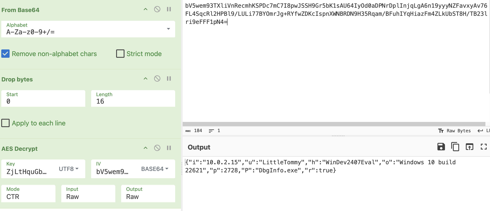

---

## Decrypting the C2 Traffic

### Finding the First Flag

With the PCAP now fully decryptable, I started going through all the encrypted payloads. One command immediately stood out: a **`screenshot`** command, followed by a massive Base64-encoded response.

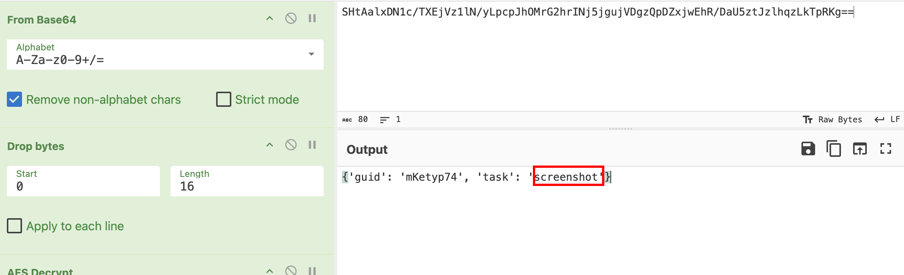

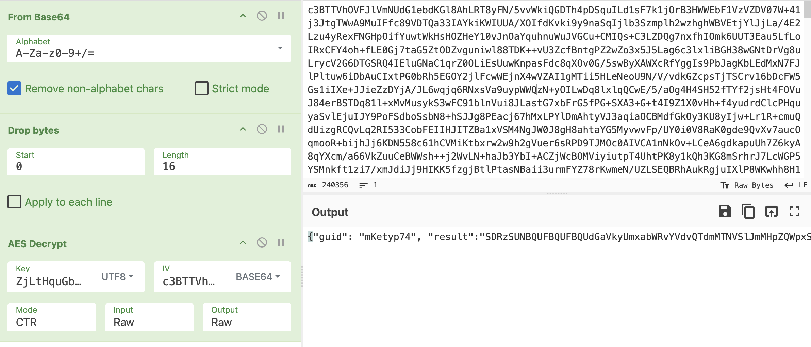

Looking at the Nimplant source code for the screenshot command:

```nim
# screenshot.nim

# Encode the image as PNG, and compress and encode it for transmission
result = base64.encode(compress(image.encodeImage(PngFormat)))
```

So the screenshot is processed like this:

> `Raw PNG image` → **gzip compress** → **Base64 encode** → transmit

To reverse it in CyberChef:

> **Base64 decode** → **gunzip decompress** → rendered image

One catch: the first Base64 decode revealed **a second layer of Base64**. After decoding both layers and decompressing, the screenshot was revealed — and it contained the **first flag**:

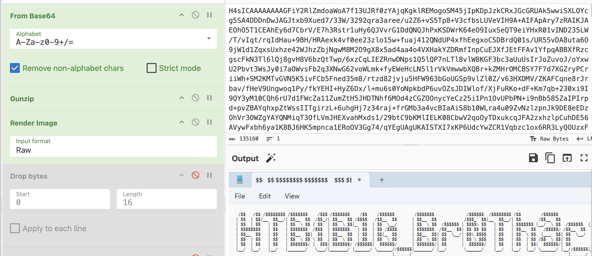

**First flag: `HTB{B1G_Br0Th3r_1$_WatCH1ng_`**

---

### Analyzing the Upload Command

Continuing through the TCP stream, I noticed the attacker executed an **`upload`** command, pushing a file named `37fd453cbfb4794f48283819f010a9fe rev.exe` onto the victim machine.

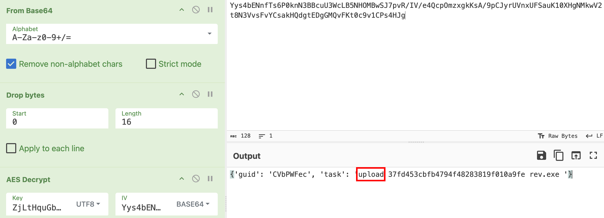

This was followed by a massive encrypted blob that didn't respond to the standard decryption parameters. I set it aside and continued decrypting the rest of the stream.

A subsequent command confirmed the upload was successful — the file `rev.exe` had landed on the victim machine:

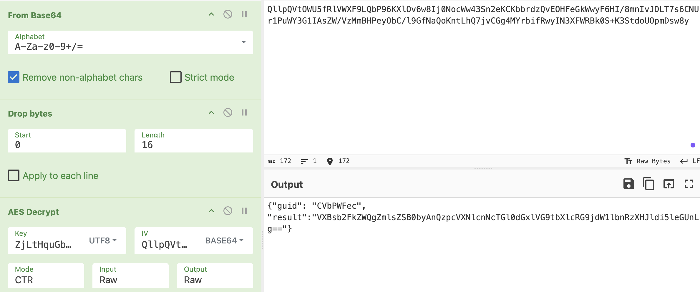
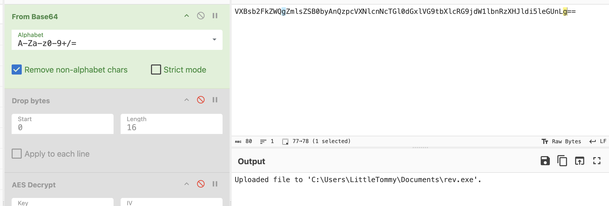

The final command the attacker ran was `whoami /all`, which returned the full user and privilege context of the compromised machine — showing the user `windev2407eval\littletommy` operating at **Medium Mandatory Level** with limited privileges.

```
USER INFORMATION
----------------

User Name                  SID                                           
========================== ==============================================
windev2407eval\littletommy S-1-5-21-1670481521-2005353806-3926057904-1001


GROUP INFORMATION
-----------------

Group Name                                                    Type             SID          Attributes                                        
============================================================= ================ ============ ==================================================
Everyone                                                      Well-known group S-1-1-0      Mandatory group, Enabled by default, Enabled group
NT AUTHORITY\Local account and member of Administrators group Well-known group S-1-5-114    Group used for deny only                          
BUILTIN\Administrators                                        Alias            S-1-5-32-544 Group used for deny only                          
BUILTIN\Remote Desktop Users                                  Alias            S-1-5-32-555 Mandatory group, Enabled by default, Enabled group
BUILTIN\Users                                                 Alias            S-1-5-32-545 Mandatory group, Enabled by default, Enabled group
BUILTIN\Performance Log Users                                 Alias            S-1-5-32-559 Mandatory group, Enabled by default, Enabled group
NT AUTHORITY\REMOTE INTERACTIVE LOGON                         Well-known group S-1-5-14     Mandatory group, Enabled by default, Enabled group
NT AUTHORITY\INTERACTIVE                                      Well-known group S-1-5-4      Mandatory group, Enabled by default, Enabled group
NT AUTHORITY\Authenticated Users                              Well-known group S-1-5-11     Mandatory group, Enabled by default, Enabled group
NT AUTHORITY\This Organization                                Well-known group S-1-5-15     Mandatory group, Enabled by default, Enabled group
NT AUTHORITY\Local account                                    Well-known group S-1-5-113    Mandatory group, Enabled by default, Enabled group
LOCAL                                                         Well-known group S-1-2-0      Mandatory group, Enabled by default, Enabled group
NT AUTHORITY\NTLM Authentication                              Well-known group S-1-5-64-10  Mandatory group, Enabled by default, Enabled group
Mandatory Label\Medium Mandatory Level                        Label            S-1-16-8192                                                    


PRIVILEGES INFORMATION
----------------------

Privilege Name                Description                          State   
============================= ==================================== ========
SeShutdownPrivilege           Shut down the system                 Disabled
SeChangeNotifyPrivilege       Bypass traverse checking             Enabled 
SeUndockPrivilege             Remove computer from docking station Disabled
SeIncreaseWorkingSetPrivilege Increase a process working set       Disabled
SeTimeZonePrivilege           Change the time zone                 Disabled
```

---

## Reversing the Uploaded Binary

### Decrypting the Uploaded Payload

The uploaded `rev.exe` payload was the last piece of the puzzle. First, I needed to understand how Nimplant encrypts file uploads. From `upload.nim`:

```nim
# upload.nim

# Handle the encrypted and compressed response
var dec = decryptData(res.body, li.cryptKey)
var decStr: string = cast[string](dec)
var fileBuffer: seq[byte] = convertToByteSeq(uncompress(decStr))
```

So the upload stream follows the same pipeline as the C2 traffic:

> `Binary file` → **gzip compress** → **AES-128-CTR encrypt** → **Base64 encode** → transmit

I wrote a Python script to reverse this:

```python
import base64
import zlib
from Crypto.Cipher import AES
from Crypto.Util import Counter


def decrypt_nimplant_upload(b64_blob, aes_key):
    try:
        raw_data = base64.b64decode(b64_blob)
    except Exception as e:
        print(f"[-] Base64 decoding error: {e}")
        return None

    if len(raw_data) < 16:
        print("[-] Data too short (needs at least 16 bytes for IV).")
        return None

    iv = raw_data[:16]
    ciphertext = raw_data[16:]

    try:
        ctr = Counter.new(128, initial_value=int.from_bytes(iv, byteorder='big'))
        cipher = AES.new(aes_key, AES.MODE_CTR, counter=ctr)

        decrypted_bytes = cipher.decrypt(ciphertext)

        try:
            decompressed_data = zlib.decompress(decrypted_bytes, zlib.MAX_WBITS | 32)
            print(f"[+] Decompressed size: {len(decompressed_data)} bytes")

            with open("decrypted_payload.bin", "wb") as f:
                f.write(decompressed_data)

            return decompressed_data

        except zlib.error:
            print("[*] Zlib decompression failed, returning raw data...")
            return decrypted_bytes

    except Exception as e:
        print(f"[-] Decryption failed: {e}")
        return None


if __name__ == "__main__":
    AES_KEY_BYTES = b'ZjLtHquGbCxfsnoS'

    try:
        with open("upload.txt", "r") as f:
            CIPHERTEXT_B64 = f.read().strip()
    except Exception as e:
        print(f"[-] Failed to read upload.txt: {e}")
        exit(1)

    result = decrypt_nimplant_upload(CIPHERTEXT_B64, AES_KEY_BYTES)

    if result:
        print("[+] Process complete.")
```

The result was a Windows executable. I uploaded it to **Detect It Easy** and confirmed it was a **C++ binary**.

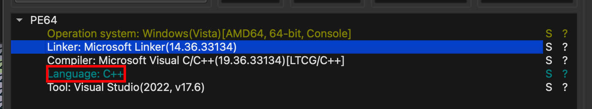

---

### Reversing the Binary with IDA

I loaded `decrypted_payload.bin` into **IDA Pro** and located the `main` function:

```c
int __fastcall main(int argc, const char **argv, const char **envp)
{
  int ticks; // eax
  int v4; // ebx
  int v5; // ebx
  DWORD LastError; // eax
  int v7; // eax
  _BYTE *v8; // rcx
  unsigned __int8 v9; // r8
  char *v10; // r10
  int v11; // r9d
  char v12; // r11
  unsigned __int8 v13; // di
  __int64 i; // r11
  char v15; // r8
  _BYTE v17[264]; // [rsp+20h] [rbp-108h] BYREF
  DWORD flOldProtect; // [rsp+140h] [rbp+18h] BYREF
  __int64 v19; // [rsp+148h] [rbp+20h] BYREF

  ticks = Xtime_get_ticks();
  v19 = 5;
  v4 = ticks;
  sub_140001280(&v19);
  if ( (double)(int)(Xtime_get_ticks() - v4) / 10000000.0 <= 4.5 )
    exit(0);
  v5 = 0;
  flOldProtect = 0;
  if ( !VirtualProtect(qword_1400014B0, 0x2AFu, 0x40u, &flOldProtect) )
  {
    LastError = GetLastError();
    sub_140001030("Error: %d", LastError);
  }
  v7 = 0;
  v8 = v17;
  do
    *v8++ = v7++;
  while ( v7 < 256 );
  v9 = 0;
  v10 = v17;
  v11 = 0;
  do
  {
    v12 = *v10;
    v9 += *v10 + aXobvreX11mb[v11++ % 0xCu];
    *v10++ = v17[v9];
    v17[v9] = v12;
  }
  while ( v11 < 256 );
  v13 = 0;
  for ( i = 0; i < 687; ++i )
  {
    v5 = (v5 + 1) % 256;
    v15 = v17[v5];
    v13 += v15;
    v17[v5] = v17[v13];
    v17[v13] = v15;
    *((_BYTE *)qword_1400014B0 + i) ^= v17[(unsigned __int8)(v17[v5] + v15)];
  }
  VirtualProtect(qword_1400014B0, 0x2AFu, flOldProtect, &flOldProtect);
  ((void (*)(void))qword_1400014B0[0])();
  return 0;
}
```

Let me break this down into its three stages:

---

#### Stage 1 — Sandbox Detection (Timing Check)

```c
ticks = Xtime_get_ticks();
v19 = 5;
sub_140001280(&v19);  // Sleep for ~5 seconds
if ( (double)(int)(Xtime_get_ticks() - v4) / 10000000.0 <= 4.5 )
    exit(0);
```

The binary sleeps for ~5 seconds and measures elapsed time. If the measured time is ≤ 4.5 seconds, it exits. This is a **timing-based sandbox evasion** technique — automated sandboxes often skip or speed up sleep calls, so this check catches them.

---

#### Stage 2 — RC4 Key Scheduling (KSA)

```c
v7 = 0;
v8 = v17;
do
    *v8++ = v7++;
while ( v7 < 256 );
// ...
do
{
    v12 = *v10;
    v9 += *v10 + aXobvreX11mb[v11++ % 0xCu];
    *v10++ = v17[v9];
    v17[v9] = v12;
}
while ( v11 < 256 );
```

This initializes a 256-byte **S-box** (the array `v17[256]`) starting with values 0–255, then shuffles it using a hardcoded **12-byte key** stored in `aXobvreX11mb`. This is the classic **RC4 Key Scheduling Algorithm (KSA)**.

---

#### Stage 3 — RC4 PRGA + Payload Decryption

```c
for ( i = 0; i < 687; ++i )
{
    v5 = (v5 + 1) % 256;
    v15 = v17[v5];
    v13 += v15;
    v17[v5] = v17[v13];
    v17[v13] = v15;
    *((_BYTE *)qword_1400014B0 + i) ^= v17[(unsigned __int8)(v17[v5] + v15)];
}
```

This is the **RC4 Pseudo-Random Generation Algorithm (PRGA)**. It generates a keystream and XORs it byte-by-byte against the encrypted payload stored at `qword_1400014B0`. The payload is exactly **687 bytes** (0x2AF) long.

After decryption, it calls `VirtualProtect` to restore the original memory permissions and then **executes the decrypted shellcode** directly.

---

### Extracting and Decrypting the Shellcode

In IDA, I clicked on `qword_1400014B0` to navigate to the raw encrypted data:

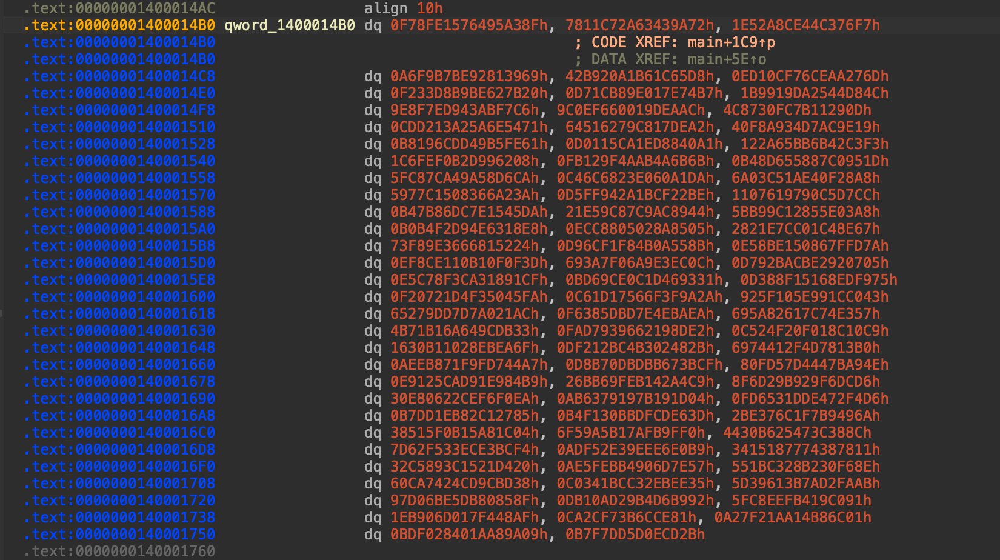

I extracted the hex values row by row and wrote a Python script to apply the RC4 decryption using `aXobvreX11mb` as the key:

```python
import struct

rows = [
    ("0F78FE1576495A38F", "7811C72A63439A72",  "1E52A8CE44C376F7"),
    ("A6F9B7BE92813969",  "42B920A1B61C65D8",  "ED10CF76CEAA276D"),
    ("F233D8B9BE627B20",  "D71CB89E017E74B7",  "1B9919DA2544D84C"),
    ("9E8F7ED943ABF7C6",  "9C0EF660019DEAAC",  "4C8730FC7B11290D"),
    ("CDD213A25A6E5471",  "64516279C817DEA2",  "40F8A934D7AC9E19"),
    ("B8196CDD49B5FE61",  "D0115CA1ED8840A1",  "122A65BB6B42C3F3"),
    ("1C6FEF0B2D996208",  "FB129F4AAB4A6B6B",  "B48D655887C0951D"),
    ("5FC87CA49A58D6CA",  "C46C6823E060A1DA",  "6A03C51AE40F28A8"),
    ("5977C1508366A23A",  "D5FF942A1BCF22BE",  "1107619790C5D7CC"),
    ("B47B86DC7E1545DA",  "21E59C87C9AC8944",  "5BB99C12855E03A8"),
    ("B0B4F2D94E6318E8",  "ECC8805028A8505",   "2821E7CC01C48E67"),
    ("73F89E3666815224",  "D96CF1F84B0A558B",  "E58BE150867FFD7A"),
    ("EF8CE110B10F0F3D",  "693A7F06A9E3EC0C",  "D792BACBE2920705"),
    ("E5C78F3CA31891CF",  "BD69CE0C1D469331",  "D3B8F15168EDF975"),
    ("F20721D4F35045FA",  "C61D17566F3F9A2A",  "925F105E991CC043"),
    ("65279DD7D7A021AC",  "F6385DBD7E4EBAEA",  "695A82617C74E357"),
    ("4B71B16A649CDB33",  "FAD7939662198DE2",  "C524F20F018C10C9"),
    ("1630B11028EBEA6F",  "DF212BC4B302482B",  "6974412F4D7813B0"),
    ("AEEB871F9FD744A7",  "D8B70DBDBB673BCF",  "80FD57D4447BA94E"),
    ("E9125CAD91E984B9",  "26BB69FEB142A4C9",  "8F6D29B929F6DCD6"),
    ("30E80622CEF6F0EA",  "AB6379197B191D04",  "FD6531DDE472F4D6"),
    ("B7DD1EB82C12785",   "B4F130BBDFCDE63D",  "2BE376C1F7B9496A"),
    ("38515F0B15A81C04",  "6F59A5B17AFB9FF0",  "4430B625473C388C"),
    ("7D62F533ECE3BCF4",  "ADF52E39EEE6E0B9",  "3415187774387811"),
    ("32C5893C1521D420",  "AE5FEBB4906D7E57",  "551BC328B230F68E"),
    ("60CA7424CD9CBD38",  "C0341BCC32EBEE35",  "5D39613B7AD2FAAB"),
    ("97D06BE5DB80858F",  "DB10AD29B4D6B992",  "5FC8EEFB419C091"),
    ("1EB906D017F448AF",  "CA2CF73B6CCE81",    "A27F21AA14B86C01"),
    ("BDF028401AA89A09",  "B7F7DD5D0ECD2B",    None),
]

RC4_KEY = b"xobvrE_x11mb"

def rc4_decrypt(key: bytes, data: bytes) -> bytes:
    S = list(range(256))
    j = 0
    for i in range(256):
        j = (j + S[i] + key[i % len(key)]) & 0xFF
        S[i], S[j] = S[j], S[i]

    result = bytearray(data)
    i = j = 0
    for n in range(len(data)):
        i = (i + 1) & 0xFF
        t = S[i]
        j = (j + t) & 0xFF
        S[i], S[j] = S[j], S[i]
        result[n] ^= S[(S[i] + t) & 0xFF]

    return bytes(result)

# Build encrypted blob
encrypted = b""
for row in rows:
    for h in row:
        if h:
            encrypted += struct.pack("<Q", int(h, 16))

enc = encrypted[:687]
dec = rc4_decrypt(RC4_KEY, enc)

print(f"[*] Decrypted size: {len(dec)} bytes\n")
print("[*] HEX:")
print(dec.hex())

print("\n[*] ASCII (safe preview):")
print(dec.decode(errors="replace"))
```

Running the script revealed the **second flag** embedded in the decrypted shellcode:

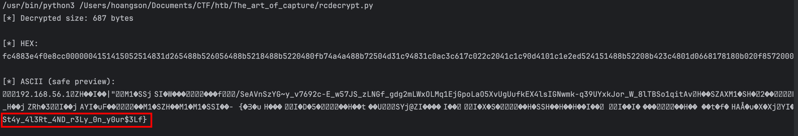

**Second flag: `St4y_4l3Rt_4ND_r3Ly_0n_y0ur$3Lf}`**

---

## Final Flag

Combining both parts:

```
HTB{B1G_Br0Th3r_1$_WatCH1ng_St4y_4l3Rt_4ND_r3Ly_0n_y0ur$3Lf}
```

---

## Summary — Attack Flow

Here's the full picture of what happened:

1. The attacker deployed **Nimplant**, a Nim-based C2 implant, on the victim's machine
2. Communications were encrypted with **AES-128-CTR**, with the AES key itself protected by a custom **XOR obfuscation scheme** keyed by a `.xorkey` file
3. The attacker used the C2 to take a **screenshot** of the victim's desktop (first flag)
4. The attacker uploaded a second binary (`rev.exe`) — a **C++ shellcode loader** that decrypts and executes embedded shellcode using **RC4** with a hardcoded key, while evading sandboxes via a timing check
5. The second flag was embedded inside the **RC4-decrypted shellcode** within `rev.exe`

---
