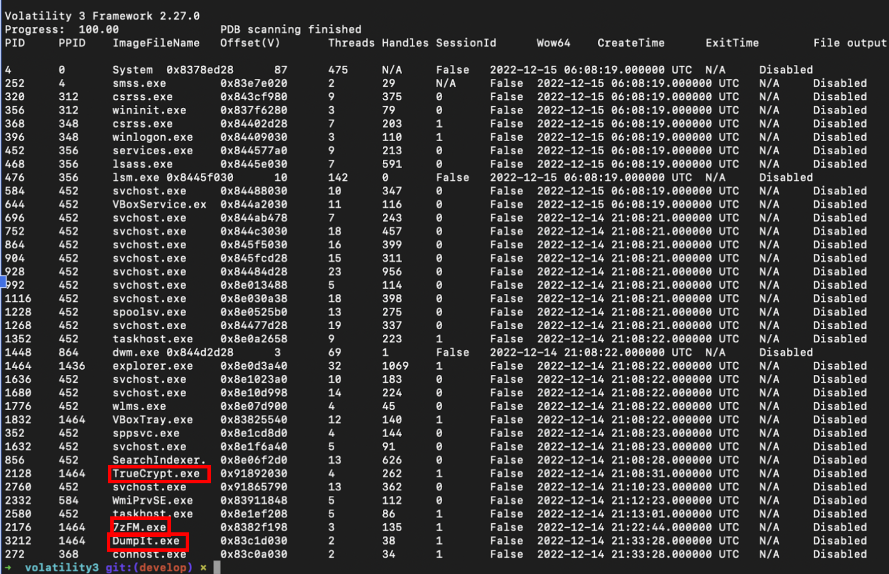
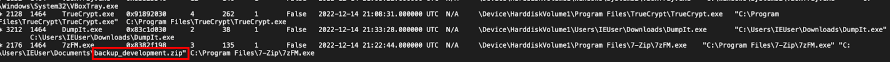
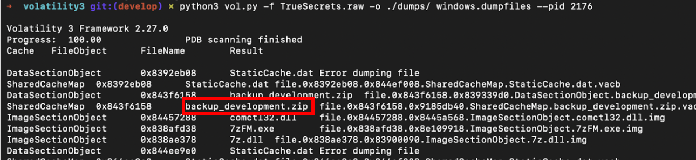
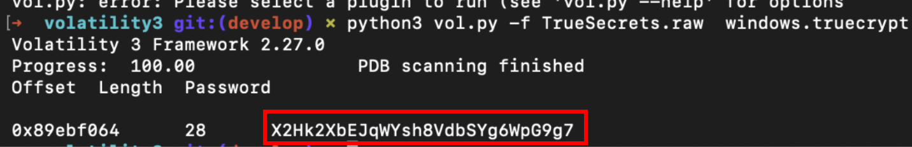
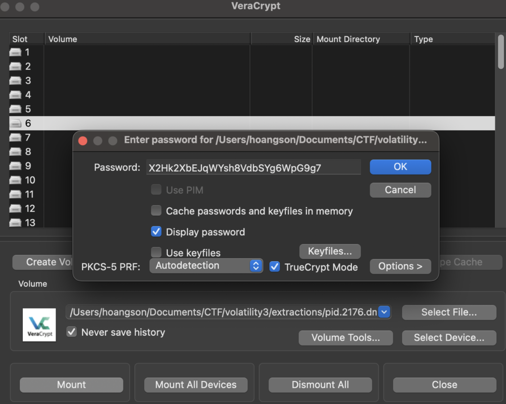
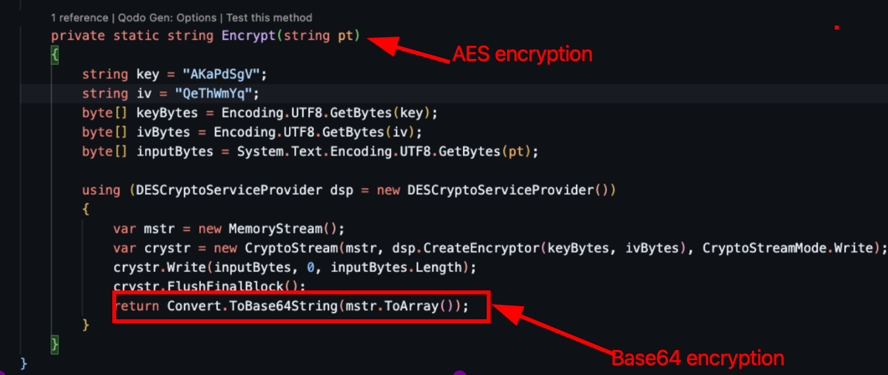
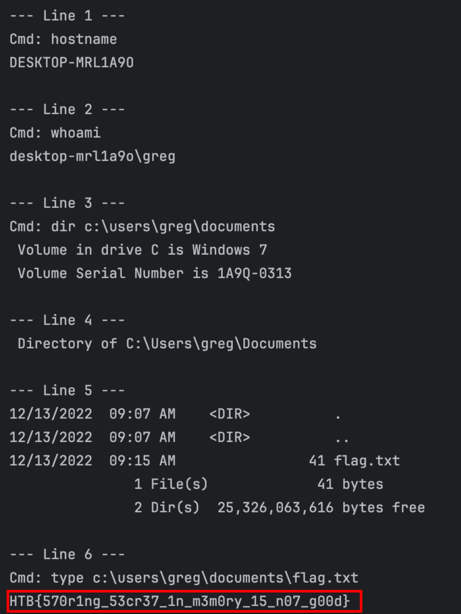

# Challenge Scenario
Our cybercrime unit has been investigating a well-known APT group for several months. The group has been responsible for several high-profile attacks on corporate organizations. However, what is interesting about that case, is that they have developed a custom command & control server of their own. Fortunately, our unit was able to raid the home of the leader of the APT group and take a memory capture of his computer while it was still powered on. Analyze the capture to try to find the source code of the server.

---

## Materials on Hand

- Memory dump file: `memory.raw`

---

## Initial Analysis

The provided file is a raw memory dump containing the volatile state of a Windows system. This includes:

- Running processes
- Loaded modules
- Open files
- Potentially sensitive data such as credentials and encryption keys

To begin the analysis, I used Volatility to enumerate running processes:
```bash
python3 vol.py -f TrueSecrets.raw windows.pslist
```



From the process list, three processes immediately stood out as suspicious:
```
TrueCrypt.exe
7zFM.exe
DumpIt.exe
```

These processes are commonly associated with the following:

- **TrueCrypt** → disk encryption
- **7zFM** → archive management
- **DumpIt** → memory acquisition

Their combination strongly suggests that sensitive data may have been archived and encrypted prior to the memory capture.

---

## Process Investigation

To gain deeper insight into process relationships, I used the process tree plugin:
```bash
python3 vol.py -f TrueSecrets.raw windows.pstree
```


The output revealed that under the following process:
```
PPID: 1464
PID:  2176 (7zFM.exe)
```



there existed a file named:
```
backup_development.zip
```

The presence of this archive alongside `TrueCrypt.exe` suggests that the file contains sensitive data that may be encrypted.

---

## Process Memory Dump

To extract the archive, I dumped the memory of the `7zFM.exe` process:
```bash
python3 vol.py -f TrueSecrets.raw windows.procdump --pid 2176 --dump-dir .
```

Within the dumped memory, I located the archive at:
```
0x843f6158
```



The extracted file was initially in `.zip.dat` format. After renaming it to `.zip`, it opened successfully.
Inside the archive, I found:
```
development.tc
```

This is a TrueCrypt container, indicating that its contents are encrypted.

---

## Password Recovery

Since TrueCrypt stores sensitive information in memory during active use, I leveraged Volatility's TrueCrypt plugin to recover it:
```bash
python3 vol.py -f TrueSecrets.raw windows.truecrypt
```



This successfully revealed the encryption password.

---

## Decryption

Using the recovered password, I mounted the `development.tc` container with VeraCrypt. Once decrypted, the container revealed several files, including source code and log files.



---

## Code Analysis

Upon inspecting the C# source file (`AgentServer.cs`) and its associated logs, I identified the encryption logic used for the stored data.

The program:

- Executes system commands
- Encrypts the output using **DES in CBC mode**
- Uses a fixed key and IV:
```
Key: AKAaPdSgV
IV:  QeThWmYq
```

- Encodes the encrypted output in Base64
- Stores the result in `.log.enc` files



---

## Log Decryption

To recover the original data, I ask AI to write a Python script that performs the following steps:

1. Base64-decodes the encrypted content
2. Decrypts it using DES-CBC with the identified key and IV
3. Removes padding
4. Converts the result back to readable UTF-8 text

```python
import base64

try:
    from Crypto.Cipher import DES
except Exception:
    import subprocess, sys
    subprocess.check_call([sys.executable, "-m", "pip", "install", "--quiet", "pycryptodome"])
    from Crypto.Cipher import DES


def pkcs7_unpad(data: bytes) -> bytes:
    if not data:
        return data
    pad = data[-1]
    if pad < 1 or pad > 8:
        raise ValueError("Invalid PKCS7 padding.")
    if data[-pad:] != bytes([pad]) * pad:
        raise ValueError("Invalid PKCS7 padding.")
    return data[:-pad]


b64_lines = [
    "wENDQtzYcL3CKv0lnnJ4hk0JYVJVBMwTj7a4Plqh86s=",
    "M35jHmvkY9WGLWdXoOBY0JrYhHmtC80Ohn+gLhaClb4QbACeOoSiYA==",
    "huF6Z1+isAzsqq9A0s+SI/u+aS/awPrAYd+mctDo7QEt+SpW2sELvSaxx6RrdK3vDavIszIatb4/1C77Zv3G0h78yhY2KXZFu8qAcYdN7tuOOlg1SLsdkhjn+CWTVwh7A8IS7NwwI=",
    "6ySb2CBt+Z1SZG6LB7/yLkC0eZ0VUaYW7N15aUsDAqzIYJWL/foyw==",
    "U2ltlYCyGAsml5xmAkE0P+/5MGUEW6jJPCteSeStd/cg9FKp89L/EksGB9OZ/hLbT44/Ur/6XL9a127v0+SzamFsgAeamiYTRfLQk2fQLsRPCY/VMDj0FWRGGIZyHXCVoOa4ePQB93Sq0tOEKT0",
    "+iTZBxkIgV9gWm/oyP/Uf6+qW+AkMT0KouTeamminxZ2efek8yfrP5L+mtFS+bWATTCjJDK2nLAdTKssL7CrHnVW8fmvc6mJR4Ismbs/d/fMDXQeiGXCA=="
]

key = b"AKaPdSgV"
iv = b"QeThWmYq"

for i, b64 in enumerate(b64_lines, start=1):
    try:
        ct = base64.b64decode(b64)
        cipher = DES.new(key, DES.MODE_CBC, iv)
        pt_padded = cipher.decrypt(ct)
        pt = pkcs7_unpad(pt_padded)
        decoded = pt.decode("utf-8", errors="replace")
        print(f"\n--- Line {i} ---")
        print(decoded)
    except Exception as e:
        print(f"\n--- Line {i} ---")
        print(f"Error: {e}")

print("\nAll lines processed.")
```

This works because DES decryption is the exact inverse of the encryption process when the correct key and IV are applied.

---

## Flag Retrieval

After decrypting the log files, the original command outputs were revealed, which contained the final flag.
