## Challenge Scenario

Wowza Grand College opened a job application portal where applicants could upload resumes for HR review. Later, the SOC team noticed suspicious certificate enrollments in their AD CS environment and collected evidence from the compromised domain controller.

## Evidence Used

- IIS access log: `log.txt`
- Windows Security log export: `security.json`
- NTFS artifacts: `$MFT` / `MFT.csv` and `$Extend\$J`
- Screenshots included with this writeup

---

#### Task 1: When did the threat actor first interact with the College's IT infrastructure?

**Answer:** `2025-07-27 19:27:35`

I started with the IIS log because the case begins with a resume upload website. The first clearly suspicious external request came from `143.198.231.177`:

```text
2025-07-27 19:27:35 192.168.189.150 GET /index.aspx - 80 - 143.198.231.177 ... 404
```

Even though the server returned `404`, this was still the first observed contact from the attacker-controlled IP. That made `2025-07-27 19:27:35` the starting point of the attack timeline.

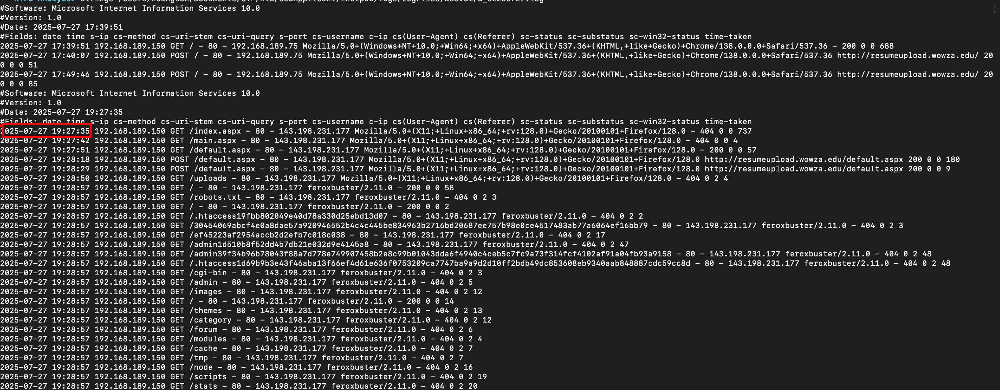

---

#### Task 2: What is the malicious IP address used for initial reconnaissance and discovery?

**Answer:** `143.198.231.177`

After finding the first request, I followed the same `c-ip` value in the IIS log. The address `143.198.231.177` kept requesting common discovery paths such as `/admin`, `/login`, `/wp-content`, `/uploads`, `/robots.txt`, and many random-looking paths.

The user agent also changed to `feroxbuster/2.11.0`, which made the behavior look like directory brute forcing rather than normal browsing.

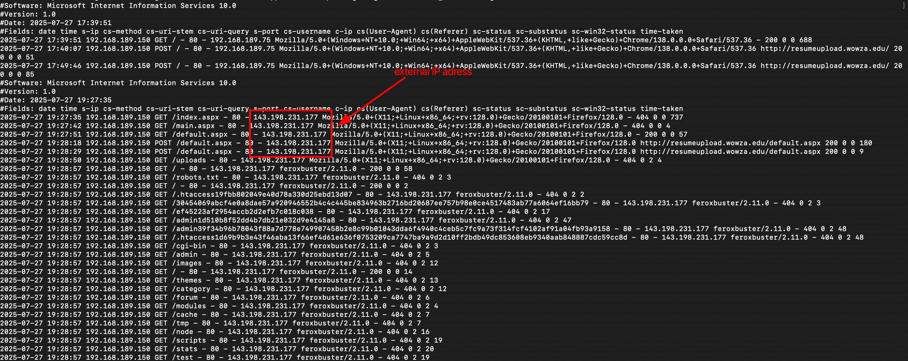

---

#### Task 3: The threat actor uploaded a file using the file upload functionality. Under what name did the server store the uploaded resume file?

**Answer:** `Resume9_eba15ba0-81ca-4d0f-9fad-3fc1fc92c181.pdf`

The attacker submitted data to the upload page:

```text
2025-07-27 19:32:28 ... POST /default.aspx ... 143.198.231.177 ... 200
```

Shortly after that, the same IP requested a new file from the `/resumes/` directory:

```text
2025-07-27 19:33:02 ... GET /resumes/Resume9_eba15ba0-81ca-4d0f-9fad-3fc1fc92c181.pdf ... 200
```

That showed me the uploaded resume had been stored by the application as:

```text
Resume9_eba15ba0-81ca-4d0f-9fad-3fc1fc92c181.pdf
```

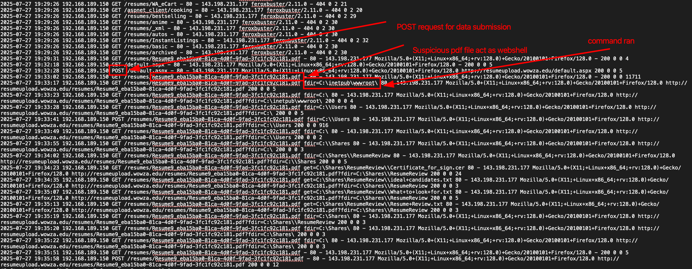

One thing I had to keep in mind from this point forward was URL encoding. Some IIS query strings used encodings like `%3a` for `:` and `%2f` for `/`, while spaces sometimes appeared as `+`. I decoded those values while writing the investigation so the Windows paths are easier to read.

---

#### Task 4: The threat actor uploaded another file in order to change the behavior of this website, allowing the first uploaded file to act as a webshell. What is the name of the uploaded file?

**Answer:** `web.config`

At first, the file looked like a normal PDF upload. The part that changed my direction was what happened next: the `.pdf` endpoint started accepting parameters such as `fdir=`, `get=`, and `del=`.

Examples from the IIS log:

```text
GET /resumes/Resume9_...pdf fdir=C:\inetpub\wwwroot\
GET /resumes/Resume9_...pdf get=C:\Shares\ResumeReview\\Certificate_for_sign.cer
GET /resumes/Resume9_...pdf fdir=C:\inetpub\wwwroot\resumes\&del=...
```

A real PDF should not browse directories, retrieve files, or delete files. That meant IIS/ASP.NET was treating the uploaded PDF as server-side code.

This is where I had to research IIS behavior. Microsoft documents that IIS `<handlers>` mappings define how requests for specific extensions or URLs are processed, and that these mappings can be configured in `web.config` files. I also found Soroush Dalili's writeup on uploading `web.config` files, which shows how this can be abused in ASP.NET/IIS environments to make an uploaded file execute as server-side code.

Sources:

- [Microsoft IIS handlers documentation](https://learn.microsoft.com/en-us/iis/configuration/system.webserver/handlers/)
- [Microsoft ASP.NET Core web.config documentation](https://learn.microsoft.com/en-us/aspnet/core/host-and-deploy/iis/web-config)
- [Uploading web.config for Fun and Profit 2](https://soroush.me/blog/uploading-web-config-for-fun-and-profit-2)

After that research, `web.config` made sense as the second uploaded file. It changed how the `/resumes/` directory handled the PDF file and allowed the first upload to behave as a web shell.

---

#### Task 5: Using the webshell, the threat actor uploaded a file on the endpoint to facilitate initial remote access. Identify the full path of this file.

**Answer:** `C:\inetpub\wwwroot\resumes\8619.exe`

Once I knew the PDF was acting as a web shell, I looked for tools placed in the same directory. The cleanup phase showed the attacker deleting this file:

```text
2025-07-27 20:11:13 ... del=C:\inetpub\wwwroot\resumes\\8619.exe ... 200
```

The USN Journal confirmed the file had been created earlier:

```text
2025-07-27T19:35:58.859972+00:00 8619.exe DATA_EXTEND|FILE_CREATE|CLOSE
```

I also checked the filename/hash against public malware reputation sources during the original investigation. Those results were not the primary proof for the answer, but they helped me understand why `8619.exe` was likely an initial access payload instead of a normal uploaded file.

So the full path of the file used for initial remote access was:

```text
C:\inetpub\wwwroot\resumes\8619.exe
```

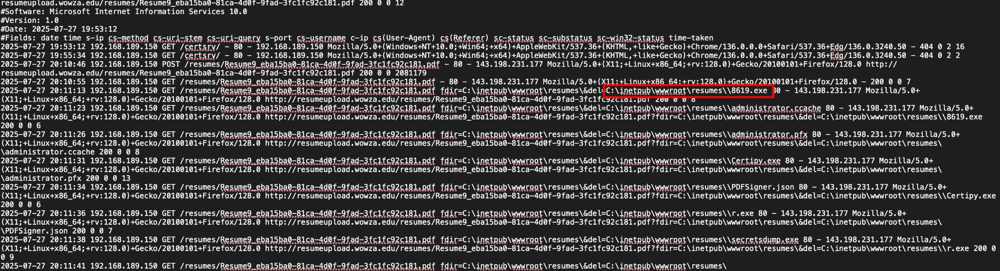

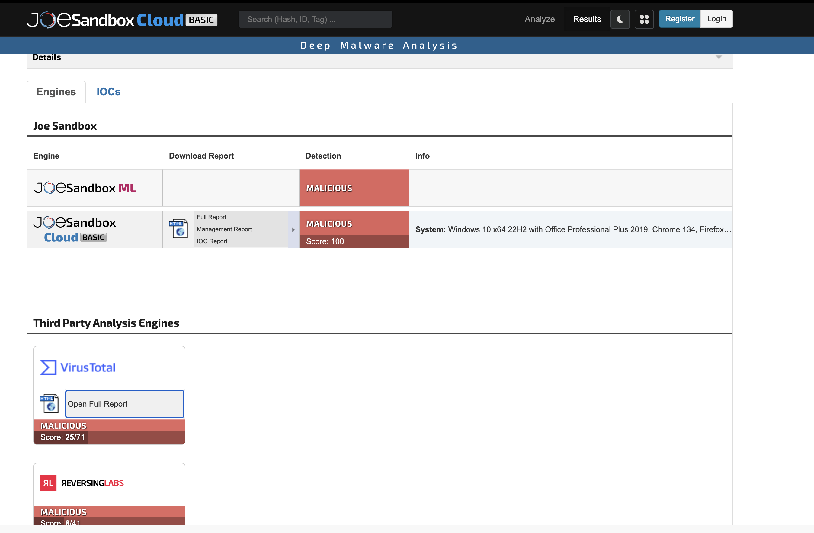

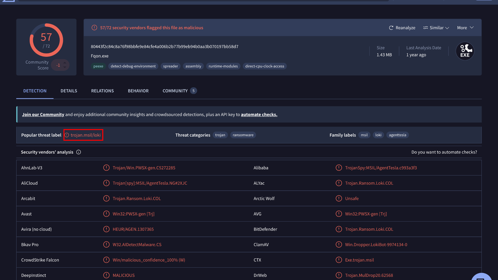

---

#### Task 6: The threat actor accessed a shared folder meant for the resume reviewers. What is the full path of the first file they retrieved?

**Answer:** `C:\Shares\ResumeReview\Certificate_for_sign.cer`

The attacker used the web shell to browse from the web root to the root of `C:\`, then into `C:\Shares\ResumeReview`:

```text
fdir=C:\
fdir=C:\Shares
fdir=C:\Shares\\ResumeReview
```

The first `get=` request from that folder retrieved:

```text
C:\Shares\ResumeReview\\Certificate_for_sign.cer
```

After normalizing the double slash, the full path is:

```text
C:\Shares\ResumeReview\Certificate_for_sign.cer
```

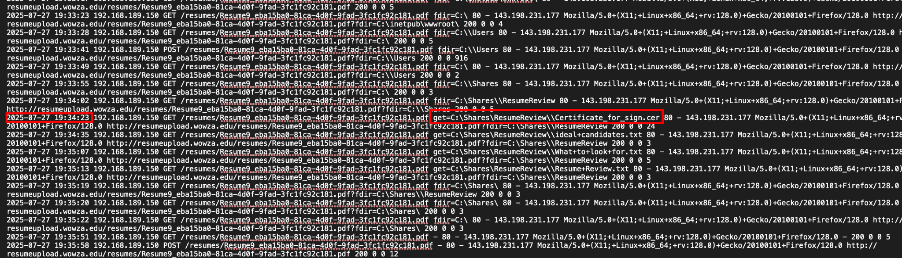

---

#### Task 7: Who was the first ideal candidate the company was seeking?

**Answer:** `warlocksmurf`

While reviewing the IIS log, I saw that the attacker did not stop after retrieving the certificate file. They used the same PDF web shell to pull another file from the resume reviewer share:

```text
2025-07-27 19:34:35 ... GET /resumes/Resume9_eba15ba0-81ca-4d0f-9fad-3fc1fc92c181.pdf get=C:\Shares\ResumeReview\\ideal+candidates.txt ... 200
```

The `+` characters are URL encoding for spaces, so the retrieved file was:

```text
C:\Shares\ResumeReview\ideal candidates.txt
```

At this point, I expected to simply open the file from the extracted evidence. That did not work because the original `C:\Shares\ResumeReview` folder and `ideal candidates.txt` were not directly available as normal files. So I had to treat it like a small file recovery problem.

The manual process would be:

1. Search the NTFS `$MFT` for the filename `ideal candidates.txt`.
2. Find the matching file record.
3. Check whether the file's `$DATA` attribute is resident or non-resident.
4. If it is resident, extract the file content directly from the MFT record.
5. Decode the recovered bytes as text.

The `$MFT`, or Master File Table, stores metadata for files on an NTFS volume. For very small files, NTFS can store the actual file content inside the MFT record itself. This is called resident data. That matters here because the file content can still be recovered even when the original file is not present in the extracted folder.

Searching for `ideal candidates.txt` returned one matching record:

```text
Record number: 913
Full path: /Shares/ResumeReview/ideal candidates.txt
Preferred name: ideal candidates.txt
State: In use
Type: File
```

Then I checked the `$DATA` attribute:

```text
$DATA attributes
  Stream: $DATA
  Resident: True
  Size: 70
  Retrieved resident content: 70 bytes
```

The important part is `Resident: True`. If this had been non-resident, I would have needed to follow NTFS data runs to the disk clusters that held the file content. Since it was resident, the 70 bytes of file content were stored directly inside MFT record `913`.

The recovered hex data was:

```text
4c 6f 6f 6b 69 6e 67 20 66 6f 72 20 73 6f 6d 65
6f 6e 65 20 6c 69 6b 65 20 74 68 65 6d 0d 0a 2d
20 77 61 72 6c 6f 63 6b 73 6d 75 72 66 0d 0a 2d
20 74 6d 65 63 68 65 6e 0d 0a 2d 20 6c 75 6b 61
73 4c 55 5a 53 43
```

Decoding those bytes as text gave:

```text
Looking for someone like them
- warlocksmurf
- tmechen
- lukasLUZSC
```

The first candidate listed was `warlocksmurf`.

The screenshot below makes the process look simple because I used my personal tool, [NTFS-Analyzer](https://github.com/hhoangsonnw/NTFS-Analyzer), to automate the repetitive MFT work. The tool lets me search for a filename, shows the matching record, identifies whether the `$DATA` attribute is resident, and prints the recovered bytes as both hex and text. A reader can use that tool to reproduce the result instead of manually parsing the raw MFT structure byte by byte.

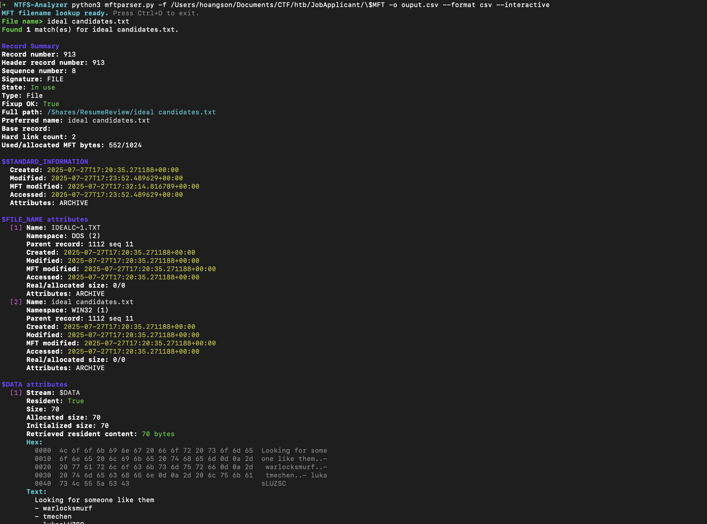

---

#### Task 8: A file was dropped to perform a potential Kerberoasting attack in the Active Directory environment. What is the name of this file?

**Answer:** `r.exe`

I looked for attacker tools staged in the upload directory. During cleanup, the attacker deleted:

```text
C:\inetpub\wwwroot\resumes\r.exe
```

The IIS cleanup request was:

```text
2025-07-27 20:11:36 ... del=C:\inetpub\wwwroot\resumes\\r.exe ... 200
```

The USN Journal showed that `r.exe` had been created much earlier:

```text
2025-07-27T19:40:15.000068+00:00 r.exe DATA_EXTEND|FILE_CREATE|CLOSE
```

The short name fits the pattern of a renamed AD attack tool. In this timeline, it appears before the AD CS activity and later gets removed with the other attacker tools.

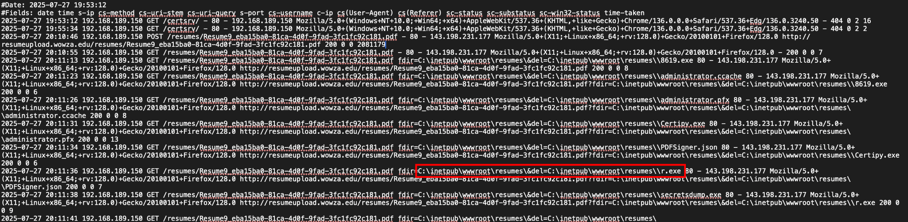

---

#### Task 9: Which service account was targeted by this Active Directory attack?

**Answer:** `WOWZA\ca_svc`

For the AD portion, I moved from IIS logs to the Windows Security log. I first had to research which Windows events are useful for AD CS investigations. Microsoft's AD CS auditing references showed that Event ID `4886` is generated when Certificate Services receives a certificate request, and Event ID `4887` is generated when Certificate Services approves and issues one.

Sources:

- [Microsoft - Audit Certification Services](https://learn.microsoft.com/en-us/previous-versions/windows/it-pro/windows-10/security/threat-protection/auditing/audit-certification-services)
- [Microsoft - Securing PKI: Events to Monitor](https://learn.microsoft.com/en-us/previous-versions/windows/it-pro/windows-server-2012-r2-and-2012/dn786423%28v%3Dws.11%29)
- [Ultimate Windows Security - Event ID 4887](https://www.ultimatewindowssecurity.com/securitylog/encyclopedia/event.aspx?eventID=4887)

With that context, Certificate Services Event ID `4886` showed a certificate request submitted by:

```text
Requester: WOWZA\ca_svc
```

The same event contained suspicious request attributes:

```text
CertificateTemplate:PDFSigner
SAN:upn=Administrator
```

So the attacker was using or abusing the `WOWZA\ca_svc` account to request certificates, while trying to place `Administrator` into the certificate's UPN.

---

#### Task 10: Attacker dropped another tool to exploit a misconfiguration in AD CS. When was this tool successfully created on the endpoint?

**Answer:** `2025-07-27 19:52:03`

The attacker later deleted `Certipy.exe` from the upload directory:

```text
2025-07-27 20:11:31 ... del=C:\inetpub\wwwroot\resumes\\Certipy.exe ... 200
```

At first this was just another deleted executable, so I researched the filename before deciding why it mattered. Certipy is a public tool for Active Directory Certificate Services enumeration and abuse, and the SpecterOps "Certified Pre-Owned" research explains why AD CS misconfigurations can lead to privilege escalation and domain compromise.

Sources:

- [Certipy GitHub repository](https://github.com/ly4k/Certipy)
- [Certipy Wiki](https://github.com/ly4k/Certipy/wiki)
- [SpecterOps - Certified Pre-Owned](https://specterops.io/blog/2021/06/17/certified-pre-owned/)

To find when it was actually created, I checked the USN Journal. The first create event happened at `19:51:32`, but the important completed-write event was:

```text
2025-07-27T19:52:03.015636+00:00 Certipy.exe DATA_EXTEND|FILE_CREATE|CLOSE
```

The `CLOSE` flag showed that the file handle closed after the data was written. I treated that as the successful creation time.

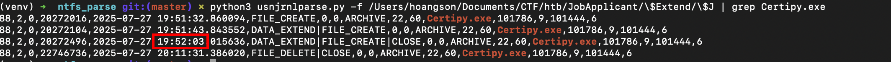

---

#### Task 11: When was AD CS exploited successfully on the domain controller?

**Answer:** `2025-07-27 19:56:38`

I searched the Security log around the AD CS events and found the abuse beginning at:

```text
2025-07-27T19:56:38.095869Z
```

The event was Security Event ID `4886`:

```json
{
  "EventID": 4886,
  "RequestId": "6",
  "Requester": "WOWZA\\ca_svc",
  "Attributes": "CertificateTemplate:PDFSigner\nSAN:upn=Administrator"
}
```

This was the first moment where the attacker requested a certificate from the vulnerable template while supplying `Administrator` as the UPN.

The same second also contained the template modification events that made the abuse possible. After checking Microsoft's PKI event list, I treated Event ID `4900` as especially important because it records certificate template security updates. Event ID `4900` showed the `PDFSigner` template security descriptor being changed, and Event ID `4898` showed the modified template content:

```text
NewSecurityDescriptor: NT AUTHORITY\Authenticated Users - Full Control
msPKI-Certificate-Name-Flag: CT_FLAG_ENROLLEE_SUPPLIES_SUBJECT
pKIExtendedKeyUsage: Client Authentication
```

Those settings matter because they let an authenticated requester supply another identity in the certificate request and use the resulting certificate for authentication.

The later chain confirmed that the abuse worked:

- `19:56:49`: certificate issued for the suspicious request
- `19:59:15`: successful Kerberos TGT request for `Administrator` using certificate-based authentication

So the AD CS exploitation point was `2025-07-27 19:56:38`, with the successful authentication appearing a few minutes later.

---

#### Task 12: Identify the name and version of the vulnerable certificate template exploited in the attack.

**Answer:** `PDFSigner v100.4`

The certificate request pointed to the `PDFSigner` template, so I searched for template-load/change events involving that name.

I researched AD CS template events before trusting the field names. Microsoft lists Event ID `4898` as "Certificate Services loaded a template", and the event includes the template name, version, schema version, template content, and security descriptor. I also used Ultimate Windows Security and Lares Labs as supporting references for how this event appears during AD CS investigations.

Sources:

- [Microsoft - Audit Certification Services](https://learn.microsoft.com/en-us/previous-versions/windows/it-pro/windows-10/security/threat-protection/auditing/audit-certification-services)
- [Ultimate Windows Security - Event ID 4898](https://www.ultimatewindowssecurity.com/securitylog/encyclopedia/event.aspx?eventid=4898)
- [Lares Labs - ADCS Exploits & Investigations](https://labs.lares.com/adcs-exploits-investigations-pt1/)

The relevant Security log entries showed:

```text
TemplateInternalName: PDFSigner
TemplateVersion: 100.4
TemplateSchemaVersion: 2
```

That identified the exploited template as:

```text
PDFSigner v100.4
```

The same template later appeared in the malicious request:

```text
CertificateTemplate:PDFSigner
SAN:upn=Administrator
```

---

#### Task 13: A new security descriptor was applied to the vulnerable certificate template and this security descriptor grants full control over the certificate template to a specific group. What is the name of that group?

**Answer:** `Authenticated Users`

This part needed the certificate template change event, not just the request event. Security Event ID `4900` showed the `PDFSigner` template being changed at `2025-07-27T19:56:38.185611Z`.

This was a correction from my first pass. Event ID `4898` is useful for seeing the loaded template, but Event ID `4900` is the stronger evidence for this question because it records that the certificate template security was updated and includes the `NewSecurityDescriptor`.

The `NewSecurityDescriptor` contained:

```text
Allow(0x000f01ff) NT AUTHORITY\Authenticated Users
Full Control
```

The short SID name in the descriptor was `AU`, which maps to `Authenticated Users`.

That was a dangerous change because `Authenticated Users` includes normal authenticated domain users. Giving that group Full Control over the certificate template made the template much easier to abuse.

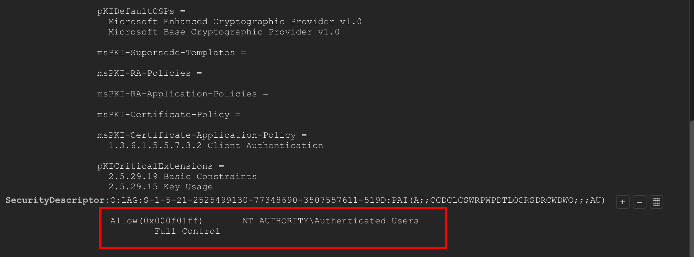

---

#### Task 14: When was the certificate issued to the threat actor for a high-privilege user, allowing privilege escalation?

**Answer:** `2025-07-27 19:57:55`

I searched for another certificate request using the same pattern:

```text
CertificateTemplate:PDFSigner
SAN:upn=Administrator
```

At `2025-07-27T19:57:55.575004Z`, Event ID `4886` showed request ID `8`:

```json
{
  "EventID": 4886,
  "RequestId": "8",
  "Requester": "WOWZA\\ca_svc",
  "Attributes": "CertificateTemplate:PDFSigner\nSAN:upn=Administrator"
}
```

Immediately after that, Event ID `4887` showed the certificate was issued:

```json
{
  "EventID": 4887,
  "SystemTime": "2025-07-27T19:57:55.676311Z",
  "RequestId": "8",
  "Requester": "WOWZA\\ca_svc",
  "Attributes": "CertificateTemplate:PDFSigner\nSAN:upn=Administrator",
  "Disposition": "3"
}
```

The matching `RequestId: 8` tied the issued certificate directly to the request for `Administrator`. The task asks for the issued time, so the rounded answer is:

```text
2025-07-27 19:57:55
```

---

#### Task 15: The threat actor successfully retrieved the NTLM hash of a high-privilege user using the newly issued certificate. What was the serial number of the certificate used to achieve this privilege escalation?

**Answer:** `1D00000008A6E7524F029E603A000000000008`

After the certificate was issued, I looked for Kerberos authentication using a certificate. Security Event ID `4768` showed a successful TGT request for `Administrator`:

```json
{
  "EventID": 4768,
  "TargetUserName": "Administrator",
  "ServiceName": "krbtgt",
  "Status": "0x0",
  "PreAuthType": "16",
  "CertIssuerName": "wowza-MAIN-DC-CA",
  "CertSerialNumber": "1D00000008A6E7524F029E603A000000000008",
  "CertThumbprint": "15F5FE778E03BB9278B655827572EB2AA1AAFA9F"
}
```

The important parts were:

- `TargetUserName: Administrator`
- `Status: 0x0`, meaning success
- `PreAuthType: 16`, indicating certificate-based Kerberos authentication
- `CertSerialNumber`, which identifies the certificate used

I checked Microsoft's Event ID `4768` documentation while working through this because I wanted to be sure I was reading the Kerberos event correctly. Event ID `4768` is generated when a Kerberos TGT is requested, so a successful `4768` for `Administrator` after the certificate issuance connected the AD CS abuse to privileged authentication.

Source:

- [Microsoft - Event ID 4768: A Kerberos authentication ticket was requested](https://learn.microsoft.com/en-us/previous-versions/windows/it-pro/windows-10/security/threat-protection/auditing/event-4768)

---

#### Task 16: The attacker exploited an Active Directory misconfiguration to gain access to Active Directory secrets stored on the domain controller. What is the MITRE ATT&CK ID for this technique?

**Answer:** `T1003.006`

At this point in the timeline, the attacker had authenticated as `Administrator`. The next suspicious behavior was access to Active Directory replication permissions, which is the pattern used by DCSync.

DCSync lets an attacker with enough privilege ask the domain controller for replicated credential data, including password hashes.

I researched the technique name instead of guessing from the tool alone. MITRE ATT&CK maps DCSync to:

```text
T1003.006 - OS Credential Dumping: DCSync
```

Source:

- [MITRE ATT&CK - OS Credential Dumping: DCSync (T1003.006)](https://attack.mitre.org/techniques/T1003/006/)

---

#### Task 17: When was the attack mentioned in the previous task successfully carried out?

**Answer:** `2025-07-27 20:05:14`

To confirm DCSync, I looked for directory service access events with replication GUIDs.

The MITRE DCSync page gave me the technique name, but the Windows evidence still had to come from the Security log. That is why I focused on Event ID `4662` and replication-related GUIDs rather than just saying "secretsdump.exe existed".

First, the Security log showed an `Administrator` network logon:

```json
{
  "EventID": 4624,
  "SystemTime": "2025-07-27T20:05:14.577498Z",
  "TargetUserName": "Administrator",
  "LogonType": 3,
  "IpAddress": "127.0.0.1",
  "TargetLogonId": "0x96a4b9"
}
```

Immediately after that, Event ID `4662` showed directory service access by the same logon session:

```json
{
  "EventID": 4662,
  "SystemTime": "2025-07-27T20:05:14.687160Z",
  "SubjectUserName": "Administrator",
  "SubjectLogonId": "0x96a4b9",
  "ObjectServer": "DS",
  "AccessMask": "0x100"
}
```

The `Properties` field contained AD replication GUIDs:

```text
{1131f6aa-9c07-11d1-f79f-00c04fc2dcd2}
{1131f6ad-9c07-11d1-f79f-00c04fc2dcd2}
```

Those correspond to replication permissions such as `DS-Replication-Get-Changes` and `DS-Replication-Get-Changes-All`, which are strong DCSync indicators.

The first DCSync-related event occurred in the `20:05:14` second, so the answer is:

```text
2025-07-27 20:05:14
```

---

#### Task 18: A Golden Ticket was issued using a previously dropped tool. What is the filename of this ticket?

**Answer:** `shinyboi_wowza_edu_2025_07_27_20_06_33_Administratorr_to_krbtgt@WOWZA.EDU.kirbi`

After DCSync, I expected to see Kerberos ticket artifacts. The USN Journal showed a `.kirbi` file being created:

```text
2025-07-27T20:06:33.604956+00:00 shinyboi_wowza_edu_2025_07_27_20_06_33_Administratorr_to_krbtgt@WOWZA.EDU.kirbi DATA_EXTEND|FILE_CREATE|CLOSE
```

The `krbtgt` part of the filename fits a Golden Ticket because Golden Tickets are forged Kerberos TGTs tied to the `krbtgt` account. I checked this against Microsoft Kerberos references and MITRE's Golden Ticket technique page before labeling it that way. Microsoft documents that the KDC uses the `krbtgt` security principal for ticket-granting activity, and MITRE describes Golden Tickets as forged Kerberos TGTs created using the `KRBTGT` account password hash.

Sources:

- [Microsoft - Key Distribution Center](https://learn.microsoft.com/en-us/windows/win32/secauthn/key-distribution-center)
- [Microsoft - Ticket-Granting Tickets](https://learn.microsoft.com/en-us/windows/win32/secauthn/ticket-granting-tickets)
- [MITRE ATT&CK - Golden Ticket (T1558.001)](https://attack.mitre.org/techniques/T1558/001/)

---

#### Task 19: The threat actor used the web shell to delete all files involved in this operation. When did the deletion routine begin?

**Answer:** `2025-07-27 20:11:13`

The cleanup routine was visible in the IIS log because the attacker used the web shell with the `del=` parameter.

The first deletion request was:

```text
2025-07-27 20:11:13 ... del=C:\inetpub\wwwroot\resumes\\8619.exe ... 200
```

The USN Journal confirmed the matching delete event:

```text
2025-07-27T20:11:13.980332+00:00 8619.exe FILE_DELETE|CLOSE
```
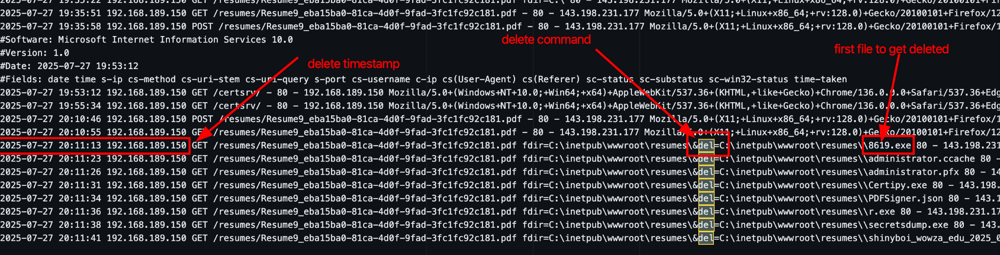

After that, the attacker deleted the rest of the operation files:

- `administrator.ccache`
- `administrator.pfx`
- `Certipy.exe`
- `PDFSigner.json`
- `r.exe`
- `secretsdump.exe`
- `shinyboi_wowza_edu_2025_07_27_20_06_33_Administratorr_to_krbtgt@WOWZA.EDU.kirbi`

---

## Attack Timeline

| Time | Phase | Evidence | What I concluded |
| --- | --- | --- | --- |
| `2025-07-27 19:27:35` | Initial recon | IIS `GET /index.aspx` from `143.198.231.177` | First observed attacker interaction with the web server. |
| `2025-07-27 19:32:28` | Upload | IIS `POST /default.aspx` from `143.198.231.177` | The attacker used the resume upload function. |
| `2025-07-27 19:33:02` | Uploaded file accessed | IIS `GET /resumes/Resume9_eba15ba0-81ca-4d0f-9fad-3fc1fc92c181.pdf` | The server stored the uploaded resume under this generated filename. |
| `2025-07-27 19:33:17` | Web shell behavior begins | Uploaded PDF receives web-shell style parameters | The PDF was no longer behaving like a normal static document. |
| `2025-07-27 19:34:23` | File retrieval | `get=C:\Shares\ResumeReview\\Certificate_for_sign.cer` | The attacker retrieved the first file from the resume reviewer share. |
| `2025-07-27 19:34:35` | File retrieval | `get=C:\Shares\ResumeReview\\ideal+candidates.txt` | The attacker retrieved `ideal candidates.txt`, later recovered from the MFT. |
| `2025-07-27 19:35:58` | Tool staging | USN Journal: `8619.exe` with `DATA_EXTEND`, `FILE_CREATE`, `CLOSE` | Initial remote access tool/payload was successfully written. |
| `2025-07-27 19:40:15` | Tool staging | USN Journal: `r.exe` with `DATA_EXTEND`, `FILE_CREATE`, `CLOSE` | Potential Kerberoasting/Kerberos abuse tool was staged. |
| `2025-07-27 19:52:03` | AD CS tool staging | USN Journal: `Certipy.exe` with `DATA_EXTEND`, `FILE_CREATE`, `CLOSE` | Certipy was successfully created before the AD CS abuse. |
| `2025-07-27 19:56:38` | AD CS abuse | Security `4886`, `4900`, and `4898` around `PDFSigner` | Certificate template abuse started; `Authenticated Users` received Full Control and the request included `SAN:upn=Administrator`. |
| `2025-07-27 19:57:55` | Certificate issued | Security `4887`, `RequestId: 8`, `Disposition: 3` | A certificate was issued for the malicious `PDFSigner` request targeting `Administrator`. |
| `2025-07-27 19:59:15` | Privileged authentication | Security `4768`, `TargetUserName: Administrator`, `PreAuthType: 16` | The issued certificate was used for certificate-based Kerberos authentication. |
| `2025-07-27 20:04:00` | Credential dumping tool staging | USN Journal: `secretsdump.exe` with `DATA_EXTEND`, `FILE_CREATE`, `CLOSE` | The attacker staged a tool commonly used for dumping AD secrets. |
| `2025-07-27 20:05:14` | DCSync | Security `4624` followed by `4662` replication GUIDs | DCSync-style credential dumping began under the `Administrator` session. |
| `2025-07-27 20:06:33` | Golden Ticket creation | USN Journal: `.kirbi` with `DATA_EXTEND`, `FILE_CREATE`, `CLOSE` | A Kerberos ticket artifact was created after DCSync. |
| `2025-07-27 20:11:13` | Cleanup | IIS `del=C:\inetpub\wwwroot\resumes\\8619.exe` | The web-shell cleanup routine began. |

## MITRE ATT&CK Mapping

| Tactic | Technique ID | Technique | Evidence in this case | Confidence |
| --- | --- | --- | --- | --- |
| Reconnaissance | [T1595.003](https://attack.mitre.org/techniques/T1595/003/) | Active Scanning: Wordlist Scanning | `feroxbuster/2.11.0` and many common discovery paths from `143.198.231.177`. | High |
| Initial Access | [T1190](https://attack.mitre.org/techniques/T1190/) | Exploit Public-Facing Application | The public resume upload site was abused to place files that led to code execution through IIS/ASP.NET behavior. | Medium |
| Persistence | [T1505.003](https://attack.mitre.org/techniques/T1505/003/) | Server Software Component: Web Shell | The uploaded PDF accepted `fdir=`, `get=`, and `del=` parameters after `web.config` changed handler behavior. | High |
| Command and Control | [T1105](https://attack.mitre.org/techniques/T1105/) | Ingress Tool Transfer | `8619.exe`, `r.exe`, `Certipy.exe`, and `secretsdump.exe` were staged under `C:\inetpub\wwwroot\resumes\`. | High |
| Credential Access | [T1558.003](https://attack.mitre.org/techniques/T1558/003/) | Steal or Forge Kerberos Tickets: Kerberoasting | `r.exe` was staged before the AD/Kerberos activity and the task context identifies it as a potential Kerberoasting tool. | Medium |
| Credential Access / Privilege Escalation | [T1649](https://attack.mitre.org/techniques/T1649/) | Steal or Forge Authentication Certificates | AD CS abuse through `PDFSigner`, `SAN:upn=Administrator`, and certificate-based authentication as `Administrator`. | High |
| Credential Access | [T1003.006](https://attack.mitre.org/techniques/T1003/006/) | OS Credential Dumping: DCSync | Security `4662` events contained replication GUIDs such as `DS-Replication-Get-Changes` and `DS-Replication-Get-Changes-All`. | High |
| Credential Access | [T1558.001](https://attack.mitre.org/techniques/T1558/001/) | Steal or Forge Kerberos Tickets: Golden Ticket | `.kirbi` file referencing `Administratorr_to_krbtgt@WOWZA.EDU` was created after DCSync. | High |
| Collection | [T1005](https://attack.mitre.org/techniques/T1005/) | Data from Local System | The web shell retrieved files from `C:\Shares\ResumeReview`, including `Certificate_for_sign.cer` and `ideal candidates.txt`. | High |
| Defense Evasion | [T1070.004](https://attack.mitre.org/techniques/T1070/004/) | Indicator Removal: File Deletion | The attacker used the web shell `del=` parameter to remove tools and artifacts during cleanup. | High |

---

